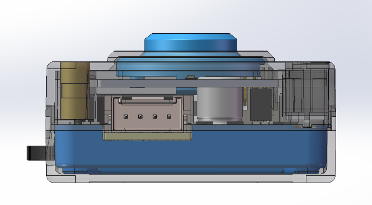
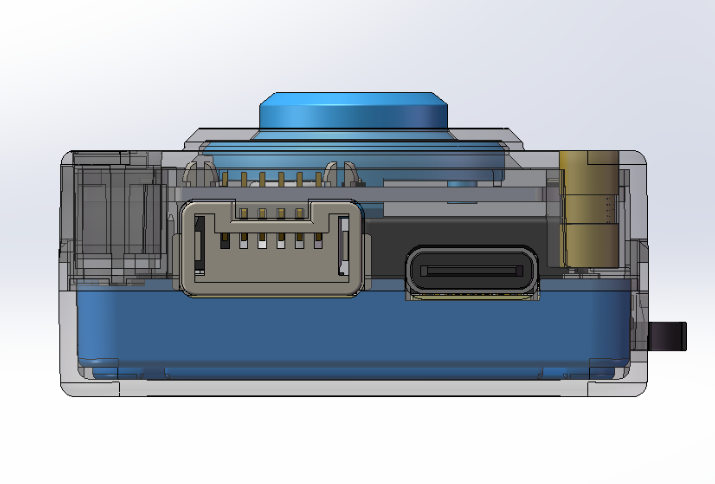

# Communication Protocol
## Grove Port
<!-- 这是一张图片，ocr 内容为： -->

+ **I²C Mode:** `GND`、`VCC`、`SDA`、`SCL` (from left to right)
+ **UART Mode:** `GND`、`VCC`、`RX`、`TX` (from left to right)

## LPF2 Port
<!-- 这是一张图片，ocr 内容为： -->

The Grove Port supports the following communication methods:
+ `I²C` (with selectable addresses)
+ `UART` (standard serial parameters)

The LPF2 Port supports the following communication methods:
+ `SPIKE emulated protocol` (compatible with LEGO SPIKE)

Users can select the desired communication mode in the Settings interface, then click Exit to restart the device and apply the configuration.

