# Extension-EV3
## Introduction
<!-- 这是一张图片，ocr 内容为： -->
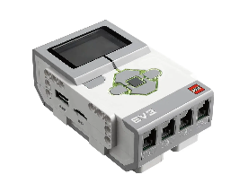

LEGO® MINDSTORMS® EV3 is the third-generation programmable robotics kit in the LEGO MINDSTORMS series. Released in 2013, EV3 was designed for education, makers, and robotics enthusiasts, and is especially suitable for youth to learn programming, engineering, and robotics. It remains widely used in schools, robotics competitions, and personal projects.

## Quick Start
### Hardware Preparation
<!-- 这是一张图片，ocr 内容为： -->
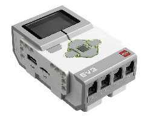 
EV3 Controller 
<!-- 这是一张图片，ocr 内容为： -->
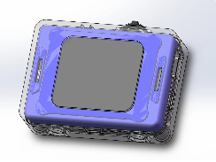 
K210 AI Vision Sensor 
Adapter Board
<!-- 这是一张图片，ocr 内容为： -->
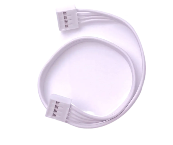 
Grove Male-to-Male Cable 
 <!-- 这是一张图片，ocr 内容为： -->
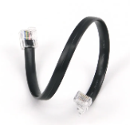   
EV3 Connection Cable 

### Software Preparation
LEGO Mindstorms Education EV3 is a professional educational robotics platform designed for classrooms and group learning. This tutorial focuses on using the EV3 platform with the Vision Module.

The Vision Module communicates with EV3 via I²C protocol.

Set the Vision Module to I²C communication mode and connect it to a lower port of the EV3.

#### Getting the Software
Enter [LEGO Mindstorms Education EV3](https://legoeducation.cn/zh-cn/downloads/mindstorms-ev3/software/)

<!-- 这是一张图片，ocr 内容为： -->
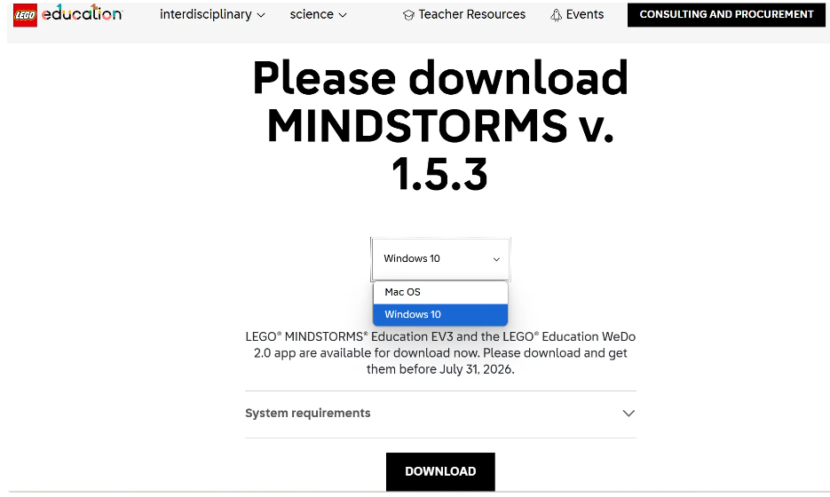

Download and install the version compatible with your computer's operating system.

#### Getting the Extension
For the LEGO Mindstorms Education EV3 programming platform, we've developed a dedicated K210 extension specifically designed for EV3. You can add this extension to your programming platform by **clicking here** to get it.

#### Adding the Extension
The following steps describe how to add the extension to the LEGO Mindstorms Education EV3 programming platform.

Step 1: Click the “Import Module” option from the toolbar.

<!-- 这是一张图片，ocr 内容为： -->
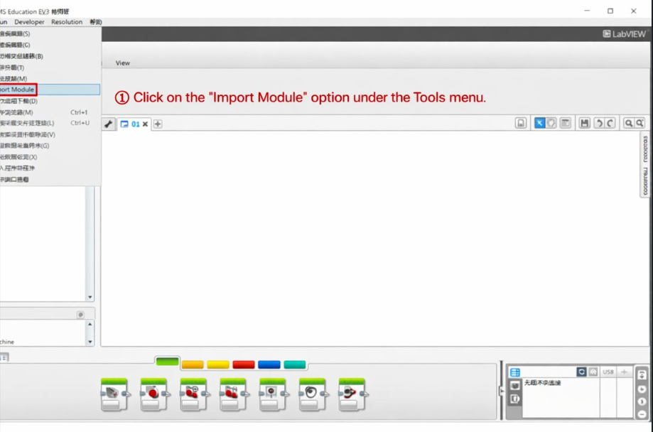

Step 2: Click “Browse”

<!-- 这是一张图片，ocr 内容为： -->
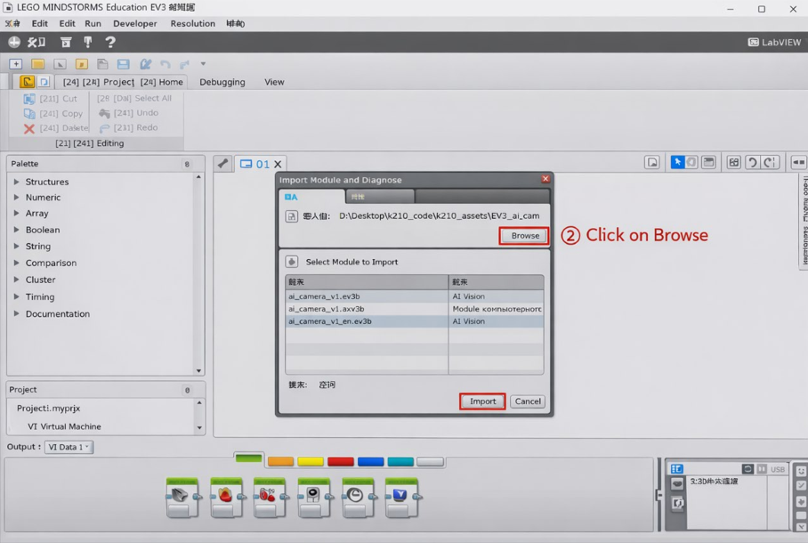

Step 3: Select the extension file and click “Open”.

<!-- 这是一张图片，ocr 内容为： -->
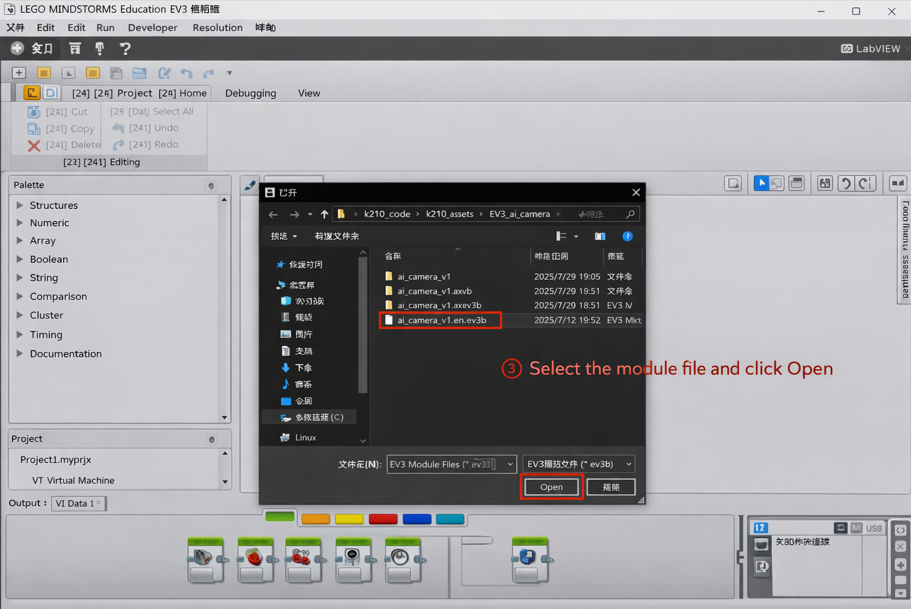

Step 4: Select the extension to be imported, then click “Import”.

<!-- 这是一张图片，ocr 内容为： -->
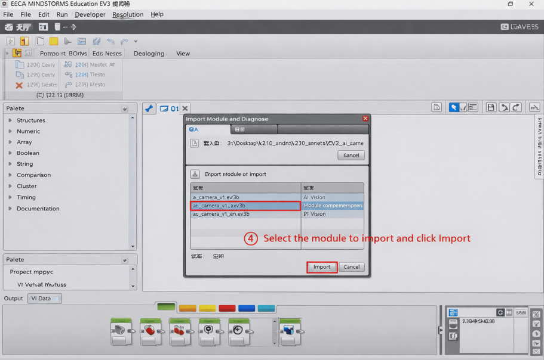

Step 5: A dialog box will pop up with the message: “To apply these changes, you must restart the EV3 editor.”

Click OK, then close and restart the EV3 software.

<!-- 这是一张图片，ocr 内容为： -->
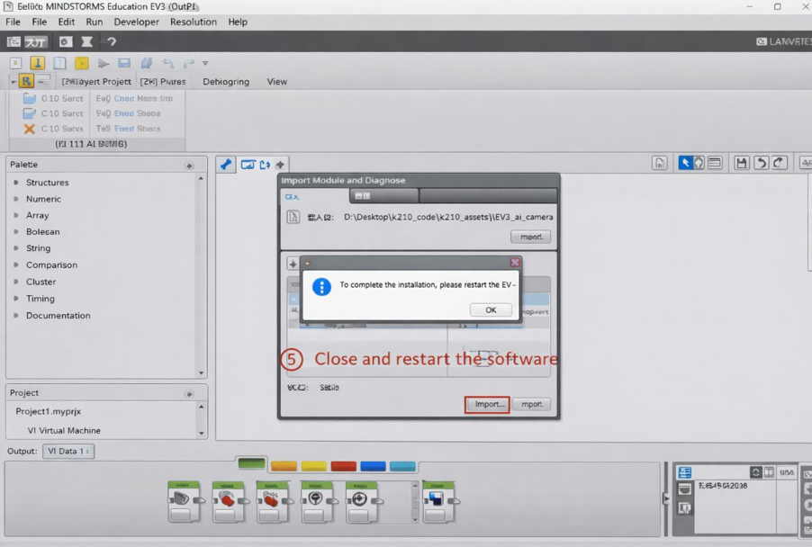

Step 6: A new “Al Vision” programming block has been added to the block palette at the bottom of the interface.

<!-- 这是一张图片，ocr 内容为： -->
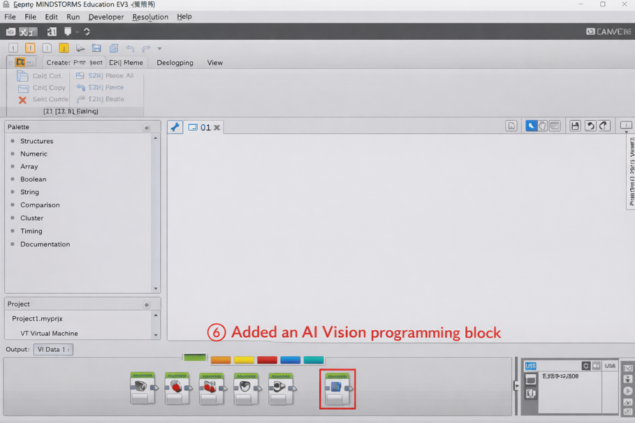

The overall process of adding the extension is as follows:

<!-- 这是一张图片，ocr 内容为： -->
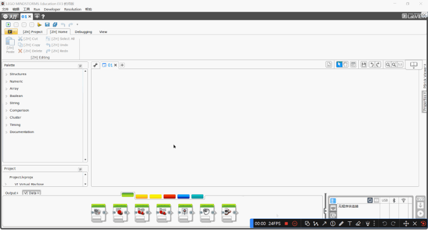

### Usage Example
Example:

+ Connect the Vision Module to Port 1 and run the program.
+ Press the center button on the EV3 to switch to Tag Recognition Mode.
+ If no tag is detected, the screen will display “None”.
+ If a tag is detected, the screen will display the corresponding Tag ID.

<!-- 这是一张图片，ocr 内容为： -->
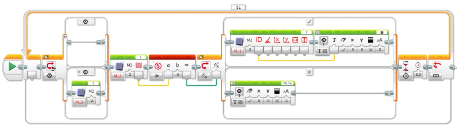

Demonstration:

<!-- 这是一张图片，ocr 内容为： -->

## Function Block Description
<!-- 这是一张图片，ocr 内容为： -->

Before use, make sure that the port and function options are selected correctly.

### Get Object ID and Coordinates
<!-- 这是一张图片，ocr 内容为： -->

Retrieve the following parameters of the recognized object:

ID、Rotation angle、X, Y coordinates、Width and height

Note: Not all detected objects contain a full set of attributes. For attributes not applicable to a specific object, the corresponding field will return 0.

Example:

<!-- 这是一张图片，ocr 内容为： -->

+ Connect the Vision Module to Port 3.
+ Manually switch to Tag Recognition Mode.
+ The EV3 screen will display the X coordinate of the recognized tag.

### Set Working Mode
<!-- 这是一张图片，ocr 内容为： -->

Configure the Vision Module to switch between different recognition modes automatically.

Example:

<!-- 这是一张图片，ocr 内容为： -->
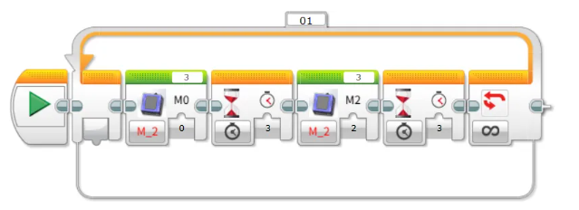

Connect the Vision Module to Port 3 and run the program. The module will automatically switch between Color Recognition mode and Tag Recognition mode at 3-second intervals.

### Get the Number of Recognized Objects
<!-- 这是一张图片，ocr 内容为： -->
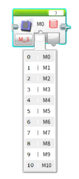

Retrieve the number of objects detected by the Vision Module in the selected mode.

Example:

<!-- 这是一张图片，ocr 内容为： -->

Connect the Vision Module to Port 3, manually switch to Tag Recognition mode, and run the program. The EV3 screen will display the number of recognized tags.

### Get the RGB Values of a Color
<!-- 这是一张图片，ocr 内容为： -->

Retrieve the RGB values detected by the Vision Module in Color Recognition mode.

Example:

<!-- 这是一张图片，ocr 内容为： -->
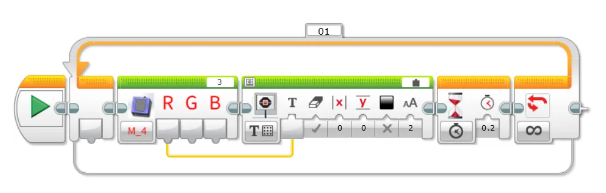

Connect the Vision Module to Port 3, manually switch to Color Recognition mode, and run the program. The EV3 screen will display the detected R (Red) value of the color.

### Get Face Attributes
<!-- 这是一张图片，ocr 内容为： -->

Retrieve whether the detected face has the following attributes: mouth open, smiling, or wearing glasses. The value is 1 if true, otherwise 0.

Example:

<!-- 这是一张图片，ocr 内容为： -->

Connect the Vision Module to Port 3, manually switch to Face Attribute Recognition mode, and run the program.

When the module detects a face with an open mouth, the EV3 screen will display 1; otherwise, it will display 0.

### Face Learning  
<!-- 这是一张图片，ocr 内容为： -->
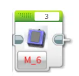

Train the module to recognize the currently detected face.

Example:

<!-- 这是一张图片，ocr 内容为： -->

Connect the Vision Module to Port 3, manually switch to Face Recognition mode, and run the program.

When the Vision Module detects a face, press the center button on the EV3 controller to let the module learn and store the current face.

### Set Target Color for Color Block Tracking
<!-- 这是一张图片，ocr 内容为： -->
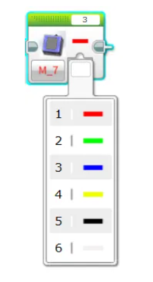

Configure the Vision Module to track a specific color.

A total of 6 colors are available for selection.

Example:  

<!-- 这是一张图片，ocr 内容为： -->
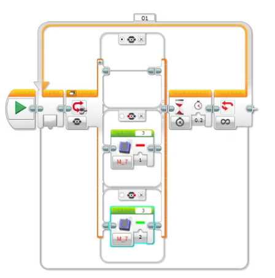

+ Connect the Vision Module to Port 3, manually switch to Color Block Tracking mode, and run the program.
+ Press the left button on the EV3 controller to start tracking a red color block.
+ Press the right button to start tracking a green color block.

### Set Fill Light Brightness
<!-- 这是一张图片，ocr 内容为： -->

Adjust the brightness of the fill light.

There are 11 levels available, where 0 means off and 10 represents 100% brightness.

Example:

<!-- 这是一张图片，ocr 内容为： -->
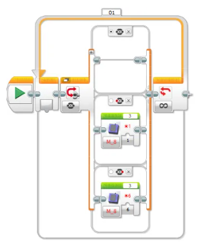

Before operation, please ensure the fill light has been switched ON in the settings menu.

Connect the Vision Module to Port 3 and run the program:

Press the left button on the EV3 controller → the fill light turns on at 10% brightness.

Press the right button → the fill light turns on at 60% brightness.

### Get Fill Light Brightness
<!-- 这是一张图片，ocr 内容为： -->

Retrieve the current brightness level of the fill light.

The brightness range is 0 to 10.

Example:

<!-- 这是一张图片，ocr 内容为： -->

After connecting the Vision Module to Port 3 and running the program, the current brightness value of the fill light will be displayed in real time on the EV3 screen.

You can adjust the brightness through the settings menu.

The displayed value will update simultaneously, providing an intuitive reflection of the current brightness setting.

### Set Fill Light State
<!-- 这是一张图片，ocr 内容为： -->

Set the ON/OFF state of the fill light.

Example:

<!-- 这是一张图片，ocr 内容为： -->

Before operation, make sure the fill light brightness is set to greater than 0 in the settings menu.

After connecting the Vision Module to Port 3 and running the program:

Press the left button on the EV3 controller to turn OFF the fill light.

Press the right button on the EV3 controller to turn ON the fill light again.

## AI Chat
## <!-- 这是一张图片，ocr 内容为： -->
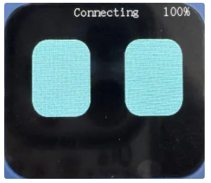
## <!-- 这是一张图片，ocr 内容为： -->
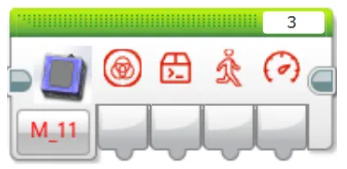
When starting to use, network configuration is required, and the registration code must be registered with XiaoZhi. For detailed operations, please refer to the Dialogue Mode document under the Mode Selection section.  

### Get Dialogue Status  
<!-- 这是一张图片，ocr 内容为： -->

The status of the AI dialogue output on the screen is as follows:  
0: AI not started  
1: Connecting  
2: Idle  
3: Listening  
4: Speaking  
5: Network configuration in progress  

### Get Custom Command
<!-- 这是一张图片，ocr 内容为： -->
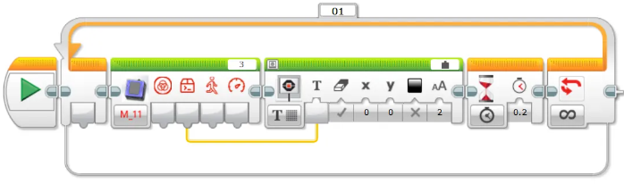

Output the executed custom command to the screen. For usage, please refer to the description of custom commands in the Dialogue Mode document under Mode Selection.

### Get Motion Command
<!-- 这是一张图片，ocr 内容为： -->
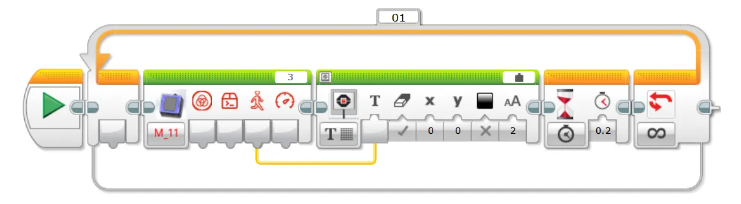

Control movement via voice for forward, backward, left turn, or right turn, and output the corresponding number to the screen.  
Motion command values:  
1: Forward  
2: Backward  
3: Left Turn  
4: Right Turn  
5: Stop

### Get Motion Speed
<!-- 这是一张图片，ocr 内容为： -->
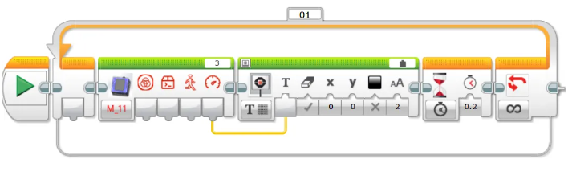

Control movement speed via voice and output the required speed to the screen.  
Motion speed range: 0 ~ 100  

## WIFI Stream
<!-- 这是一张图片，ocr 内容为： -->
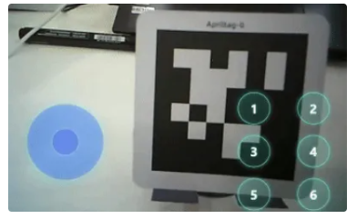

<!-- 这是一张图片，ocr 内容为： -->

When starting to use, network configuration is required for the device. For detailed operations, please refer to the Wi-Fi transmission document under Mode Selection.

### Get Web Button Value
<!-- 这是一张图片，ocr 内容为： -->
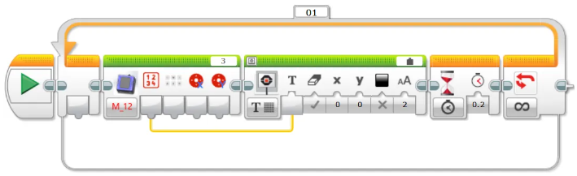

Get the value of the button pressed in the webpage and output it to the screen. A byte is returned, with each button corresponding to a specific bit position in the byte: 0012 3456. When a button is pressed, the corresponding bit is set to 1.  

### Get Keyboard Key Value  
<!-- 这是一张图片，ocr 内容为： -->
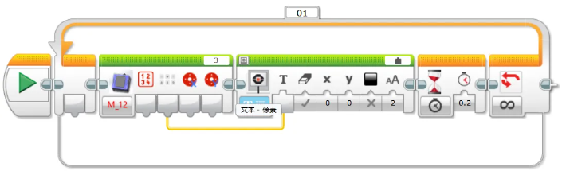

Get the value of the pressed keys (WASD) on the keyboard and output it to the screen. A byte is returned, with each key corresponding to a specific bit position in the byte: 0000 WASD. When a key is pressed, the corresponding bit is set to 1  

### Get Joystick Values
<!-- 这是一张图片，ocr 内容为： -->
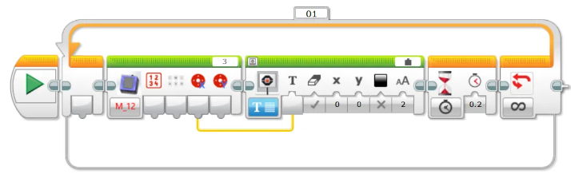

Get the value of the joystick in the X direction and output it to the screen. The range is -100 to 100.

<!-- 这是一张图片，ocr 内容为： -->

Get the value of the joystick in the Y direction and output it to the screen. The range is -100 to 100.

## Notes
Due to the I²C communication mechanism of the EV3, in some modes, if data is read without appropriate delay, the values obtained may be inaccurate. Therefore, when reading data in these modes, it is recommended to add a delay of about 0.2 seconds to ensure stable communication and accurate sensor values.  
