# Extension – SPIKE
## Introduction
<!-- 这是一张图片，ocr 内容为： -->
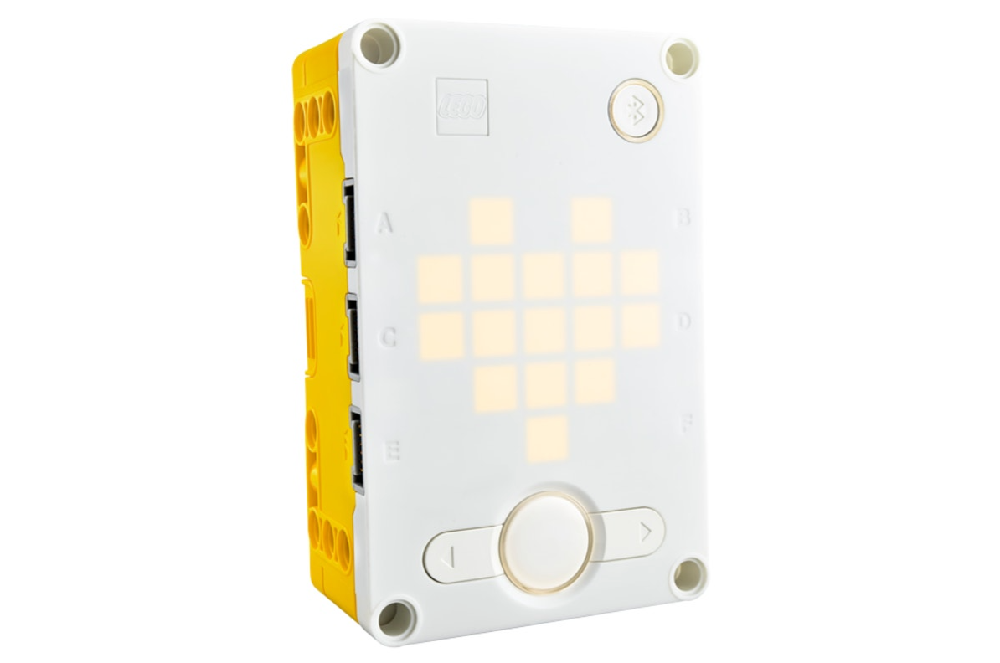

The SPIKE Prime is based on the SPIKE Prime Hub system.

The kit consists of the SPIKE Prime hub, motors, sensors, actuators, and LEGO Technic structural parts.

This document focuses on integrating the vision module with the SPIKE Prime controller.

## Quick Start
Since SPIKE Prime does not allow the addition of custom modules, the vision module simulates a SPIKE color sensor in order to work with SPIKE Prime.

Before use, set the module's port protocol to SPIKE mode.

Refer to the UI Interface section for operation details. For further details, see [SPIKE Compatibility Mode](https://ai-vision-advanced-docs.readthedocs.io/en/latest/docs/AIVisionAdvanced/05CommunicationProtocol/04SPIKECompatibilityMode.html)

### Hardware Preparation
<!-- 这是一张图片，ocr 内容为： -->
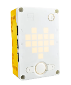
SPIKE Prime Hub
<!-- 这是一张图片，ocr 内容为： -->

K210 AI Vision Sensor
<!-- 这是一张图片，ocr 内容为： -->
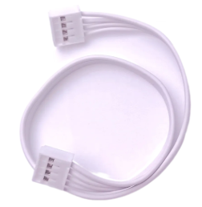
Grove male-to-male cable
<!-- 这是一张图片，ocr 内容为： -->
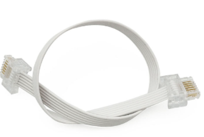
Dual-head WeDo 2.0 cable
<!-- 这是一张图片，ocr 内容为： -->
 
SPIKE Motor

### Software Preparation
You can enter the [LEGO SPIKE](https://spike.legoeducation.com/) programming page to program the SPIKE Prime Hub. 

1. Go to the LEGO SPIKE webpage.
2. At the bottom right, click SPIKE Prime Essential/Prime Set.

<!-- 这是一张图片，ocr 内容为： -->

3. Click New Project.

<!-- 这是一张图片，ocr 内容为： -->
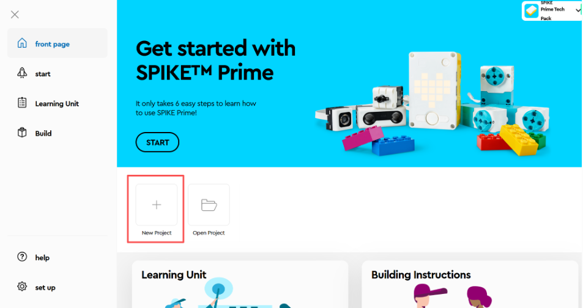

4. Select a programming method you are familiar with. (The following introduces WORD MODULE programming.)

<!-- 这是一张图片，ocr 内容为： -->

5. Enter the block WORD MODULE interface.

<!-- 这是一张图片，ocr 内容为： -->
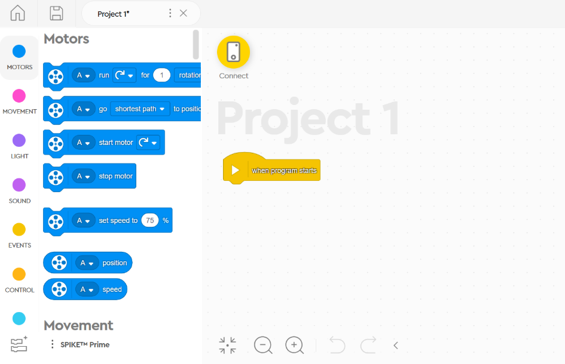

6. Click Show Block Extensions.

<!-- 这是一张图片，ocr 内容为： -->

7. Select More Sensor Blocks.

<!-- 这是一张图片，ocr 内容为： -->
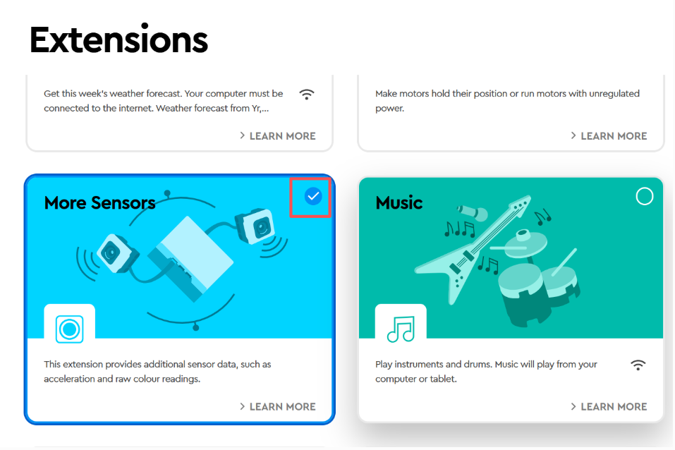

8. In the More Sensor Blocks section, an additional block named Get Color Sensor RGB Value will appear.

<!-- 这是一张图片，ocr 内容为： -->

### Usage Example 1
Connect the vision module to Port A of the SPIKE hub and manually switch it to Tag Recognition Mode.

If no tag is detected, the SPIKE matrix display shows N.

If a tag is detected, the SPIKE matrix display shows the Tag ID.

<!-- 这是一张图片，ocr 内容为： -->

Demonstration:

<!-- 这是一张图片，ocr 内容为： -->

### Usage Example 2
Connect the AI vision module to the SPIKE E port and the motor to the SPIKE B or D port (without corresponding port connections).

When you say "move forward": if the reflection value is "1%", the motor will rotate clockwise.

When you say "move backward": if the reflection value is "2%", the motor will rotate counterclockwise.

The default reflection value is "5%", which will stop the motor.

  
<!-- 这是一张图片，ocr 内容为： -->
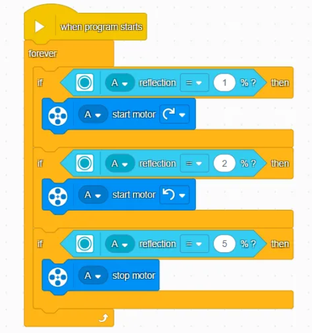

Demonstration:

<!-- 这是一张图片，ocr 内容为： -->

### Usage Example 3
Connect the vision module to the SPIKE C port, and display the collected values on the hub through the image transmission button.

<!-- 这是一张图片，ocr 内容为： -->
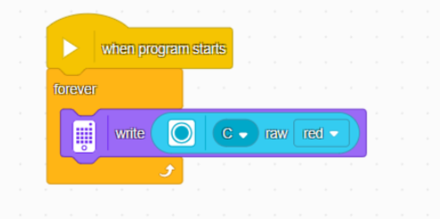

Demonstration:

<!-- 这是一张图片，ocr 内容为： -->

## Usage Instructions  
Since the vision module emulates a color sensor, it is read-only. This means that you can only use the built-in color sensor blocks in SPIKE to read values from the vision module. Mode switching must be done manually on the vision module itself.

The output values of the vision module in different modes correspond directly to the values of the SPIKE color sensor. For detailed mapping, please refer to the SPIKE Compatibility Mode section.

After completing the above steps, connect the vision module to the SPIKE Prime hub. The hub will detect the module as a color sensor, as shown in the figure below:

<!-- 这是一张图片，ocr 内容为： -->
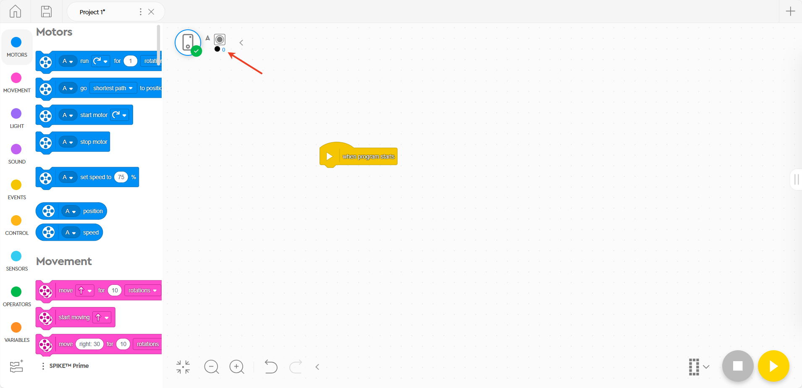

### Color Recognition
1. Switch the vision module to Color Recognition Mode.
2. Read the R value of the detected color from the vision module and display it on the SPIKE Prime hub.

<!-- 这是一张图片，ocr 内容为： -->

### Color Block Tracking
1. Switch the vision module to Color Block Tracking Mode.
2. If a color block is detected, the x-coordinate of the block will be displayed on the SPIKE Prime hub; otherwise, N will be shown.

<!-- 这是一张图片，ocr 内容为： -->
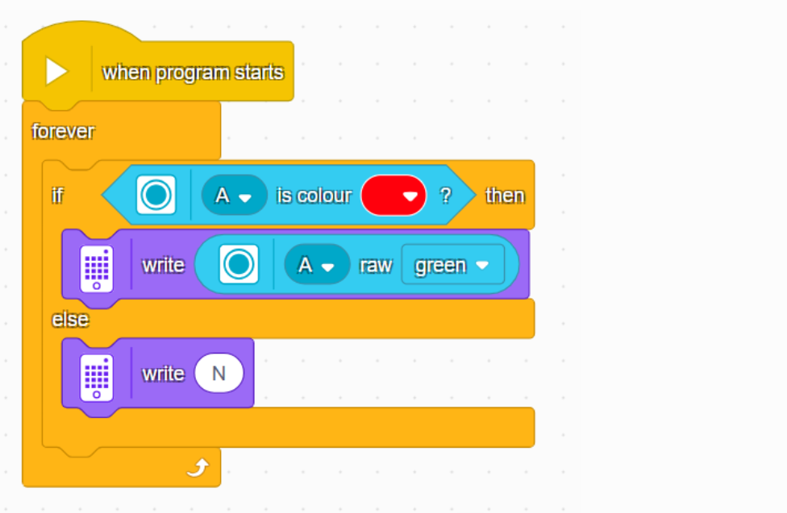

### Tag Recognition
1. Switch the vision module to Tag Recognition Mode.
2. If a tag is detected, the Tag ID will be displayed on the SPIKE Prime hub; otherwise, N will be shown.

<!-- 这是一张图片，ocr 内容为： -->
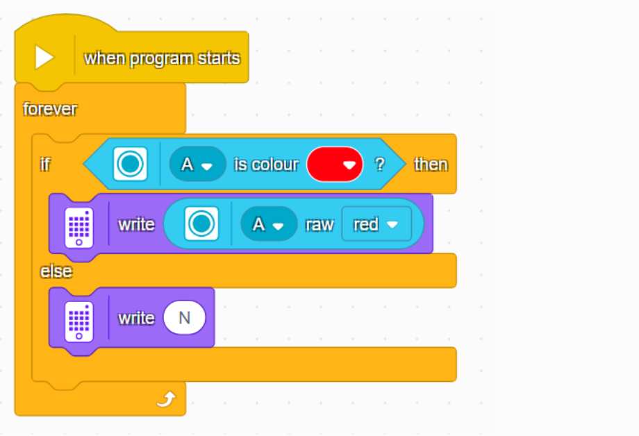

### Line Recognition
1. Switch the vision module to Line Recognition Mode.
2. If a line is detected, the X-coordinate of the line will be displayed on the SPIKE Prime hub; otherwise, N will be shown.

<!-- 这是一张图片，ocr 内容为： -->

### 20-Class Object Recognition
1. Switch the vision module to 20-Class Object Recognition Mode.
2. If an object is detected, its ID will be displayed on the SPIKE Prime hub; otherwise, N will be shown.

<!-- 这是一张图片，ocr 内容为： -->

### QR Code Recognition
1. Switch the vision module to QR Code Recognition Mode.
2. If a QR code is detected, its X coordinate will be displayed on the SPIKE Prime hub; otherwise, N will be shown.

<!-- 这是一张图片，ocr 内容为： -->
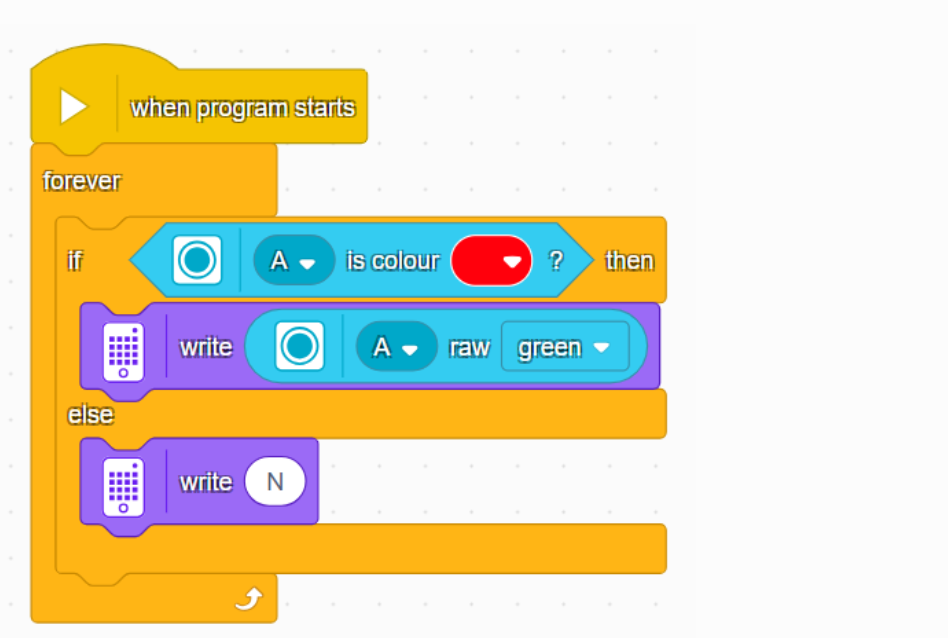

### Face Attribute Recognition
1. Switch the vision module to Face Attribute Recognition Mode.
2. If no face is detected, the SPIKE Prime hub will display N.
3. If a face is detected: Open mouth → `o` Closed mouth → `-`

<!-- 这是一张图片，ocr 内容为： -->
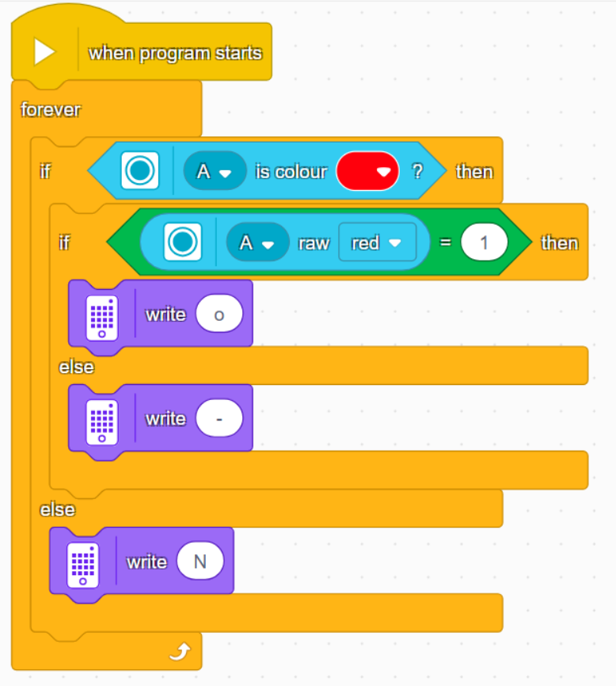

### Face Recognition
1. Switch the vision module to Face Recognition Mode.
2. Manually control the module to learn faces.
3. If no learned face is recognized, the SPIKE Prime hub will display N.
4. If a learned face is recognized, the hub will display the X-coordinate of the detected face.

<!-- 这是一张图片，ocr 内容为： -->
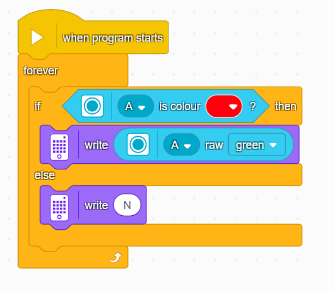

### Deep Learning
1. Switch the vision module to Deep Learning Mode.
2. Manually control the module to perform deep learning training.
3. If no object is recognized, the SPIKE Prime hub will display N.
4. If an object is recognized, the hub will display the corresponding ID.

<!-- 这是一张图片，ocr 内容为： -->
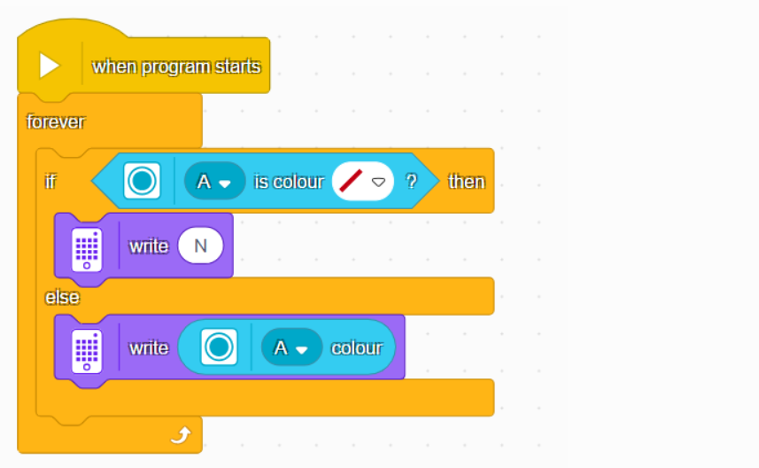

### Road Sign Recognition
1. Switch the vision module to Road Sign Recognition Mode.
2. If no road sign is recognized, the SPIKE Prime hub will display N.
3. If a road sign is recognized, the hub will display the corresponding road sign ID.

<!-- 这是一张图片，ocr 内容为： -->
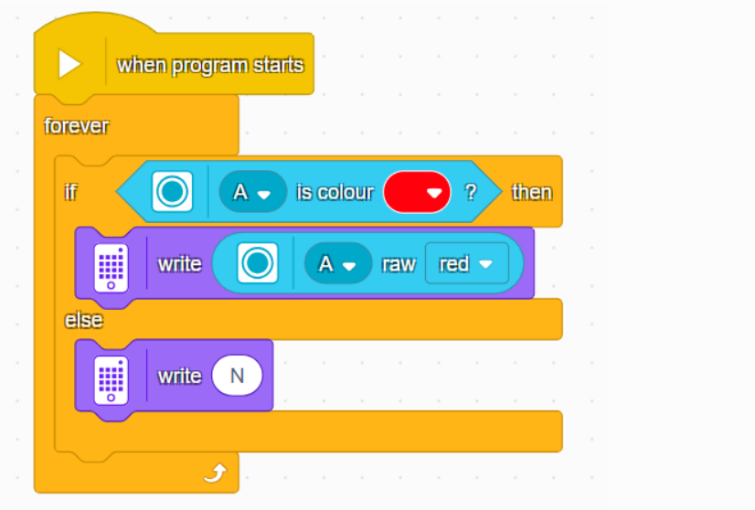

## AI Chat
Before using this function, you need to configure the network and register the identification code on Xiaozhi. For detailed instructions, please refer to the Conversation Mode document under Mode Selection.

### Get Chat Status  
<!-- 这是一张图片，ocr 内容为： -->
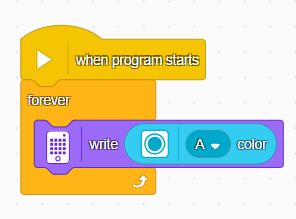

**Display the AI chat status on the LED matrix. The possible values are:**  
**0**: AI not started  
**1**: Connecting  
**2**: Standby  
**3**: Listening  
**4**: Speaking  
**5**: Network configuration in progress  

### Get Custom Command
<!-- 这是一张图片，ocr 内容为： -->
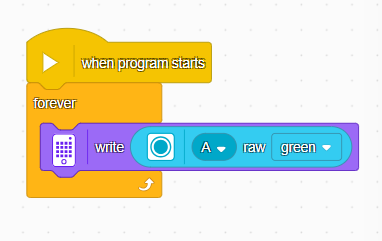

Display the custom command being executed on the LED matrix. For usage details, please refer to the description of custom commands in the Conversation Mode document under Mode Selection.

### Get Motion Command  
<!-- 这是一张图片，ocr 内容为： -->
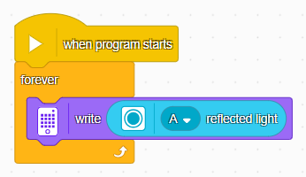

Control movement by voice, including forward, backward, turn left, and turn right, and display the corresponding command number on the LED matrix.

**Motion command values:**  
**1**: Forward  
**2**: Backward  
**3**: Turn left  
**4**: Turn right  
**5**: Stop  

### Get Motion Speed  
<!-- 这是一张图片，ocr 内容为： -->
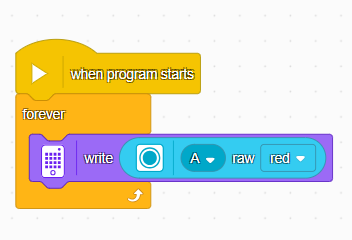
Control movement speed by voice and display the required speed on the LED matrix.  
**Motion speed range:**  
**0 ~ 100**

## WIFI Stream
Before using this function, the device needs to be connected to Wi-Fi. For detailed instructions, please refer to the WiFi Video Streaming document under Mode Selection.

### Get Web Button Values  
<!-- 这是一张图片，ocr 内容为： -->
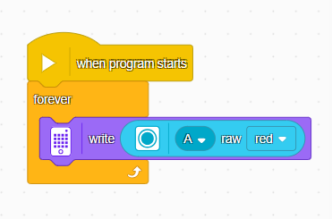

Get the values of the buttons pressed on the web page and display them on the LED matrix.

A byte is returned, and the bit positions corresponding to each button in the byte are: 0012 3456.

When a corresponding button is pressed, its bit is set to 1.

### Get Keyboard Key Values
<!-- 这是一张图片，ocr 内容为： -->
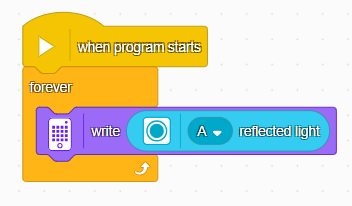

Get the values of the **W, A, S, D** keys pressed on the keyboard and display them on the LED matrix.  
A byte is returned, and the bit positions corresponding to each key in the byte are: **0000 wasd**.  
When a corresponding key is pressed, its bit is set to **1**.  

### Get Web Joystick Values  

<!-- 这是一张图片，ocr 内容为： -->
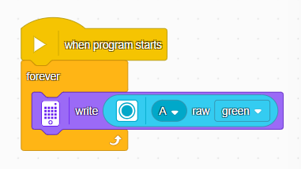

Get the value of the joystick in the **X direction** and display it on the LED matrix.  
The range is **0 ~ 200**. When the joystick is in the center position on the X axis, the value is **100**.  

<!-- 这是一张图片，ocr 内容为： -->
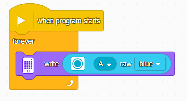

Get the value of the joystick in the **Y direction** and display it on the LED matrix.  
The range is **0 ~ 200**. When the joystick is in the center position on the Y axis, the value is **100**.  

