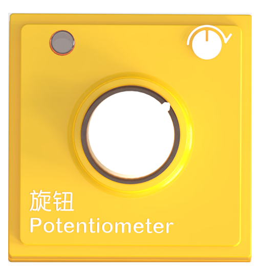
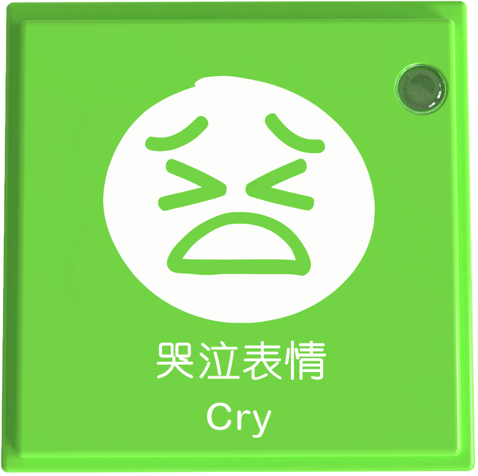
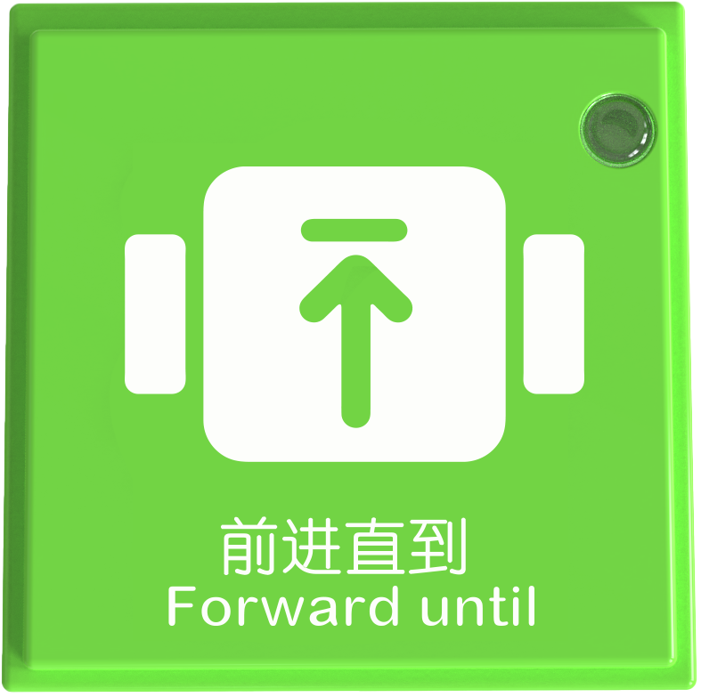
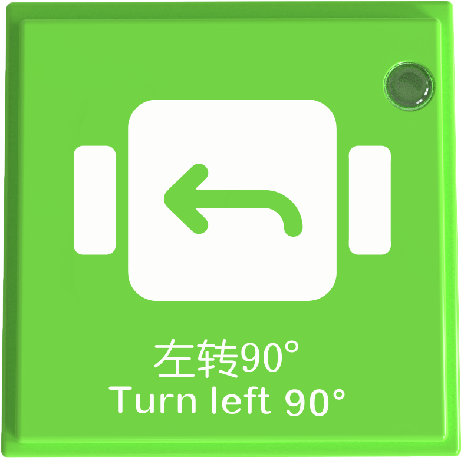
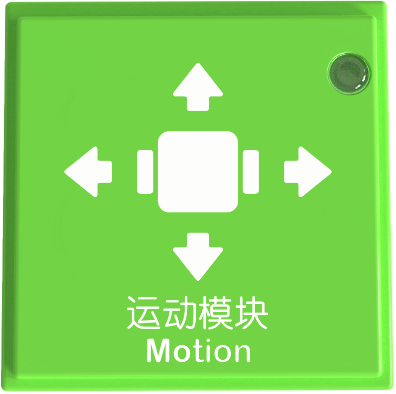
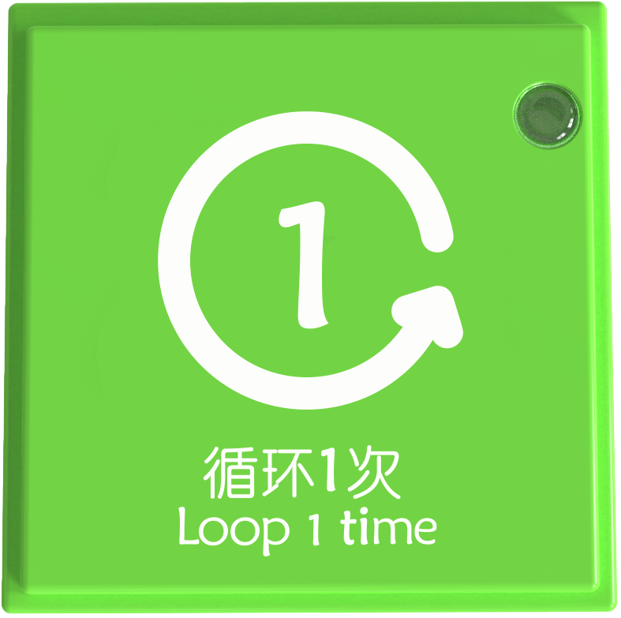

# Introduction
## Concepts  
 ![[img1]](img1/Introduction01.png)

The ICBlocks series coding blocks are educational robotic products designed specifically for children aged 3-6. They are developed based on the concept of screen-free tangible programming. The blocks feature reverse-polarity-protected magnetic connections, ensuring safety and ease of use. This design allows children to engage in robotic coding simply and intuitively, away from electronic screens, fostering comprehensive development of computational thinking and logical reasoning skills.  

## **Parts List**
|  |   |         |           |
| :---: | :---: | :---: | :---: |
| Boxy Robot | Coding Board | Power Block | Motor Block |
|  |  |  |  |
| Record Block | Expression Block | LED Block | Color LED Block |
|  |  |  |  |
| Photoelectric Block | Potentiometer Block | Gyro Block | Light Block |
|  |  |  |  |
| Sound Block | Button Block | Sad Block | Angry Block |
|  |  |  |  |
| Happy Block | Smile Block | Cry Block | Fireengine Siren Block |
|  |  |  |  |
| Police Car Siren Block |     Phone Ring Block | Train Whistle Block | Car Whistle Block |
|  |  |  |  |
| Play Recording Block | Start Motor Block | Stop Motor Block | Turn On the Light Block |
|  |  |  |  |
| Turn Off the Light Block | One Step Forward Block | Forward Until Block | Two Steps Forward Block |
|  |  |  |  |
| Step Back Block | Turn Right 90° Block | Turn Right Until Block | Turn Left Until Block |
|  |  |  |  |
| Turn Left 90° Block | Motion Block | Stop Block | Loop 1 Time Block |
|  |  |  |  |
| Loop 2 Times Block | Loop 3 Times Block | Infinite Loop Block | Memory Module |
|  |  |  |  |
| Voice Block | Transfer Block | Magnetic Extension Wire | ICRobot Multifunctional Bluetooth Handle ( Preschool ) |

## ICBlock Series of Sets
| Item |   ICBlocks Preschool Smart Coding Block Set |  ICBlocks Preschool Smart Coding Block Set（Campus）  | ** **ICBlocks Preschool Smart Coding Block Set**  ** ** （Customized）Tailored to Your Needs  ** |
| :---: | :---: | :---: | :---: |
| **Boxy Robot** | 1 | 1 | 1 |
| **Coding Board** | 1 | 1 | 1 |
| **Power Block** | 1 | 1 | — |
| **Motor Block** | 1 | 1 | — |
| **Record Block** | 1 | 1 | — |
| **Expression Block** | 1 | — | — |
| **LED Block** | 1 | 1 | — |
| **Color LED Block** | 1 | 1 | — |
| **Photoelectric Block** | 2 | 2 | — |
| **Potentiometer Block** | 1 | 1 | — |
| **Gyro Block** | 1 | 1 | 1 |
| **Light Block** | 2 | — | — |
| **Sound Block** | 1 | 1 | — |
| **Button Block** | 1 | 1 | — |
| **Happy Block** | 1 | — | — |
| **Sad Block** | 1 | — | — |
| **Cry Block** | 1 | — | — |
| **Smile Block** | 1 | — | — |
| **Angry Block** | 1 | — | — |
| **Play Recording Block** | 1 | 1 | — |
| **Police Car Siren Block** | 1 | — | — |
| **Phone Ring Block** | 1 | — | — |
| **Fireengine Siren Block** | 1 | — | — |
| **Car Whistle Block** | 1 | — | — |
| **Train Whistle Block** | 1 | — | — |
| **Forward Until Block** | 1 | — | — |
| **One Step Forward Block** | 2 | 3 | 2 |
| **Turn Left Until Block** | 1 | — | — |
| **Turn Left 90° Block** | 2 | 2 | 2 |
| **Turn Right Until Block** | 1 | — |  |
| **Turn Right 90° Block** | 2 | 2 | 2 |
| **Two Steps Forward Block** | 1 | 1 | 2 |
| **Step Back Block** | 1 | 1 | — |
| **Motion Block** | 1 | 1 | 1 |
| **Stop Block** | 1 | 1 | — |
| **Start Motor Block** | 1 | — | — |
| **Stop Motor Block** | 1 | — | — |
| **Turn On the Light Block** | 1 | 1 | — |
| ** Turn Off the Light Block** | 1 | 1 | — |
| **Loop 1 Time Block** | — | 1 | 1 |
| **Loop 2 Times Block** | — | 1 | 1 |
| **Loop 3 Times Block** | — | 1 | 1 |
| **Infinite Loop Block** | — | 1 | 1 |
| **Memory Module** | — | — | — |
| **Voice Block ** | — | — | — |
| **Transfer Block** | 2 | 2 | — |
| **Magnetic Extension Wire** | 2 | 1 | — |
| **ICRobot Multifunctional Bluetooth Handle ( Preschool )** | — | — | — |

