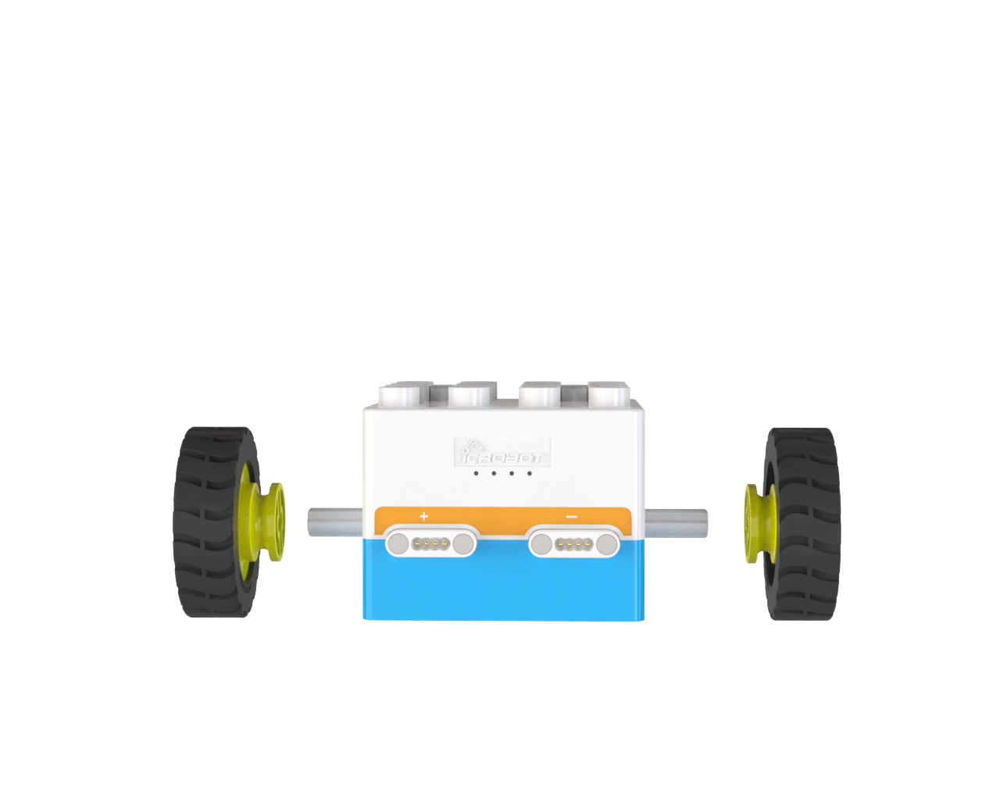

# Quick Start
## **Introduction**
The ICBlocks series offers a wide variety of blocks. To help you get started with the ICBlocks products, we have prepared a few simple examples to help you quickly understand the logic behind using ICBlocks.  

## How to use?
### Effect Demonstration:  

### Parts Preparation:  
|   |    |   |   |
| :---: | :---: | :---: | :---: |
| Boxy Robot   ×1 | Caster Wheels   ×2 | Axles   ×2 | Wheels   ×2 |

### Assembly Steps  
| Step1: Install the Axles   | |
| :---: | --- |
|  |  |
| Step2: Install the Wheels   | |
|  |  |
| Step3: Install the Caster Wheels | |
|  |  |

## Logic Control - Quick Start  
### Effect Demonstration  
|  |    |
| :---: | :---: |
| Voice-controlled Boxy Robot moves forward.   | Voice-controlled Boxy Robot moves backward.  |

### Parts Preparation  
|  |  |
| :---: | :---: |
| ICBlocks Boxy Robot   ×1 | Sound Block ×1 |

### Steps:  
#### Power On   
+ Press and hold the power button on the Boxy robot for 2s to turn it on.
+ After powering on, the four status indicators on top of the Boxy Robot will light up, displaying blue and orange colors, corresponding to the blue actuator magnetic interfaces and orange sensor magnetic interfaces, respectively.

#### Connect the Sensor  
Connect the sound block to any orange magnetic interface on the Boxy Robot (orange interfaces are for input; blue interfaces are for output).  

### Effect Demonstration  
The two orange magnetic interfaces are labeled with “+” and “-”. When using the sound block to control the ICBlocks  Boxy Robot:  

+ Connecting to the “+” interface: The Boxy Robot moves **backward** when sound is detected.
+ Connecting to the “-” interface: The Boxy Robot moves **forward** when sound is detected.

|  |  |
| :---: | :---: |
| **“-” Interface** | **Boxy Robot Moves Forward** | **“+” Interface** | **Boxy Robot Moves Backward** |

###  More Logic Control Scenarios  
|   |  |
| :---: | :---: |
| Button Logic Control   | Tilt Logic Control   |
|  |  |
| Line-following Robot   | Light-chashing Car   |

## Coding Control - Quick Start  
### Effect Demonstration  
Build a robot by combining LEGO Duplo bricks, use the coding board to control it, light up the LED block, and complete precise movements in a designated map area.  

### Parts Preparation  
|  |      |    |
| :---: | :---: | :---: |
| Boxy Robot ×1 | Coding Board×1 | Color LED Block×1 |
|   |   |   |
| One Step Forward Blocks ×2 | Turn Left 90° Blocks ×1 | Turn Right 90° Block×1 |
|   |   |   |
| Turn On the Light Block×1 |  Round Eye  ×1 |  Single-sided 4-hole Arcs  ×2 |

### Steps:  
#### Power On and Connect Bluetooth  
+ Long press the power buttons on both the Boxy Robot and coding board for 2s to power them on.
+ When the Bluetooth indicator on the coding board stops flashing and remains steady, and the two orange status indicators on the Boxy Robot turn blue, the Bluetooth connection has been successfully established.
+ If the Bluetooth connection fails, refer to the "[Maintenance and Debugging - Bluetooth Unpairing and Pairing](https://www.yuque.com/g/crystal-vzc6k/cfl3ix/kthkmblon2x7lto6/collaborator/join?token=AqV5B0GuOdypecmQ&source=doc_collaborator#%20《Bluetooth%20Unpairing%20and%20Pairing》)" section for troubleshooting.

#### Assemble the Robot  
Connect the color LED block to any magnetic interface on the ICBlocks robot, and use the prepared LEGO bricks to assemble the robot as shown in the diagram below.  

#### Coding
Connect the pre-arranged coding instruction blocks to the coding board in the desired sequence.  

#### Start the Code
Press the “Start” button on the coding board to execute the program in order, from left to right.  

