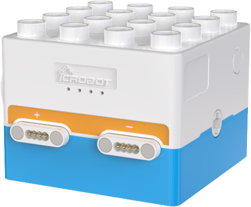
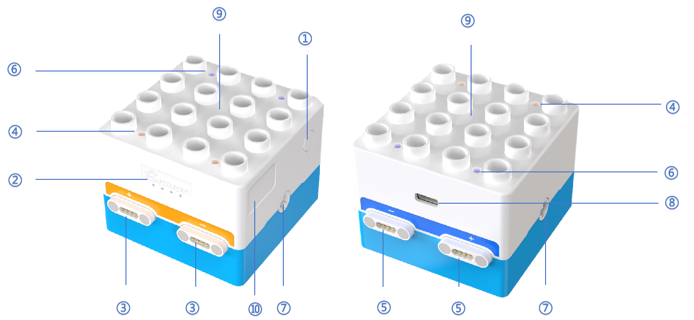

# Boxy Robot  
## Overview  

Boxy Robot, part of the ICBlocks series, integrates four main functions: controller logic control, actuator logic control, screen-free coding, and Bluetooth handle remote control.  

## Structure

| **No.** | **Name** | **Description** |
| :---: | :---: | --- |
| **①** |  Power Button   |  Press and hold the power button for 2s to turn the Boxy Robot on/off.   |
| **②** | Battery Indicator   | Battery Status:   1.  Charging State   **a. Charging:** A single indicator light flashes.   **b. Fully Charged:** All four indicator lights remain on.   2.  Operating State        1. **Full Battery:** All four indicator lights remain on.     2. **Low Battery Warning:** A single indicator light flashes while the others are off, indicating low battery.   |
| **③** | Orange Magnetic Ports |  Two orange magnetic ports ("+" and "-") are available. In logic control mode, orange ports pair with corresponding blue ports.   |
| **④** | Orange Status Indicator  | Introduction： 1. **Port Type Indicator**: The orange status light indicates that the port supports connection to orange sensor blocks.   2. **Block Recognition Indicator**: + When an orange magnetic port successfully recognizes an orange sensor block, the status light will flash briefly. + If the block is not successfully recognized, the status light will remain off. 3. **Bluetooth Connection Indicator**:   When the Boxy Robot successfully establishes a Bluetooth connection with the coding board or the ICrobot multifunctional Bluetooth handle, the orange status light will switch to blue, indicating that the Bluetooth connection is established.   |
| **⑤** | Blue Magnetic Ports   | Two blue magnetic ports ("+" and "-") are available. In logic control mode, blue ports pair with corresponding orange ports.   |
| **⑥** |  Blue Status Indicator   | Introduction： 1. **Port Type**:        Lights up to indicate compatibility with blue actuator blocks.   2. **Block Recognition**： When a blue magnetic port successfully recognizes a blue actuator block, the status light will flash briefly.   If the block is not successfully identified, the indicator is not flashing. |
| **⑦** | Power Output Axle Connector   | Equipped with two built-in geared motors. The connectors are compatible with ICBlocks long or short axles and LEGO DUPLO axle components.   |
| **⑧** | USB-C Port   | Used for charging and firmware upgrades.   |
| **⑨** | Building Structure   | Compatible with LEGO DUPLO large-brick building blocks.   |
| **⑩** | Label Area   | Provides space for attaching Bluetooth pairing labels for the controller and programming remote.   |

## Specifications  
| **Item** | **Description** |
| :---: | :---: |
| **Name** | ICBlocks-Boxy Robot |
| **Code** |  B0010002   |
| **Dimensions** |  70 × 64 × 52.5 mm   |
| **Weight** | 146 g |
| **Material** | ABS |
| **Main Board/Chip** | STM32F103C8T6 |
| **Connectivity** | BLE4.2/USB-C |
| **Charging Input** | 5V/1A |
| **Battery Capacity** | 1500mAh（LiPo）  |
| **Battery Life** | 4 h |
| **Coding Support** |  Screen-free Coding |
| **Sensor Magnetic Ports** | 2 |
| **Actuator Magnetic Ports** | 2 |
| **Building Compatibility** |  LEGO DUPLO   |
| **Age** | 3+ |

##  Usage Instructions  
The Boxy Robot serves as the core control hub for the ICBlocks series, offering diverse functionalities to meet a variety of robotic operation needs.  

| ** Mode  ** | **Description  ** | **Example  ** |
| :---: | --- | :---: |
|  Controller Logic Control   | The Boxy Robot is directly connected to the sensor, and the logic control function of the Boxy Robot is realized through the input. The data feedback from the sensors drives the robot to perform the corresponding action. | 
 |
| External Sensor Control | The Boxy Robot supports the precise control of the sensor to the actuator through logic control. |  |
|  Screen-free Coding   | The Boxy Robot is paired with the coding board control via Bluetooth to support screen-free coding operation. Users can directly use the coding board control to design and run the control program. | 
 |
| ** **Bluetooth Handle Remote Control ** ** | The Boxy Robot is connected with the ICrobot multi-function handle through Bluetooth to easily realize accurate remote operation. | 
 |

## Firmware Upgrade  
Please click the link to view the detailed steps to perform a firmware upgrade.

 [Boxy Robot Firmware Upgrade Tutorial Link  ](https://www.yuque.com/g/crystal-vzc6k/cfl3ix/gy3t1bv6t9rp8avw/collaborator/join?token=Sl2UArygKC6EooFg&source=doc_collaborator#%20《Boxy%20Robot%20Firmware%20Upgrade》)

