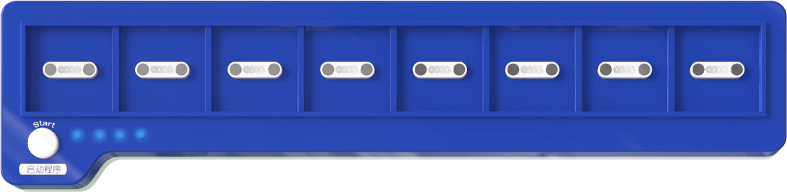
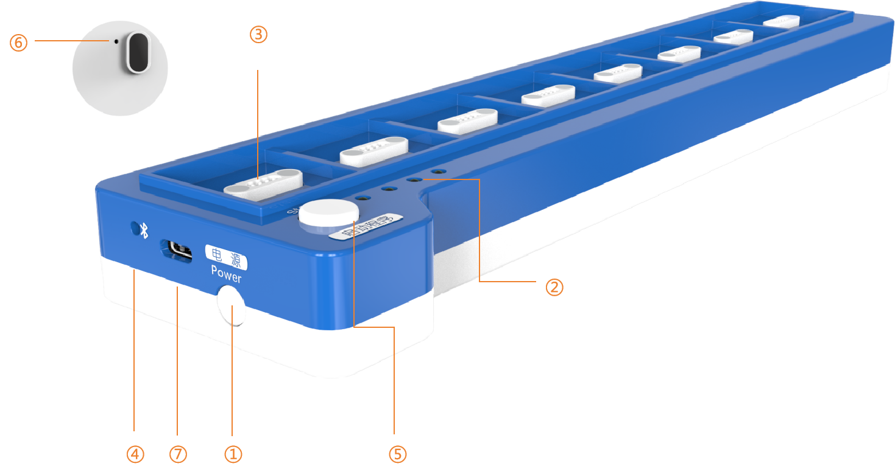
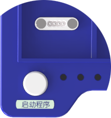

# Coding Board
## Introduction  

The ICBlocks coding board is a screen-free coding platform based on the ICBlocks product series. The coding board supports green coding command blocks and orange sensor blocks,  which can be used as coding blocks and placed directly on the coding board. By connecting via Bluetooth to the Boxy Robot, the coding board sends coding instructions to the Boxy Robot to execute the coding operations.  

## Structure

| No.   | Name   |  Description   |
| :---: | :---: | --- |
| **①** | Power Button   | Press and hold the power button for 1s to turn the device on/off.   |
| **②** | Battery Indicator   | Battery Status:   1. Charging:      1. Charging: Single light flashes      2. Fully charged: 4 lights stay on   2. Working:       1. Full charge: 4 lights stay on       2.  Low battery warning: A single light flashes while others turn off, indicating low battery.   |
| **③** | Magnetic Block Ports    | 8 magnetic interfaces for placing green coding blocks and orange sensor blocks.   |
| **④** | Bluetooth Status Indicator   | A steady light indicates that Bluetooth is connected; flashing indicates Bluetooth is not connected.   |
| **⑤** | Start Button   | 1.  Start the program:    Click the start button to execute the program from left to right.   2. Skip current instruction:   During program execution, click the start button to skip the current instruction block and move to the next one.   3. Enter debug mode： In the off state, press and hold the start button, then press the power switch for 1s to turn it on and enter debug mode. The coding board can then be connected and adjusted via ICBlocks debugging software.   |
| **⑥** | Reset Button   | In the on state, click the reset button to unbind from the current Boxy Robot via Bluetooth, allowing for a new search and connection to another Boxy Robot.   |
| **⑦** | USB-C Port |  Used for charging the coding board and firmware upgrades.   |

## Specifications  
| **Item** | **Description** |
| :---: | :---: |
| **Name** | ICBlocks- Coding Board   |
| **Code** |  B0010001   |
| **Dimensions** |  297×70×30 mm |
| **Weight** | 244 g |
| **Appearance Material** | ABS |
| **Mainboard/Chip** | STM32F103RBT6 |
| **Battery Capacity** | 1100mAh（LiPo) |
| **Charging Input** | 5V/1A |
| **Battery Life** | 7 h |
| **Connection/Transmission** | BLE4.2 / USB-C |
| **Coding Support** |  Screen-Free Coding |
| **Magnetic Block Ports** | 8 |
| **Age** | 3+ |

##  Usage Instructions  
The coding board is a screen-free coding platform based on ICBlocks series products. It combines green coding command blocks and orange sensor blocks to meet various robot coding needs. Using the coding board, users can control the Boxy Robot's built-in motors and blue actuator blocks to realize a wide range of coding functions.  

| **Mode** | **Description** | **Example** |
| :---: | --- | :---: |
| **Built-in Motor  Coding** | Using motion command blocks, control the Boxy Robot's built-in motors to move forward, backward, turn left, right, etc., easily achieving basic motion control.   |  |
| **Blue Actuator  Block Coding** | Use motor control commands, expression commands, sound recording commands, light control commands, and more to drive the blue actuator block for advanced functions like motor rotation, expression changes, sound playback, and light control.   |  |
| **Sensor Interaction Coding** | Combine sensor blocks with robot-related or motion instruction blocks to enable the sensors to detect the environment and control the Boxy Robot's actions, giving it intelligent response capabilities.   |  |

## Firmware Upgrade  
 Please click the link to view the detailed steps to perform a firmware upgrade.

 [Coding Board Firmware Upgrade Tutorial Link](https://www.yuque.com/g/crystal-vzc6k/cfl3ix/sn1gzlp8eczwvmtg/collaborator/join?token=NJhFKsFmFvnJVNYm&source=doc_collaborator#%20《Coding%20Board%20Firmware%20Upgrade》)  

## Version Notes  
This document is intended for the new version of the ICBlocks coding board and is not suitable for the older version. The distinction between the new and old versions can be seen below: 

| **New Version Coding Board** | **Old Version Coding Board** |
| :---: | :---: |
|   The "Start" label is printed above the start button in the new version.   |   The "Start" label is **not** printed above the start button in the old version.   |

