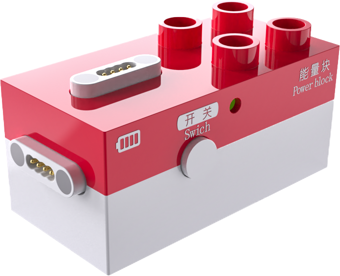
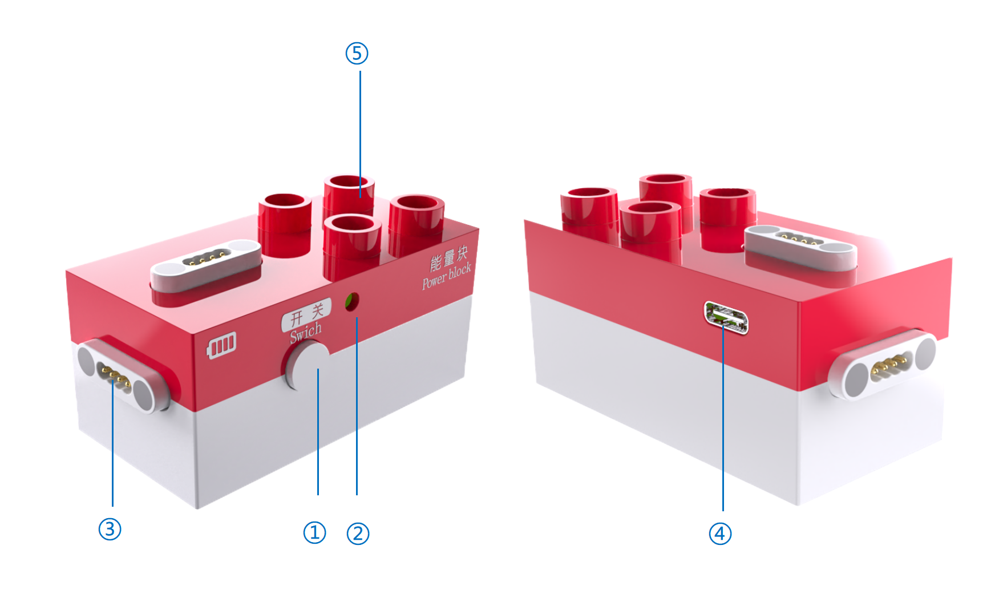

# Power Block
## Introduction  

The Power Block is an independent power supply block that provides power to motors, record block, expression block, and LED block.

## Structure

|  No.   |  Name   |  Description   |
| :---: | :---: | --- |
| **①** | Power Button   | Press and hold the power button for 1s to turn the device on/off.   |
| **②** |  Battery Indicator   | Battery Status:   1. Charging State   a. Charging: Green light flashes    b. Fully charged: Green light stays on   2.  Operating State    Power levels are indicated by four color-coded levels:    Green: Full charge; Yellow: High battery; Orange: Medium battery; Red: Low battery.   Low Battery Warning: Red light flashes to indicate insufficient power.   |
| **③** |  Magnetic Port | Two magnetic ports that can provide power to actuator blocks.   |
| **④** | USB-C Port | Used for charging the Power Block and for firmware upgrades.   |
| **⑤** | Building Structure | Compatible with LEGO DUPLO large-brick building blocks.   |

## Specifications
| **Item** | **Description** |
| :---: | :---: |
| ** Name  ** | ICBlocks- Power Block   |
| ** Code  ** |  B0010015   |
| ** Dimensions  ** |  66×33.5×32 mm   |
| ** Weight  ** | 38 g |
| ** Appearance Material  ** | ABS |
| ** Mainboard/Chip  ** | STM32G030F6P6 |
| ** Battery Capacity  ** | 650mAh（LiPo） |
| ** Charging Input  ** | 5V/1A |
| ** Battery Life  ** | 3 h |
| ** Connection/Transmission  ** | USB-C |
| **Magnetic Block Ports ** | 2 |
| **Building Compatibility** |  LEGO DUPLO |
| **Age  ** | 3+ |

## Usage Instructions
By directly connecting the record block, expression block, LED block (or color LED block), and motors to the Power Block's magnetic ports, users can directly control and operate these actuator blocks.  

|   |    |    |    |
| :---: | :---: | :---: | :---: |
|  Play sound  | Display expressions   | Illuminate LED light | Rotate motor   |

## Version Notes  
This document is intended for the new version of the ICBlocks Power Block and is not applicable to the older version. The differences between the new and old versions are as follows:  

1. **New Version:** Sound effects during power on/off, LED light flashes during charging.
2. **Old Version:** No sound effects during power on/off, LED light stays on during charging.

