# Output Blocks
##  Motor Block  
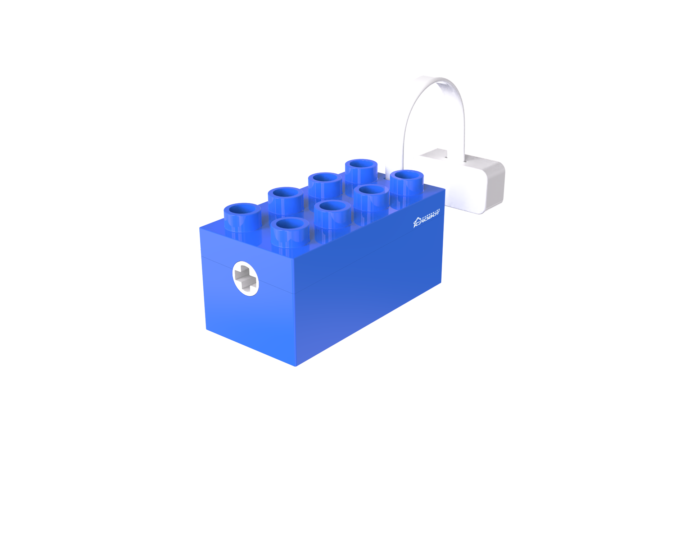

### **Introduction**
The Motor Block provides rotational power. The motor houses an N20 gear motor that generates power using the electromagnetic principle of the DC motor, and the gearbox reduces the speed to increase torque. The motor speed is controlled by an integrated main control chip and motor driver chip, enabling precise control.  

###  Structure
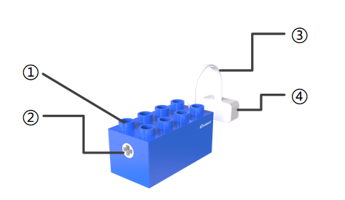

|  No.   |  Name   |  Description   | |
| :---: | :---: | :---: | --- |
| **①** | **Building Structure** |  Compatible with LEGO Duplo series building blocks   | |
| **②** | **Power Output Shaft Connector** | Outputs power from the built-in motor and connects with the building structure   | |
| **③** | **Magnetic Connector Cable** |  Connects to the magnetic port, transmitting signals   | |
| **④** | **Magnetic Suction Base** | Used for connecting the block to the Boxy Robot, providing stable power and data transmission   | |

### Specifications
| **Item** | **Description** |
| :---: | :---: |
| **Name** | ICBlocks-Motor Block   |
| **Code** | B0010009 |
| **Dimensions** |  63.3 (+275) x 31.4 x 33.4 mm   |
| **Weight** | 49 g |
| **Material** | ABS |
| **Valid IDs** | 1081~1380 |
| **Operating Voltage** | 3.3 V |
| **Connection Method** |  Magnetic   |

### Usage Instructions 
|  Type   |  Description   |  Example   |
| :---: | --- | --- |
| **Direct Control by Power Block** | Connect the motor to the magnetic interface of the Power Block, long press the switch for 1s to start the motor.   |  |
| **Logic Control by Boxy Robot** | Connect the sensor block to the **orange input port** of Boxy Robot to control the motor on the **blue output port**. Note: "+" and "-" must correspond on input and output ports.   The photoelectric block connects to the orange input "+" to control motor rotation on the blue output "+".   |  |
| **Screen-Free Coding Control** | Using the coding board and green coding blocks, start or stop the motor using the start motor and stop motor blocks.   |  |
| **Bluetooth Controller Remote Control** | After connecting the Boxy Robot to the Bluetooth controller, push or pull the right joystick to control the motor's forward or reverse motion.    |  |

## Expression Block  

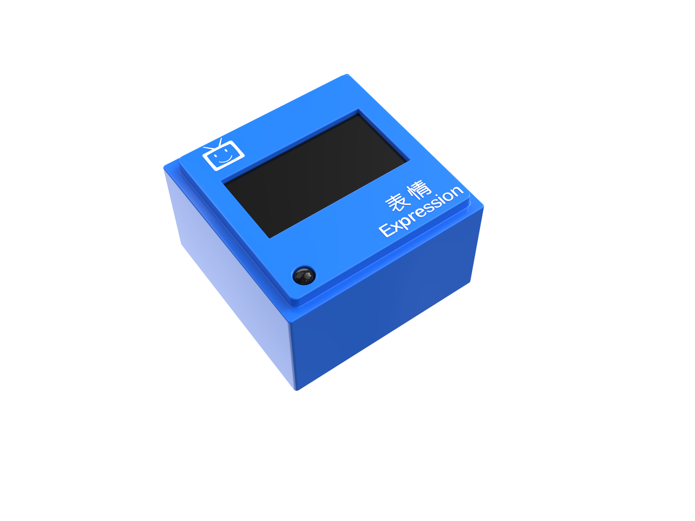

### Introduction
The Expression Block displays specified content and supports two display modes: expressions and counts. The mode can be switched by pressing a button.  

| Expression Display Mode   |  Count Display Mode   |  Button Illustration   |
| --- | :---: | --- |
| 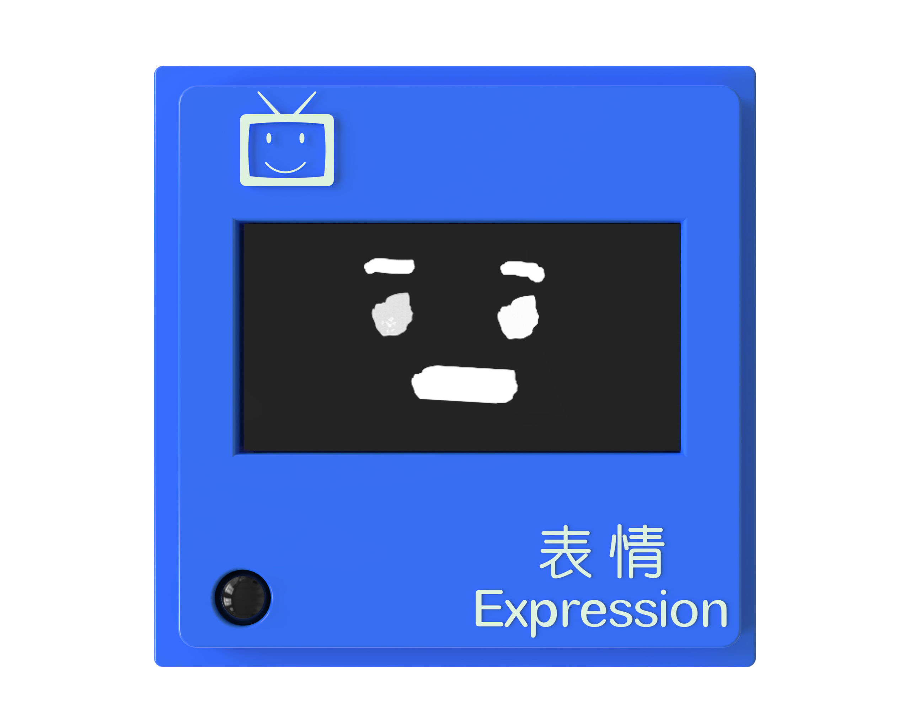 | 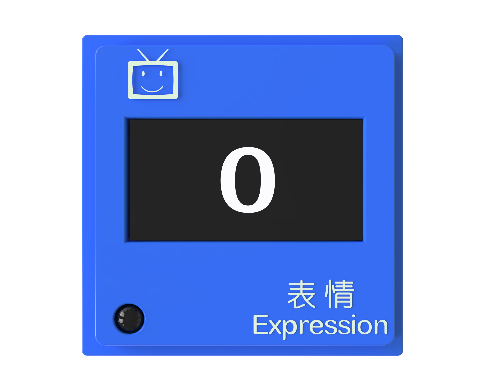 | 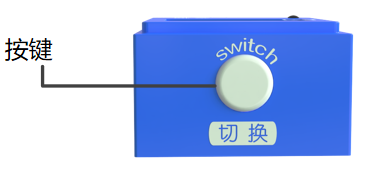 |
| Built-in 5 expressions: happy, sad, crying, smiling, and angry.   |  Displays numbers from 0 to 99.   | In the expression display mode, the button switches expressions. In the count display mode, the button switches numbers. |

###  Structure  
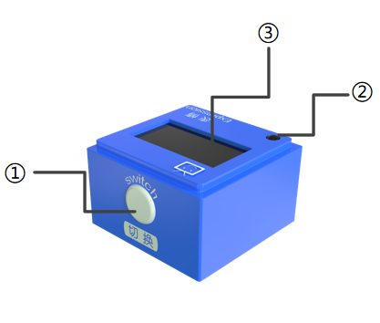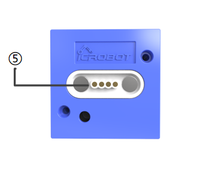

|  No.   |  Name   | **Description** | |
| :---: | :---: | :---: | --- |
| **①** | Button   | Switch  | |
| **②** |   Power Indicator  |  Indicates if the block is successfully connected to the Boxy Robot   | |
| **③** |  Screen   | Displays content   | |
| **④** | Magnetic Suction Base | Used for connecting the block to the Boxy Robot, providing stable power and data transmission   | |

### Specifications
| Item | **Description** |
| :---: | :---: |
| **Name** | ICBlocks-Expression Block |
| **Code** | B0010011 |
| **Dimensions** | 32 x32 x 21 mm |
| **Weight** | 16 g |
| **Material** | ABS |
| **Valid IDs** | 561~680 |
| **Operating Voltage** | 3.3 V |
| **Connection Method** |  Magnetic |

### Usage Instructions 
| Type | Description | Example |
| :---: | --- | --- |
| **Direct Control by Power Block** | The Expression Block has two modes: Expression Display and Count Display. Connect to the Power Block's magnetic interface, long press the switch for 1s to start, it will display one mode, remove and reattach to display the other mode.   |  |
| **Logic Control by Boxy Robot** | Connect the sensor block to the orange input port and the expression block to the blue output port. Ensure "+" and "-" match.   + **Expression Display Mode:** Connect the button module to the orange input port "+" to control the blue output port "+" Expression Module. Press the button sensor to cycle through happy, crying, sad, smiling, and angry expressions. + **Number Display Mode:** Connect the button module to the orange input port "-" to control the blue output port "-" Expression Module. Press the button sensor to cycle through numbers 0 to 99 in the number display mode. |  |
| **Screen-Free Coding Control** | Using the coding board and green coding blocks, you can control the expression block to show one of five expressions: happy, sad, crying, smiling, or angry.   |  |
| **Bluetooth Controller Remote Control** | After connecting Boxy Robot to the Bluetooth controller, press the button to switch between happy, sad, crying, smiling, and angry expressions.   |  |

## Record Block  
## 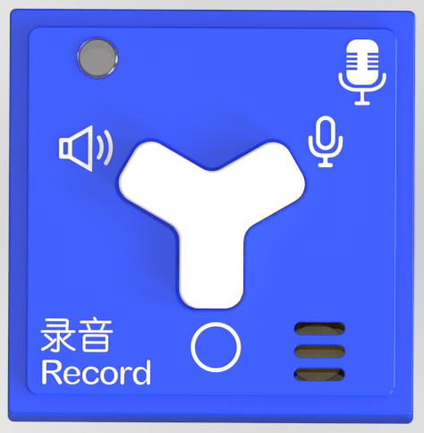

### Introduction
The Record Block contains both a speaker and a microphone, capable of playing recorded sounds and 6 built-in sounds.  

### Structure  
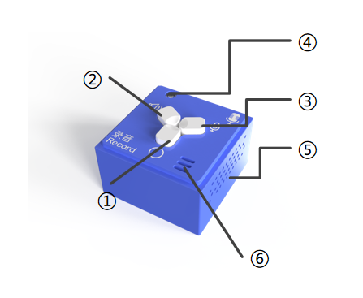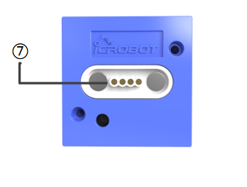

|  No. | Name   | Description   | |
| :---: | :---: | :---: | --- |
| **①** | ⚪ Button   | Press to switch to the next sound; cycles back to the first one at the end   | |
| **②** | 🔈 Button   | Play the current sound source   | |
| **③** |  🎙 Button   | Press and hold to record sound   | |
| **④** |   Power Indicator   |  Indicates if the block is successfully connected to the Boxy Robot   | |
| **⑤** | Speaker & Sound Hole   | The speaker hole for sound output   | |
| **⑥** | Microphone & Pickup Hole   | The microphone hole for sound recording   | |
| **⑦** | Magnetic Suction Base | Used for connecting the block to the Boxy Robot, providing stable power and data transmission   | |

### Specifications
| **Item** | **Description** |
| :---: | :---: |
| **Name** | ICBlocks-Record Block |
| **Code** | B0010010 |
| **Dimensions** | 32 x 32 x 21 mm |
| **Weight** | 15 g |
| **Material** | ABS |
| **Valid IDs** | 3260~3500 |
| **Operating Voltage** | 3.3 V |
| **Connection Method** | Magnetic   |

### Usage Instructions 
| Type   | Description |  Example   |
| :---: | --- | --- |
| **Direct Control by Power Block** | Connect the Record Block to the Power Block's magnetic interface, long press the switch for 1s to start, press 🔈 to play the selected sound, press 🎙 to record sound, press ⚪ to switch between built-in sounds.   |  |
| **Logic Control by Boxy Robot** | Connect the sensor block to the orange input port of Boxy Robot, control the record block on the blue output port. Note: "+" and "-" must correspond on input and output ports.    |  |
| **Screen-Free Coding Control** | Using the coding board and green coding blocks, use Car Whistle Block, Fireengine Siren Block, Train Whistle Block, Police Car Siren Block, and Play Recording Block to control the sounds.   |  |
| **Bluetooth Controller Remote Control** | After the  Boxy Robot   is connected with the Bluetooth handle, press switch button to switch between Car Whistle Block, Fireengine Siren Block, Train Whistle Block, Police Car Siren Block, and Play Recording Block,press play button  to play recordings.   |  |

## LED Block & Color LED Block

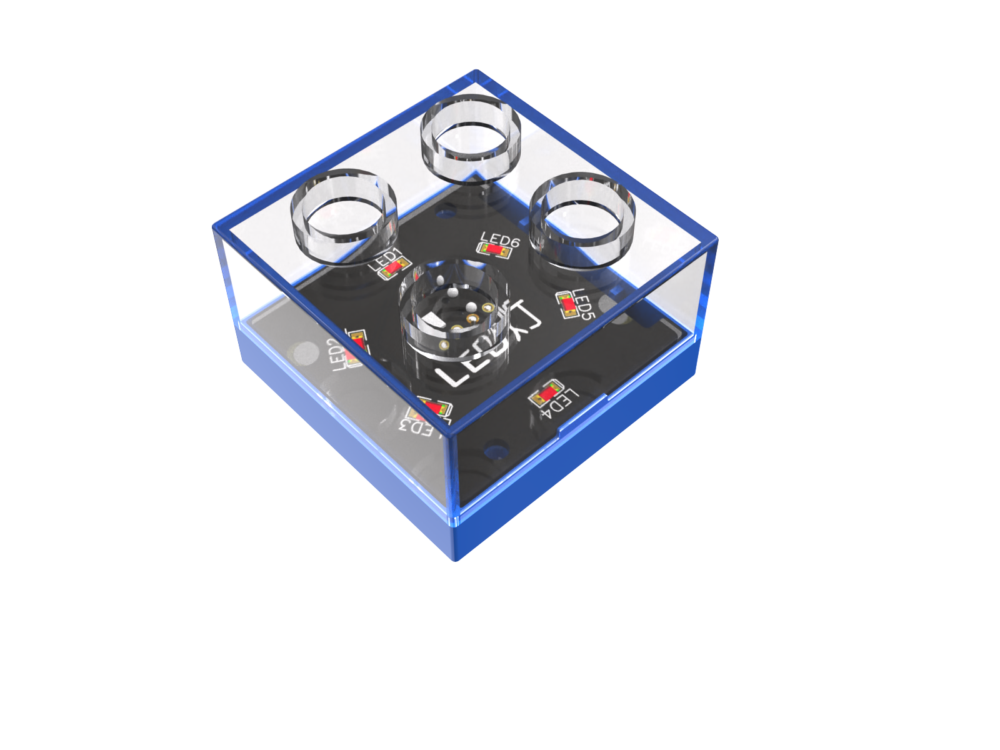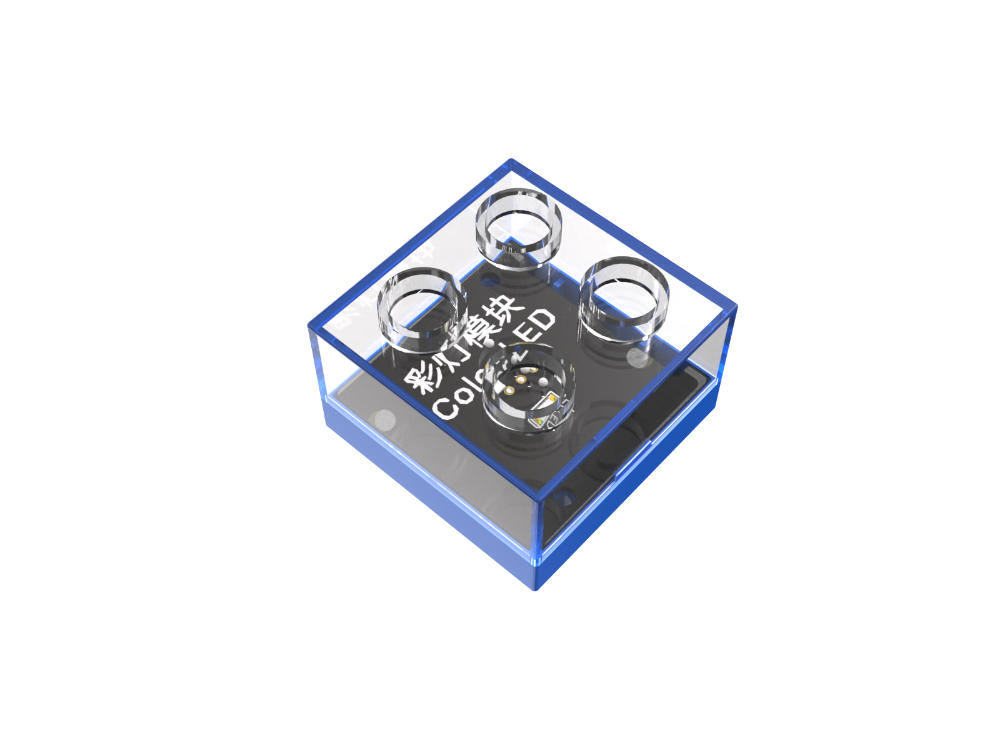

### Introduction
The LED Block emits white light.  
The Color LED Block emits alternating flashing colored lights.  

###  Structure  
| **Color LED Block** | **LED Block** | **Block Back** |
| :---: | :---: | :---: |
| 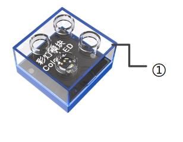 | 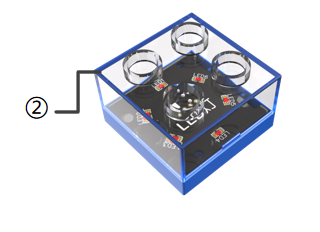 | 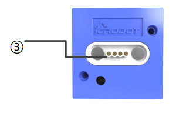 |

|  No.   |  Name   |  Description   | |
| :---: | :---: | :---: | --- |
| **①** | Transparent Case   |  Protects the internal LED and electronic components   | |
| **②** | Transparent Case   |  Protects the internal LED and electronic components   | |
| **③** | Magnetic Suction Base | Used for connecting the block to the Boxy Robot, providing stable power and data transmission   | |

###  Specifications
| **Item** | **Description** |
| :---: | :---: |
| **Name** | ICBlocks-LED Block |
| **Code** | B0010012 |
| **Operating Voltage** | 32 x 32 x 24 mm |
| **Weight** | 11 g |
| **Material** | ABS |
| **Valid IDs** |  681~880 |
| **Operating Voltage** | 3.3 V |
| **Connection Method** | Magnetic  |

| **Item** | 描述 |
| :---: | :---: |
| **Name** | ICBlocks-Color LED Block |
| **Code** | B0010013 |
| **Operating Voltage** | 32 x 32 x 24 mm |
| **Weight** | 11 g |
| **Material** | ABS |
| **Valid IDs** |  681~880 |
| **Operating Voltage** | 3.3 V |
| **Connection Method** | Magnetic  |

### Usage Instructions 
|  Type |  Description  |  Description  |
| :---: | --- | --- |
| **Direct Control by Power Block** | Connect the LED or Color LED Block to the Power Block's magnetic interface, long press the switch for 1s to start the light. The LED emits white light / Color LED emits alternating colored lights.   |  |
| **Logic Control by Boxy Robot** | Connect the sensor block to the orange input port of Boxy Robot, control the LED block on the blue output port. Note: "+" and "-" must correspond on input and output ports.   + **Clockwise:** Connect the Potentiometer Block to the orange input "+" and the Color LED/LED Block to the blue output "+". The block will gradually brighten. + **Counterclockwise:** Connect the Potentiometer Block to the orange input "-" and the Color LED/LED Block to the blue output "-". The block will gradually dim until it turns off. |  |
| **Screen-Free Coding Control** | Using the coding board and green coding blocks,  use the light on/off blocks to control the Color LED/LED blocks.    |  |
| **Bluetooth Controller Remote Control** |  After connecting Boxy Robot to the Bluetooth controller,  press turn on the light button  to  turn the Color LED/LED on or off. |  |

