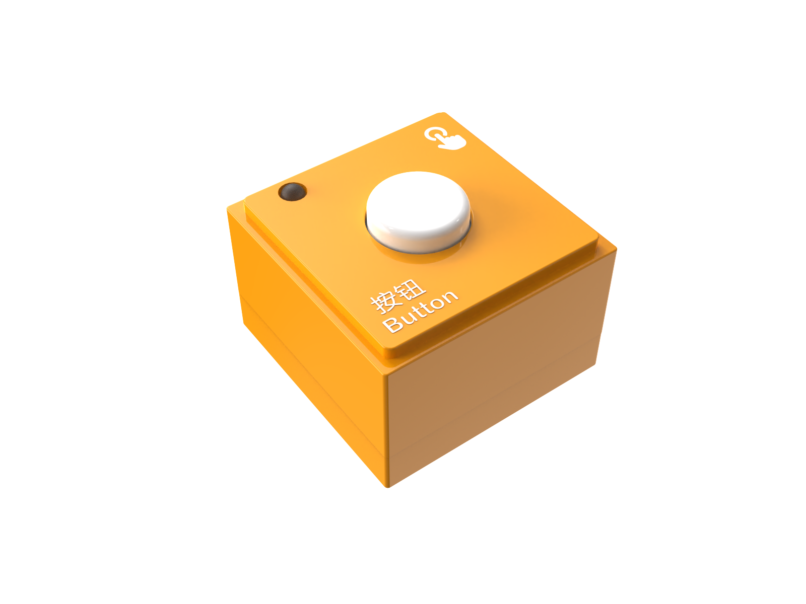

# Input Blocks
## Photoelectric Block
    

### **Introduction**
The Photoelectric Block is primarily used to detect light intensity and changes. It operates on the principle of the photoelectric effect by measuring the intensity of light received by the sensor to respond to variations in light.

### **Structure**

| No. |  Name   |  Description   | |
| :---: | :---: | --- | --- |
| **①** | Power Indicator | Indicates whether the block is successfully connected to the Boxy Robot. | |
| **②** | Photoelectric Sensor | Emits and receives light signals to detect objects or changes. | |
| **③** | Magnetic Suction Base | Used for connecting the block to the Boxy Robot, providing stable power and data transmission.  | |

### Specifications
| **Item** | **Description** |
| :---: | :---: |
| **Name  ** | ICBlocks-Photoelectric Block |
| **Code ** | B0010007 |
| **Dimensions ** | 32 x32 x 21.0 mm |
| **Weight** | 12 g |
| **Material ** | ABS |
| ** Valid IDs  ** | 0~54 |
| **Operating Voltage ** | 3.3 V |
| **Connection Method ** | Magnetic |
| **Effective Range** | 1～120mm |

### **Usage Instructions**
| Type | Description |  Example   |
| --- | --- | --- |
| **Logic Control by Boxy Robot ** **** | Single Photoelectric block: Connect the block to the Boxy Robot's orange input terminal to control the built-in motor movement. |  |
| | Dual Photoelectric blocks: Connect one block each to the "+" and "-" terminals of the Boxy Robot's orange input. The Boxy Robot enters line-following mode, and all port indicators turn blue. When the photoelectric block detects white, the indicator turns orange, controlling the motor to complete the line-following task. |  |
| **Actuator Logic Control** | Connect the photoelectric block to the Boxy Robot's orange input terminal to control the blue output terminal actuator block. Ensure the "+" and "-" terminals correspond.   Example: Connect the photoelectric block to the orange "+" input terminal to control the blue "+" output terminal motor rotation.   |  |
| **Block Interactive Coding** | The block can be used with "Until" blocks as a waiting module. When a white object is detected, the Boxy Robot stops executing the "Until" command and waits for a new trigger signal.  |  |

#### **Sensitivity Adjustment**
|  |  |  |
| --- | --- | --- |
| 1. Connect the photoelectric block to the Boxy Robot using a magnetic extension wire. | 2. Adjust the potentiometer screw at the bottom of the block using a screwdriver, turning clockwise slowly as shown. The indicator turns off when the block detects a black line or obstacle and lights up when no black line is detected. | 3. Block the block's transmitter and receiver with your hand or an object. If the built-in motor stops automatically within 1-2 seconds, the adjustment is complete.   |

_Note:_ Use a screwdriver with an SL2.0 specification. Rotate slowly and avoid large angle adjustments.

## **Light Block**

### **Introduction**
The Light Block detects changes in ambient light intensity based on the photoelectric effect. It typically he uses photosensitive components (e.g., photoresistors) to sense light intensity and convert the changes into electrical signals for the control system.

### Structure

| No. |  Name   |  Description   | |
| :---: | :---: | --- | --- |
| **①** | Power Indicator | Indicates whether the block is successfully connected to the Boxy Robot. | |
| **②** | Light Sensor | Detects ambient light intensity. | |
| **③** | Magnetic Suction Base | Used for connecting the block to the Boxy Robot, providing stable power and data transmission.  | |

### Specifications
| **Item** | **Description** |
| :---: | :---: |
| **Name  ** | ICBlocks-Light Block |
| **Code  ** | B0010006 |
| **Dimensions  ** | 31.6 x 31.6 x 21.0 mm |
| **Weight** | 13 g |
| **Material** | ABS |
| ** Valid IDs  ** | 55~154 |
| **Operating Voltage  ** | 3.3 V |
| **Connection Method** | Magnetic   |

### Usage Instructions 
| Type | Description   |  Example  |
| --- | --- | --- |
| **Logic Control by Boxy Robot** **** | Single Light Block: Connect the light block to the Boxy Robot's orange input terminal to control the built-in motor movement. |  |
| | Dual Light Sensors: Connect one light block each to the "+" and "-" terminals of the Boxy Robot's orange input. The controller enters light-tracking mode, and all port indicators turn blue. When the light sensor detects darkness, the indicator turns orange, controlling the motor to complete the light-tracking task.  |  |
| **Actuator Logic Control** **** | Connect the light block to the Boxy Robot's orange input terminal to control the blue output terminal actuator module. Ensure the "+" and "-" terminals correspond.  Example: Connect the light module to the orange "+" input terminal to control the blue "+" output terminal motor rotation.  |  |
| **Sensor Interactive Coding** | The block can be used with "Until" blocks as a waiting module. When darkness is detected, the Boxy Robot stops executing the "Until" command and waits for a new trigger signal. |  |

#### **Sensitivity Adjustment**
When using the light detection block, if the light block cannot detect the light change or the sensitivity does not meet the requirements, the sensitivity of the block needs to be adjusted according to the following steps.

|  |  |  |
| --- | --- | --- |
| 1、 Use two magnetic extension wires to connect the light block to the Boxy Robot in light-tracking mode. | 2、Adjust the screw at the indicated position using a screwdriver. | 3、Observe the Boxy Robot's top indicators. When light shines on the block, the indicator changes from blue to orange, indicating successful calibration. |

_Note:_ Use a screwdriver with an SL2.0 specification. Rotate slowly and avoid large angle adjustments.

## Sound Block  

###  Introduction:  
The Sound Block collects environmental sounds through a microphone, converts them into electrical signals, and outputs a digital signal after processing, responding to specific sound variations.  

###  Structure:  

|  Name   |  Name   | **Description** | |
| :---: | :---: | :---: | --- |
| **①** | Power Indicator |   Indicates if the block is successfully connected to the Boxy Robot.  | |
| **②** |  Sound Sensor   |   Picks up ambient sounds and provides sound signal input.   | |
| **③** | Magnetic Suction Base | Used for connecting the block to the Boxy Robot, providing stable power and data transmission   | |

### Specifications
| Item | **Description** |
| :---: | :---: |
| **Name ** | ICBlocks-Sound Block |
| ** Code  ** | B0010004 |
| **Dimensions** | 31.6 x 31.6 x 21.0 mm |
| **Weight** | 13 g |
| **Material ** | ABS |
| ** Valid IDs  ** | 155~244 |
| **Operating Voltage ** | 3.3 V |
| **Connection Method ** |  Magnetic |

### Usage Instructions 
| Type | Description | Example |
| :---: | --- | --- |
| **Logic Control by Boxy Robot ** | Connect the sound block to the orange input port of the Boxy Robot to control motor motion.     |  |
| **Actuator Logic Control** | Connect the sound block to the orange input port and actuators to the blue output port. Ensure matching "+" and "-" terminals.    Example: Sound Block "+" connects to the orange input "+" to control the motor via blue output "+" terminal.   |  |
| **Block Interactive Coding** | Use with "Until" blocks as a wait module. When sound is detected, the Boxy Robot stops the "Until" command and waits for a new trigger signal.   |  |

### Sensitivity Adjustment  
|  |  |  |
| --- | --- | --- |
| 1. First, connect the Boxy Robot to the sound block with the magnetic extension wire. | 2. a Use a screwdriver to turn the potentiometer screw at the bottom clockwise until the indicator light turns off.   | 3. Test by producing sounds near the detection hole. If the sensitivity is unsatisfactory, repeat steps 2 and 3 until achieving the desired sensitivity.   |

Note: Recommended screwdriver size is SL2.0. Adjust slowly without large rotations.  

## Button Block  

### Introduction
The Button Block changes the circuit state by pressing the switch, sending a signal to the controller to trigger preset actions or responses.  

### Structure  

| No. |  Name   |  Description    | |
| :---: | :---: | :---: | --- |
| **①** | Power Indicator | Indicates whether the block is successfully connected to the Boxy Robot or the coding board. | |
| **②** |  Button Sensor   |  Detects button press as an input signal for the Boxy Robot or actuators.    | |
| **③** | Magnetic Suction Base | Used for connecting the block to the Boxy Robot or coding board, providing stable power and data transmission.  | |

### Specifications
| **Item** | **Description** |
| :---: | :---: |
| **Name** | ICBlocks-Button Block |
| **Code ** | B0010003 |
| **Dimensions ** | 31.6 x 31.6 x 22.9 mm |
| **Weight** | 13 g |
| **Material ** | ABS |
| **  Valid IDs  ** | 245~334 |
| **Operating Voltage ** | 3.3 V |
| **Connection Method ** | Magnetic |

### **Usage Instructions**
| Type | Description |  Example   |
| :---: | --- | --- |
| **Logic Control by Boxy Robot** | Connect the button block to the orange input port of the Boxy Robot to control motor motion.   |  |
| **Actuator Logic Control** | Connect the button block to the orange input port and actuators to the blue output port. Ensure matching "+" and "-" terminals.   Example: Button Block "+" connects to orange input "+", controlling motor rotation via blue output "+".   |  |
| **Block Interactive Coding** | Use with "Until" blocks as a wait module. When the button is pressed, the Boxy Robot stops the "Until" command and waits for a new trigger signal.   |  |

## Potentiometer Block  

###  Introduction  
The Potentiometer Block detects rotation angles and directions (clockwise/counterclockwise) using a rotary encoder, converting analog signals into digital signals for Boxy Robot adjustment or operation.  

### Structure  

| No. |  Name   |  Description   | |
| :---: | :---: | :---: | --- |
| **①** | Power Indicator |  Indicates whether the block is successfully connected to the Boxy Robot or the coding board. | |
| **②** |  Rotary Potentiometer   |   Detects rotation angle and direction.   | |
| **③** | Magnetic Suction Base | Used for connecting the block to the Boxy Robot, providing stable power and data transmission.  | |

### Specifications
| **Item** | **Description** |
| :---: | :---: |
| **Name  ** | ICBlocks-Potentiometer Block |
| **Code ** | B0010008 |
| **Dimensions ** | 31.6 x 31.6 x 35.3 mm |
| **Weight** | 117 g |
| **Material ** | ABS |
| ** Valid IDs  ** | 460~560 |
| **Operating Voltage ** | 3.3 V |
| **Connection Method** | Magnetic |

### **Usage Instructions**
| Type | Description | Example |
| :---: | --- | --- |
| **Logic Control by Boxy Robot ** | Connect the potentiometer to the orange input port to detect rotation direction: clockwise for forward and counterclockwise for backward motion.   |  |
| **Actuator Logic Control** | Connect the potentiometer to the orange input and actuators to the blue output port. Ensure matching "+" and "-" terminals.   Motor: Connect the potentiometer to the orange input "+" to control the blue output "+".   Clockwise rotation: Controls the motor to reverse; the larger the rotation angle, the faster the motor speed.   Counterclockwise rotation: Controls the motor to rotate forward; the larger the rotation angle, the faster the motor speed.      |  |
| **Block Interactive Coding** **** | Used in conjunction with the "until" type block as a waiting module, when the potentiometer block is detected to rotate to the right, the Boxy Robot stops the execution of the "until" command and waits for a new trigger signal.   |  |
| | Used in conjunction with the motion block and the stop block, the potentiometer block senses the rotation direction and controls the robot motion: 1. When rotating clockwise, the robot advances; 2. When rotating counterclockwise, the robot moves backward. |  |

## Gyro Block  
### 
### **Introduction**
The Gyro Block can detect tilt angles in four directions: forward, backward, left, and right, with each direction ranging from 0° to 180°. By sensing changes in tilt angles through a built-in three-axis gyroscope sensor, it can control the robot's movements. This block measures and detects rotation angles and angular velocity in three-dimensional space, commonly used for tracking rotation, tilt, or directional changes. It converts angular velocity into digital signals for theBoxy Robot to manage direction and angle control.  

### Structure

| No. | Name   |  Description   | |
| :---: | :---: | :---: | --- |
| **①** | Power Indicator | Indicates whether the block is successfully connected to the Boxy Robot or the coding board.  | |
| **②** |  Backward |  Indicates if the module detects a backward tilt   | |
| **③** |  Left |  Indicates if the module detects a leftward tilt   | |
| **④** |  Right |  Indicates if the module detects a rightward tilt   | |
| **⑤** |  Forward   |   Indicates if the module detects a forward tilt   | |
| **⑥** | Magnetic Suction Base |  Used for connecting the block to the Boxy Robot or coding board, providing stable power and data transmission.  | |

### Specifications
| **Item** | **Description** |
| :---: | :---: |
| **Name  ** | ICBlocks-Gyro Block |
| **Code  ** | B0010005 |
| **Dimensions  ** | 31.6 x 31.6 x 21.0mm |
| **Weight** | 12 g |
| **Material** | ABS |
| ** Valid IDs  ** | 335~424 |
| **Operating Voltage  ** | 3.3V |
| **Connection Method** | Magnetic   |

### Usage Instructions 
| Type | Description |  Example  |
| :---: | --- | --- |
| **Logic Control by Boxy Robot** | Connect the Gyro Block to the orange input port of the Boxy Robot using a magnetic extension wire. Place the block horizontally. When tilted, the robot will perform corresponding actions.   |  |
| **Actuator Logic Control** | Connect the Gyro Block to the orange input port and use it to control the actuator block connected to the blue output port. Ensure the "+" and "-" terminals align.     **Example:** Motor Module: Connect the Gyro Block to the orange input "+" and control the blue output "+". Forward/Left Tilt: Motor rotates forward; Backward/Right Tilt: Motor reverses.   |  |
| **Sensor Interactive Coding** | Used with motion modules, the Gyro Block detects tilt direction (forward, backward, left, right) and controls the robot to move accordingly.     |  |

## 
