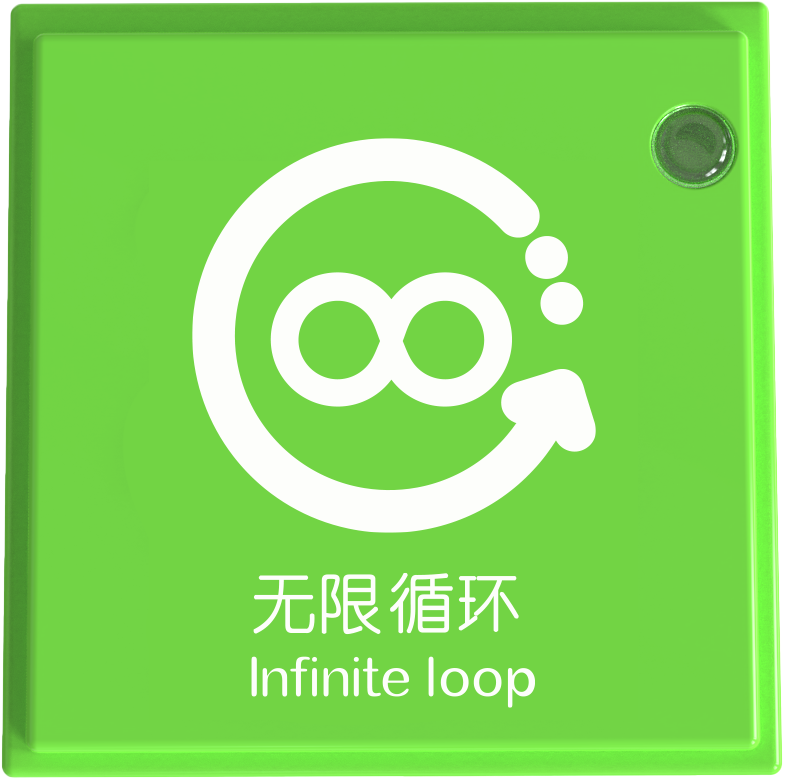

# Coding Blocks
## Overview  
> + **All coding instruction blocks can only take effect on the coding board.**
>

|  |  |  |  |
| --- | --- | --- | --- |
|  |  |  |  |
|  |  |  |  |
|  |  |  |  |
|  |  |  |  |
|  |  |  |  |
|  |  |  |  |
|  |  |  |  |

As shown in the figure, all coding blocks are green square blocks. There are a total of 29 instruction blocks divided into seven categories: Robot Coding Instruction Blocks, Loop Blocks, Motor Instruction Blocks, Lighting Control Instruction Blocks, Expression Control Instruction Blocks, Sound Control Instruction Blocks, and Motion Control Instruction Blocks.  

## Coding Instruction Block Structure

|  No.   |  Name   | Description  | |
| :---: | :---: | :---: | --- |
| **①** |  Icon   |  Represents the function visually to help users understand the block's purpose   | |
| **②** | Chinese Name  |  Describes the function or name of the block in the text for clarity   | |
| **③** | English Name  | | |
| **④** |  Power Indicator   | 1. Indicates whether the coding board recognizes the block 2. Displays the block's working status during program execution | |
| **⑤** | Magnetic Suction Base | Used for connecting the block to the coding board, providing stable power and data transmission.    | |

### Specifications
| **Item** | **Description** |
| :---: | :---: |
| **Name** | ICBlocks-Coding Instruction Block |
| **Code** | 31.6 x 31.6 x 21.0 mm |
| **Weight** | 11 g |
| **Material** | ABS |
| **Operating Voltage** | 3.3 V |
| **Connection Method** | Magnetic   |

## Robot Instruction Block  
| **Name** | **Image** | **Block ID Range** |
| :---: | :---: | :---: |
| **Motion Block** |  |  Valid IDs: 545~639   |
| **Stop Block** |  |  Valid IDs: 1360~1474   |

The Robot Instruction blocks include motion and stop blocks. They must be used with other blocks on the coding board.  

### Usage Instructions 
| Type | **Description** |
| :---: | --- |
| **Screen-Free Coding Control** | 1. Motion and stop blocks work with sensors (e.g., Gyro Block, Potentiometer Block) to detect state and control robot movements such as forward, backward, left, or right.   2. The stop block can also be placed in the program to halt current actions and wait for new triggers.   |

## Loop Instruction Block
| **Name** | **Image** | **Block ID Range** |
| :---: | :---: | :---: |
| **Loop 1 Time Block** |  |  Valid IDs: 3357~3307 |
| **Loop 2 Times Block** |  |  Valid IDs: 3475~3405 |
| **Loop 3 Times Block** |  |  Valid IDs: 3597~3507 |
| **Infinite Loop Block** |  |  Valid IDs: 3684~3604 |

The Loop Instruction Block allows a block or a group of blocks to execute repeatedly (e.g., once, twice, three times, or infinitely) Like "for loops" in programming, it enables repeated actions or commands until the specified count is reached.  

###  Usage Instructions 
| Type | **Description** |
| :---: | --- |
| **Screen-Free Coding Control** | The Loop Instruction Block is used with other instruction blocks.   Examples:   + The "Loop 1 Time Block" is placed after the "One Step Forward Block", then the Boxy Robot will execute once the "One Step Forward Block" + The "Loop 2 Times Block" is placed after the "One Step Forward Block", then the Boxy Robot will execute twice the "One Step Forward Block" + The "Loop 3 Times Block" is placed after the "One Step Forward Block", then the Boxy Robot will execute three times the "One Step Forward Block" + The "Infinite Loop" is placed after the "One Step Forward Block", then the Boxy Robot will continue to execute the "One Step Forward Block" indefinitely until the start button is pressed to exit the loop. |

Note:  When using more than 2 loop instruction blocks on the coding board, it will not form a nest. Only when using the memory module to remember the loop program, the memory module + loop instruction block can form a nest.

## Memory Instruction Block
| **Name ** | **Image** | **Block ID Range** |
| :---: | :---: | :---: |
| **Memory Module** |  |  Valid IDs: 3793~3655 |

The Memory Module is a storage block that stores all blocks on the coding board and packages them like a function.   

### Usage Instructions 
| Type | **Description** |
| :---: | --- |
| **Screen-Free Coding Control** | There are eight magnetic ports on the coding board, and if the program written goes beyond these ports, the memory module can be used to store more instructions. 1. **Store Program**: Connect the Memory Module to the last magnetic port of the coding board to store all instructions in prior connectors.   2. **Continue Coding**: Move the Memory Module to the first magnetic port and continue programming.   3. **Execute Code**: Press the start button on the coding board. The Memory Module will execute all stored instructions sequentially.   |

## Motor Control Instruction Block
| **Name** | **Image** | **Block ID Range** |
| :---: | :---: | --- |
| **Start Motor Block** |  |  Valid IDs: 2790~2949 |
| **Stop Motor Block** |  |  Valid IDs: 2950~3119 |

The motor control instruction blocks include two types: start the motor and stop motor.

### Usage Instructions 
| Type | **Description** |
| :---: | --- |
| **Screen-Free Coding Control** | After successfully connecting the coding board to the Boxy Robot, use the start and stop motor blocks to control the motor.   |

## Lighting Control Instruction Block  
| **Name** | **Image** | **Block ID Range** |
| :---: | :---: | :---: |
| **Turn On the Light Block** |  |  Valid IDs: 2580~2674 |
| **Turn Off the Light Block** |  |  Valid IDs: 2675~2789 |

The lighting control instruction blocks provide two operation states of turning on and turning off the lights.

### Usage Instructions 
| Type | **Description** |
| :---: | --- |
| **Screen-Free Coding Control** | After connecting the coding board to the Boxy Robot, use Turn On the Light Block and Turn Off the Light Block to control LED or Color LED lights.   |

## Expression Control Instruction Block
| **Name** | **Image** | **Block ID Range** |
| :---: | :---: | :---: |
| **Smile Block** |  |  Valid IDs: 1475~1574 |
| **Angry Block** |  |  Valid IDs: 1575~1654 |
| **Sad Block** |  |  Valid IDs: 1655~1744 |
| **Happy Block** |  |  Valid IDs:1745~1899 |
| **Cry Block** |  |  Valid IDs: 1900~2009 |

The expression control instruction blocks contain five expressions: smile expression, angry expression, sad expression, happy expression and cry expression.

### Usage Instructions 
| Type | **Description** |
| :---: | --- |
| **Screen-Free Coding Control** | After connecting the coding board to the Boxy Robot, use Expression Control blocks to display facial expressions on the expression block.   |

## Sound Control Instruction Block
| **Name** | **Image** | **Block ID Range** |
| :---: | :---: | :---: |
| **Play Recording Block** |  |  Valid IDs: 2490~2579 |
| **Phone Ring Block** |  |  Valid IDs: 2400~1489 |
| **Car Whistle Block** |  |  Valid IDs: 2300~2399 |
| **Fireengine Siren Block** |  |  Valid IDs: 2100~2199 |
| **Police Car Siren Block** |  |  Valid IDs: 2010~2099 |
| **Train Whistle Block** |  |  Valid IDs: 2200~2299 |

The sound control instruction blocks include playing recording, phone ring, car whistle, fireengine whistle, police car whistle, and train whistle, a total of 6 kinds of sounds.

### Usage Instructions 
| Type | **Description** |
| :---: | --- |
| **Screen-Free Coding Control** | After connecting the coding board to the Boxy Robot, use sound control blocks to play specific sounds through the sound block.   |

## Motion Control Instruction Block
| **Name** | **Image** | **Block ID Range** |
| :---: | :---: | :---: |
| **One Step Forward Block** |  |  Valid IDs:  1010~1099 |
| **Two Steps Forward Block** |  |  Valid IDs: 3120~3295 |
| **Forward Until Block** |  |  Valid IDs:  1275~1359 |
| **Step Back Block** |  |  Valid IDs: 850~1009 |
| **Turn Left 90° Block** |  |  Valid IDs: 640~729 |
| **Turn Left Until Block** |  |  Valid IDs: 1100~1189 |
| **Turn Right 90° Block** |  |  Valid IDs: 730~849 |
| **Turn Right Until Block** |  |  Valid IDs: 1190~1274 |

The motion control instruction blocks include One Step Forward Block, Two Steps Forward Block, Forward Until Block, Step Back Block, Turn Right/Left 90° Block, and Turn Right/Left Until Block. Each block operates independently and does not require other functional blocks on the coding board.  

### Usage Instructions 
| Type | **Description** |
| :---: | --- |
| **Screen-Free Coding Control** | After connecting the coding board to the Boxy Robot, use motion control blocks to command the built-in motors for movement.   |

 

