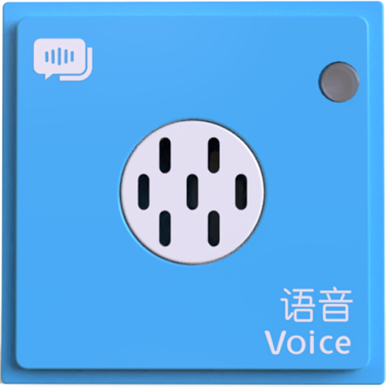
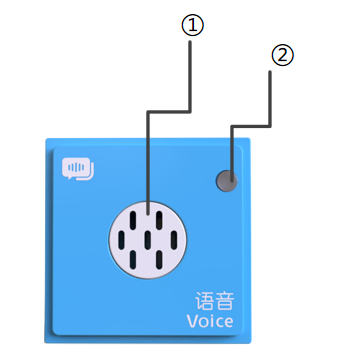
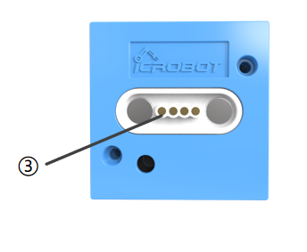

# Voice Block

## Introduction
The Voice Block is the only block in the ICBlocks series equipped with intelligent voice prompt functionality. When connected to the Boxy Robot, the block provides block prompt functionality, voice control functionality, and voice programming functionality. It supports two modes: online and offline, with different voice prompt capabilities for each mode.

## Structure  

  

|  No. | Name   | Description   |
| :---: | :---: | :---: |
| **①** | Speaker & Sound Hole  | The speaker hole for sound output   |
| **②** |  Power Indicator  |   Indicates if the block is successfully connected to the Boxy Robot   |
| **③** | Magnetic Suction Base | Used for connecting the block to the Boxy Robot, providing stable power and data transmission   |

## Specifications
| **Item** | **Description** |
| :---: | :---: |
| **Name** | ICBlocks-Voice Block |
| **Code** | B0010062 |
| **Dimensions** | 32 x 32 x 21.0 mm |
| **Weight** | 16 g |
| **Material** | ABS |
| **Valid IDs** | 3260~3500 |
| **Operating Voltage** | 3.3 V |
| **Connection Method** | Magnetic |

## Usage Instructions
| Type | Description |  Example  |
| --- | --- | :---: |
|   Online Mode   | When the coding board is connected to the Boxy Robot, the voice block provides voice prompts, such as block connection notifications, placement error alerts, and execution process updates during program runs. |  |
|  Offline Mode     | Without a connection to the coding board, the voice block supports block prompts, voice control, and voice coding. It notifies the user of block connections and command execution status via voice.   |  |
|   Voice Control    | Supports five categories of voice commands: movement, LED lights, recordings, expressions, and motor control. The system only responds to voice commands after being activated and remains active until deactivation.    |  |
|   Voice Coding     | Users can program through voice commands. It supports various control instructions, allowing program execution upon completion, including termination commands.     |  |

## Voice Command Table  
1. Interactive Commands with Replies (Not for Programming)  

|  Command Category   |  Command Phrase   |  Reply   |  Description   |
| :---: | :---: | --- | --- |
| **Voice Block Version** | **Voice Block Version** | "The current voice block version is ICBlocks voice block V1.0. Thank you for your support."   | Version details are updated with each version.  Example: "Current...V1.1..."   |
| **Boxy Robot Version** | **Boxy Robot Version** | "The current Boxy Robot version is ICBlocks Boxy Robot V2.8. Visit the official ICBlocks website for updates."   |  Version details change with updates. Example: "Current...V2.9..."   |

2.  Commands without Replies  

|  Command Name   |  Command Phrase   |  Description   |
| --- | :---: | --- |
| **Wake Up Command** | Hello Boxy | The voice block has a higher priority than other actuators; once activated, the Boxy Robot can only be controlled by the voice block.   |
| **Exit Voice State Command** |  Exit |  Shut up | Close | Turn off | Step back | Stop talking   | Use the "Exit" command or wait for 60 seconds for the voice block to exit activation mode, allowing other blocks to function normally.   |
| **Start Coding Command** |  Start programming | Start coding   | Entering voice coding mode. |
| **End Coding Command** |  End programming| End coding   |  Ends the programming process.   |
| **Execute Program Command** |  Run program | Run code   | Enters program execution mode until completion or upon recognizing the stop execution command phrase.   |
| **Stop Program Command** |  Stop program | Program stop   | Interrupts the program and exits execution mode.   |
| **Wait for Command** | Wait for one second |   The program waits for the specified duration.    |
| | Wait for two seconds. | |
| | Wait for three seconds. | |
|    **Movement Command** |  Move forward one step|One step forward | Functions the same as the corresponding block, controlling the Boxy Robot to perform movements based on command phrases.   |
| | | |
| |  Move backward one step|One step backward   | |
| | | |
| |  Turn left ninety degrees|Turn ninety degrees left | |
| | | |
| | Turn Right Ninety Degrees| Turn ninety degrees right | |
| | | |
| | Move forward two steps. | |
| | Forward, backward, turn left, turn right, stop. | |
|  **LED Block Command** | Turn on the light. |  Functions the same as the corresponding block, turning the LED block or color LED block on or off.    |
| | | |
| | Turn off the light. | |
| | | |
| | The light is too dim. |  Increases or decreases the brightness of the LED light or color LED light.      |
| | The light is too bright. | |
| | Increase brightness | |
| | | |
| | Decrease brightness Lower the brightness | |
| | | |
| | Brighten the light | |
| | Dim the light | |
| **Record Block Command** |  Play Recording   | Functions the same as the corresponding block, controlling the recording block.   |
| |  Car Horn   | |
| | Train whistle |Train | |
| | Police car siren |police car|alarm | |
| | Fire engine siren |fire engine|firefighting|extinguish fire | |
| | Phone ringing |telephone | |
| **Expression Block Command** | Happy  | Functions the same as the corresponding block, displaying expressions on the expression block.   |
| | Sad | |
| | Cry | |
| | Angry | |
| | Smile | |
| **Motor Block Command** | Start/stop motor (motor stop) | Functions the same as the corresponding block,  controlling the independent motor.   |
| | Motor forward/reverse | |
| **Photoelectric Block Command** | Waiting for photoelectric change |    Functions the same as the corresponding block, and waits for the corresponding block to trigger changes.      |
| **Light Block Command** | Waiting for light change | |
| | | |
| **Sound Block Command** | Waiting for sound change | |
| **Gyro Block Command** | Waiting for tilt change | |
| **Button Block Command** | Waiting for button change | |
| **Potentiometer Block Command** | Waiting for knob change | |

