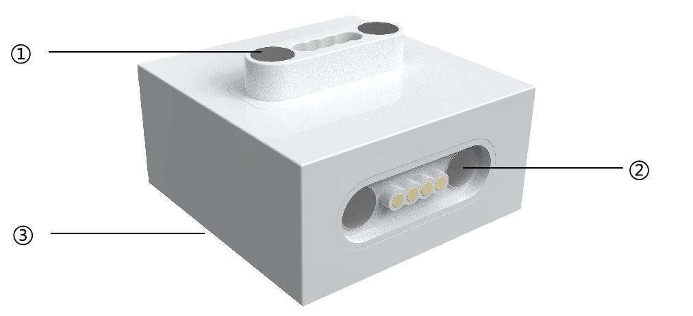
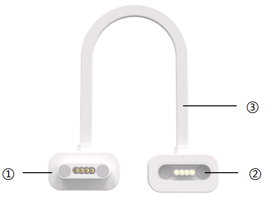

# Auxiliary Blocks
## Introduction  
The ICBlocks series boasts powerful functionality. To meet diverse assembly needs and enhance the adaptability of the set, we have designed auxiliary blocks, including the Magnetic Transfer Block and Magnetic Extension Wire.  

## Magnetic Transfer Block
### Structure  

| No. |  Name   |  Description    |
| :---: | :---: | :---: |
| **①** |  Magnetic Male Port   |  Connects sensor modules and actuators.   |
| **②** |  Magnetic Female Port   | Connects to the Boxy Robot.   |
| **③** |  Bottom Structure   |  Compatible with LEGO Duplo large-block bricks.   |

###  Specifications  
| **Item** | **Description** |
| :---: | :---: |
| **Name** | ICBlocks-Transfer Block |
| **Code** |  B0010014   |
| **Dimensions** |  32 x 32 x 18 mm   |
| **Weight** | 13 g |
| **Material** | ABS |
| **Operating Voltage** | 3.3 V |
| **Connection Method** | Magnetic  |

### Usage Instructions 
1. **Change Block Connection Direction:** When used with the Gyro Block and the Boxy Robot, this block helps maintain a horizontal orientation.  
2. Facilitate Construction: Adapts to a wider range of usage scenarios.  

## Magnetic Extension Wire
### Structure  

| **No.** | **Name** | **Description** |
| :---: | :---: | :---: |
| **①** |  Magnetic Male Port   |  Connects sensor modules and actuators.   |
| **②** |  Magnetic Female Port   | Connects to the Boxy Robot.   |
| **③** | Connecting Cable   | Transmits signals between the two ports.   |

### Specifications  
| **Item** | **Description** |
| :---: | :---: |
| **Name** | ICBlocks-Magnetic Extension Wire |
| **Code** |  Y0080020155   |
| **Dimensions** |  270 x 28 x 11 mm   |
| **Weight** | 19 g |
| **Material** | ABS + Silicone   |
| **Operating Voltage** | 3.3 V |
| **Connection Method** | Magnetic   |

