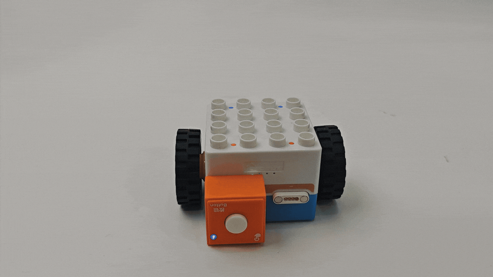

# Logic Control Function
## Introduction  
When the Boxy Robot is powered on and no Bluetooth connection is established, it defaults to Logic Control Mode. In this mode, you can activate the robot's logic control functions by connecting sensors to the orange magnetic ports or actuators to the blue magnetic ports. Different combinations of sensors and actuators will trigger different logic control functions. For better understanding, the following explains the four categories of logic control functions.  

## Boxy Robot Logic Control
**Definition**: The Boxy Robot uses sensors connected to the orange magnetic ports to control its built-in motor. This functionality is referred to as the logic control function of the robot.  

|  |  |
| :---: | :---: |
| Button Logic Control   |  Sound Logic Control   |
|  |  |
|  Photoelectric Logic Control   | Light-sensitive Logic Control   |
|  |  |
| Potentiometer Logic Control | Gyro Logic Control |

**Note**: If the sensor is not recognized during use, adjust its sensitivity following the [sensor sensitivity adjustment instructions](https://www.yuque.com/g/crystal-vzc6k/cfl3ix/azbgmyb3i1gp4061/collaborator/join?token=esQ79qKqI4e8WdV6&source=doc_collaborator#%20《Input%20Blocks》).  

## Actuator Logic Control Function  
**Definition**: The Boxy Robot uses sensors connected to the orange magnetic ports to control actuators connected to the blue magnetic ports. This functionality is referred to as the **Actuator Logic Control Function**.  

### Button-Controlled Actuator Functions  
|  |   |
| :---: | :---: |
| Button-controlled LED Block   | Button-controlled Record Block |
|  |  |
| Button-controlled Motor | Button-controlled Expression Block  |

### Sound-Controlled Actuator Functions  
|  |  |
| :---: | :---: |
| Sound-controlled LED Block | Sound-controlled Record Block |
|  |  |
| Sound-controlled Motor | Sound-controlled Expression Block  |

### Light Block Controlled Actuator Functions  
|  |   |
| :---: | :---: |
|  Light-sensitive controlled LED Block   | Light-sensitive controlled Record Block  |
|  |   |
|  Light-sensitive controlled Motor   | Light-sensitive controlled Expression Block   |

### Photoelectric-Controlled Actuator Functions  
|  |  |
| :---: | :---: |
| Photoelectric-controlled LED Block  | Photoelectric-controlled Record Block |
|  |  |
| Photoelectric-controlled Motor | Photoelectric-controlled Expression Block |

### Potentiometer-Controlled Actuator Functions  
|  |  |
| :---: | :---: |
| Potentiometer-controlled LED Block | Potentiometer-controlled Record Block |
|  |  |
| Potentiometer-controlled Motor | Potentiometer-controlled Expression Block |

### Gyro -Controlled Actuator Functions  
|  |  |
| :---: | :---: |
| Gyro -Controlled LED Block | Gyro -Controlled Record Block |
|  |  |
| Gyro -Controlled Motor | Gyro -Controlled Expression Block |

## Comprehensive Logic Control Function  
**Definition**: The Boxy Robot has two logic control interfaces. One uses sensors connected to the orange magnetic ports to control the built-in motor, while the other uses sensors connected to the orange magnetic ports to control actuators on the blue magnetic ports. This is referred to as the **Comprehensive Logic Control Function**.  

### Control Logic Description  
**Example**: 

The Boxy Robot's two logic control interfaces are marked with “+” and “-” symbols.

+ The “+” interface controls the built-in motor through sensors connected to the orange magnetic ports.
+ The “-” interface controls actuators connected to the blue magnetic ports via sensors connected to the orange magnetic ports.
+ Sensors on the “+” interface control the built-in motor.
+ Sensors on the “-” interface control actuators on the blue magnetic ports.

## Special Logic Control Combinations  
To offer more interactive options with the ICBlocks series, two special logic control combinations are available: **Line-following Mode** and **Light-tracking Mode**.  

### Line-following Function  
**Usage**:

+ Connect two photoelectric sensors to the two orange magnetic ports.
+ Leave the blue magnetic ports empty.
+ The Boxy Robot will enter the **Line-following Mode**.

 Line-following Robot  

### Light-tracking Function  
**Usage**:

+ Connect two light-sensitive sensors to the two orange magnetic ports.
+ Leave the blue magnetic ports empty.
+ The Boxy Robot will enter the **Light-tracking Mode**.

 Light-tracking Robot  

