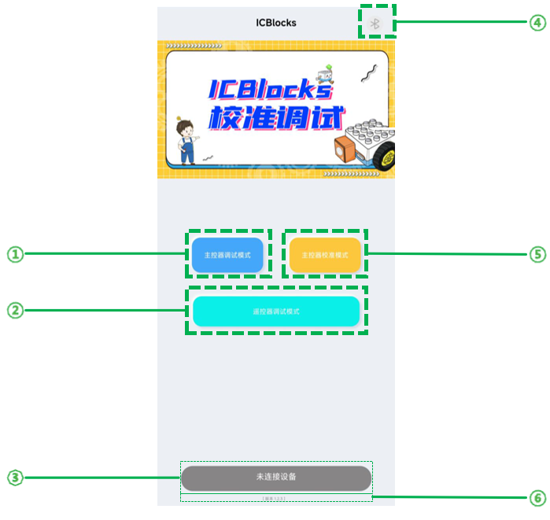
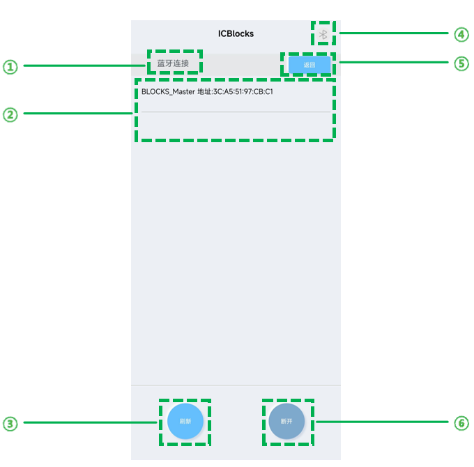
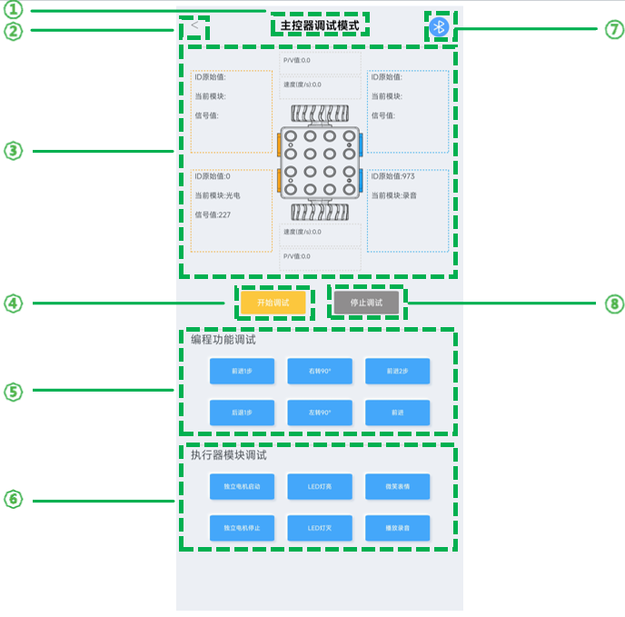
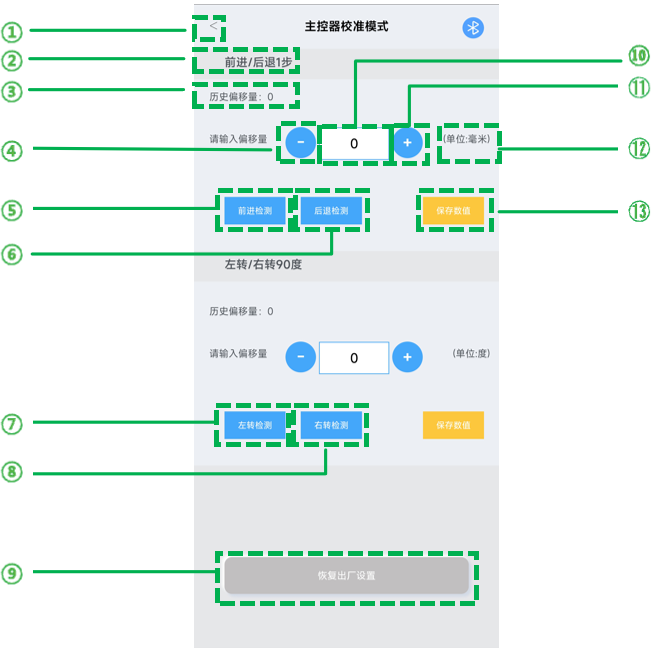
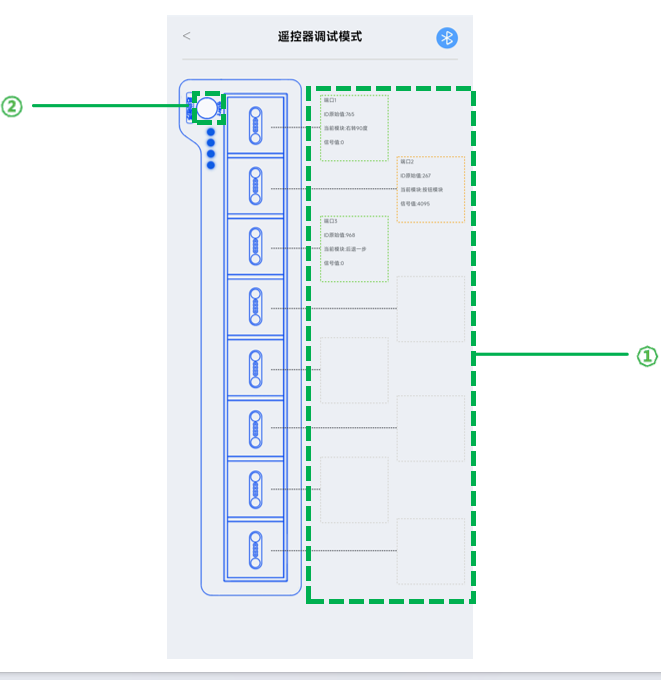
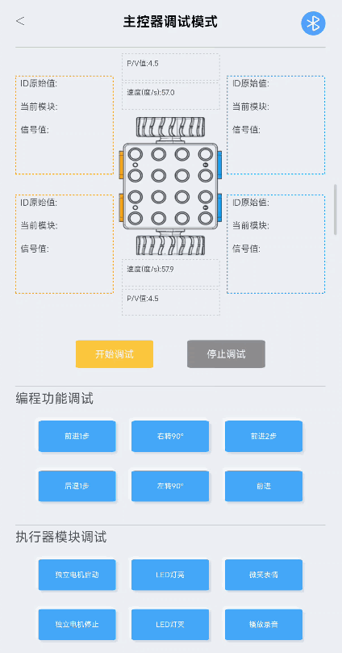
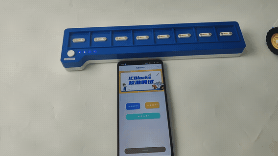

# ICBlocks Calibration and Debugging Tool Guide
## Introduction  
The ICBlocks Calibration and Debugging Tool is a dedicated software designed for ICBlocks Boxy Robots and coding boards. It assists users in monitoring device status and addressing practical issues during use effectively.  

## Software Installation  
Download the ICBlocks Debugging Software installation package from the official website [[Download Link](https://www.icrobot.com/www/cn/index.html#/file/index?type1=%E8%BD%AF%E4%BB%B6%E8%B5%84%E6%96%99&type2=ICBlocks)]. Transfer the installation package to your Android device for installation.

## Interface Guide  
The software includes five pages: the Home Interface, Bluetooth Connection Interface, Boxy Robot Debugging Interface, Boxy Robot Calibration Interface, and Coding Board Debugging Interface. Below are detailed descriptions:  

## Home Interface  

|  No.   |  Name   | Description |
| :---: | :---: | :---: |
|  ? |  "Boxy Robot Debugging Mode"   |  Enters the Bluetooth Connection Interface if no device is connected.   |
| | |  Enters the Boxy Robot Debugging Interface if a device is connected.   |
|  ? |  "Coding Board Debugging Mode"   |  Enters the Bluetooth Connection Interface if no device is connected.   |
| | |  Enters the Coding Board Debugging Interface if a device is connected.   |
|  ? |  Device Connection Status   |  Displays the device connection status on the Home Interface.   |
|  ? |  Device Connection Indicator   |  Indicates connection status across all pages   |
| | |  Blue for connected, Grey for disconnected.   |
|  ? |  "Boxy Robot Calibration"    |  Enters the Bluetooth Connection Interface if no device is connected.   |
| | |  Enters the Boxy Robot Calibration Interface if a device is connected.   |
|  ? |  Software Version   |  Displays the current software version.   |

## Bluetooth Connection Interface  

|  No.   |  Name   | Description |
| :---: | :---: | :---: |
|  ? | Interface Title   | Displays the name of the current interface.   |
|  ? | Device List   |  Shows the names and addresses of detected devices.   |
|  ? |  "Refresh"   |  Refreshes the device list when clicked.   |
|  ? | Device Connection |  Indicates connection status across all pages   |
| | |  Blue for connected, Grey for disconnected.   |
|  ? |  "Back"   |  Exits the Bluetooth Connection Interface.   |
|  ? |  "Disconnect"   |  Disconnects the currently connected device.   |

## Boxy Robot Debugging Interface  

|  No.   |  Name   | Description |
| :---: | --- | :---: |
|  ? | Interface Title   | Displays the name of the current interface.   |
|  ? |  Back Button   |  Exits the current interface.   |
|  ? |  Data Display Area   | Displays information about attached blocks during debugging.   |
|  ? |  "Start Debugging"   |  Activates debugging mode.   |
|  ? |  Coding Block Debug   |  Allows control of the Boxy Robot by sending specific commands during debugging.   |
|  ? | Actuator Block Debug |  Allows control of the Boxy Robot by sending specific commands during debugging.  |
|  ? |  Device Connection   |  Indicates connection status across all pages   |
| | |  Blue for connected, Grey for disconnected.   |
|  ? |  "Stop Debugging"   |  Exits debugging mode.   |

## Boxy Robot Calibration Interface  

|  No.   |  Name   | Description |
| :---: | :---: | :---: |
|  ? |  Back Button |  Exits the current interface.   |
|  ? |  Title   | Displays the calibration action, e.g., "One Step Forward Block."   |
|  ? |  Previous Offset   |  Shows the last configured offset value.   |
|  ? |  ?- ? |  Decreases the current offset value by one unit per click.   |
|  ? |  "Forward Test"   | Click to realize the control of the Boxy Robot forward further |
|  ? |  "Backward Test"   | Click to realize the control of the Boxy Robot to take a step back |
|  ? |  "Left Turn Test"   | Click to realize the control of the Boxy Robot to turn left 90° |
|  ? |  "Right Turn Test"   | Click to realize the control of the Boxy Robot to turn right 90° |
|  ? |  "Reset to Factory"   | Resets the Boxy Robot's offset values to factory defaults.   |
|  ? |  Offset Input Field   | Opens a soft keyboard for direct input of offset values.   |
|  ? |  ?+ ? | Increases the current offset value by one unit per click.   |
|  ? |  Unit   | Shows the unit of the offset value, such as millimeters or degrees.   |
|  ? |  "Save Data"   | Saves the current offset configuration to the Boxy Robot.   |

## Coding Board Debugging Interface  

|  No.   |  Name   | Description |
| :---: | :---: | :---: |
|  ? | Data Display   | Displays the block information attached to the coding board via magnets.   |
|  ? |  Simulation   | Highlights the simulation button red when the start button is pressed.   |

# Boxy Robot Debugging and Calibration Steps  
To calibrate or debug the ICBlocks Boxy Robot using the ICBlocks Calibration and debugging tool, follow these steps:

## Connecting Devices to Software  
Long press the Boxy Robot's power button to turn it on.  

Open the ICBlocks Calibration Debugging Tool and click "Boxy Robot Debugging" or "Boxy Robot Calibration" on the Home Interface. Select the device name from the device list on the Bluetooth Connection Interface to connect.  

__**Note**_: Ensure Bluetooth and Location permissions are enabled for the software.  _

## Boxy Robot Debugging  
Click "Boxy Robot Debugging Mode" on the Home Interface to enter the debugging interface.  

### Check the connected blocks
In the "Boxy Robot Debugging Interface," click the "Start Debugging". Then attach an orange or blue block to the corresponding magnetic interface on the Boxy Robot. The "Data Display Area" will show relevant information about the attached block, including its original ID, block name, and signal value.

If an orange block is attached to the blue interface of the Boxy Robot, the block name displayed in the corresponding position within the software will show as "undefined."

When the motor of the Boxy Robot moves, the area of the upper and lower wheels in the "Boxy Robot Debugging Interface" - "Data Display Area" will feed back the motion data and status (speed/blocking, etc.).

### Controlling the Boxy Robot to Execute Actions  
Click the buttons in the "Coding Block Debug " and "Actuator Block Debug" to make the Boxy Robot execute the corresponding commands immediately.  

## Calibrating the Precision of the Boxy Robot Motor Movements  
On the "Home Interface," click the "Boxy Robot Calibration" button to enter the "Boxy Robot Calibration Interface."  

In the "Boxy Robot Calibration Interface," click the "Forward Test" button to check whether the Boxy Robot moves forward by 12.8 cm (or the desired distance). If the distance is not as required, modify the value in the "Offset Input Field" and click Save to reset the offset.  

The method for adjusting the left/right 90° rotation offset (angle) is the same as above.

# Coding Board Debugging Method  
To calibrate the ICBlocks coding board using the ICBlocks Calibration and Debugging Tool, follow these steps:  

## Connecting the Device to the Software  
Press and hold the "Start" button on the coding board while also holding down the "Power" button to make the ICBlocks Calibration and Debugging Tool discover the device.  

Open the ICBlocks Calibration and Debugging Tool. On the Software Home Page, click the "Coding Board Debugging Mode". In the Bluetooth Connection Interface, select the device name from the device list to establish a connection.  

## Coding Board Debugging  
On the Software Home Interface, click the "Coding Board Debugging Mode" to enter the "Coding Board Debugging Interface."  

In this interface, the status of the coding board is displayed in real-time, including attached blocks and whether the Start button is pressed.  

+ If a green block is attached, a green dashed frame will appear around the block information in the corresponding position on the interface.
+ If an orange block is attached, an orange dashed frame will appear around the block information.
+ Blue blocks are not compatible with the coding board.

