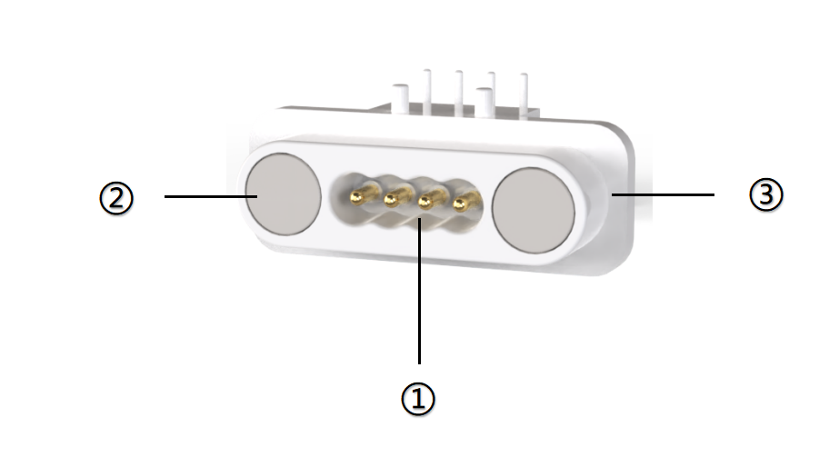
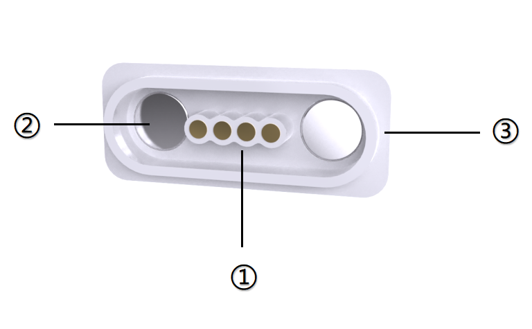
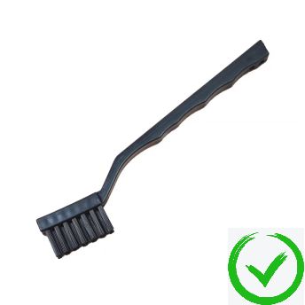
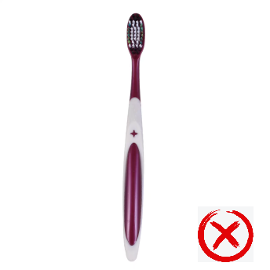

# Read Before Operation!
During the use of ICBlocks series blocks, some users have encountered uncertainty about which specific areas of the magnetic connectors to clean. This often leads to excessive effort without achieving the desired results. To prevent such issues, carefully read this chapter before starting the cleaning process to ensure proper execution.  

## Introduction to Magnetic Connectors  
All electronic blocks in the ICBlocks series communicate through magnetic contact points. Due to the design of the magnetic socket structure and environmental factors, dirt may accumulate on the magnetic connectors of electronic blocks, causing errors in signal transmission. To reduce such problems, it is recommended that users regularly clean the probes and contact points of ICBlocks blocks.  

## Structure of the Magnetic Male Port  

| **No.** | **Name ** | **Description ** |
| :---: | :---: | --- |
|  ? |  Pogo Pin Spring Probes   | Each magnetic male port has four spring probes: two for power and two for signals.   |
|  ? |  Strong Magnets   | Each magnetic male port has two strong magnets for attachment but not for signal transmission.   |
|  ? |  Injection-molded   | The housing that secures the spring probes and strong magnets.   |

### Cleaning Instructions for Magnetic Male Port 
Based on the structural diagram, power, and signal transmission occur through the pogo pin spring probes. During cleaning, ensure that the pogo pin spring contacts are clean to maintain reliable signal transmission and communication.  

## Structure of the Magnetic Female Port  

| **No.** | **Name ** | **Description ** |
| :---: | :---: | --- |
|  ? | Copper Contact Points   | Each magnetic female port has four copper contact points: two for power and two for signals.   |
|  ? |  Strong Magnets   | Each magnetic female port has two strong magnets for attachment but not for signal transmission.   |
|  ? |  Injection-molded   | The housing that secures the spring probes and strong magnets.   |

### Cleaning Instructions for Magnetic Female Port 
Based on the structural diagram, power, and signal transmission occur through the copper contact points. During cleaning, ensure that the copper contact points are clean to maintain reliable signal transmission and communication.  

## Essential Cleaning Tools  
## Hard-bristle Circuit Cleaning Brush  
|  |  |
| :---: | :---: |
| **Recommended:** Use a dedicated hard-bristle circuit cleaning brush.   |  Soft-bristle toothbrushes are too gentle and may not effectively clean.   |

**Selection Criteria:** Dirt on magnetic probes is often stubborn. A soft-bristle toothbrush may fail to remove it, so a hard-bristle brush is recommended for higher efficiency.  

## 530 Precision Electrical Cleaner  

**Description:** A high-efficiency cleaner designed for electronic components and electrical equipment. It effectively removes dirt, grease, dust, and other contaminants.  

## Cleaning Assistance Software  

To ensure effective cleaning of the Boxy Robot's magnetic connectors, use the ICBlocks Calibration and Debugging Software to monitor the interface data in real time during the cleaning process.  

**Usage Guide for ICBlocks Calibration Software: **[Guide](https://icreaterobot-docs.readthedocs.io/en/latest/docs/ICBlocks/06MaintenanceandDebug/01ICBlocksCalibrationandDebuggingToolGuide.html)

