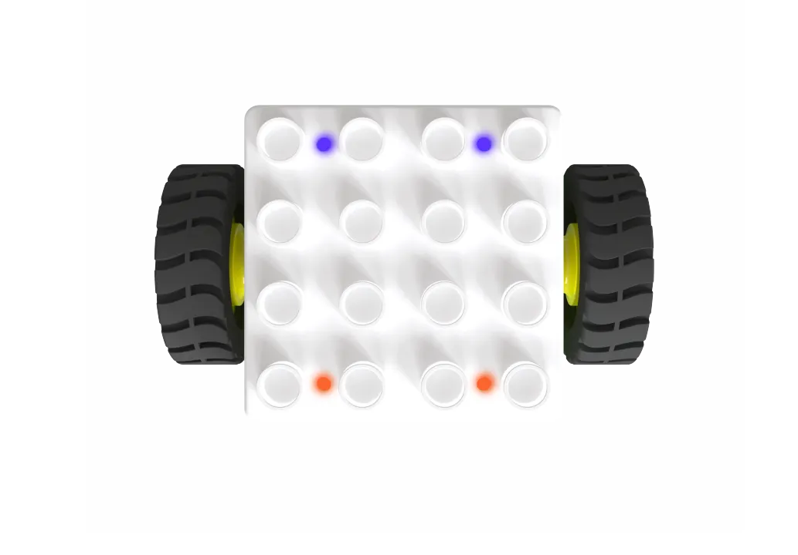
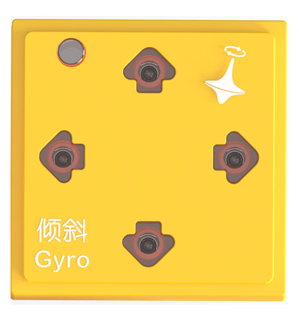
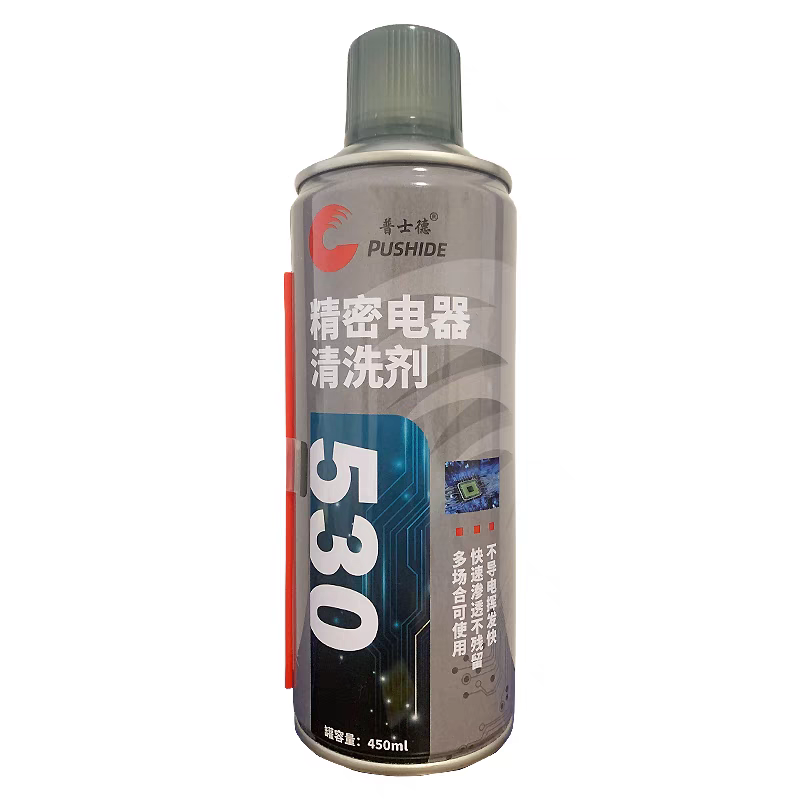
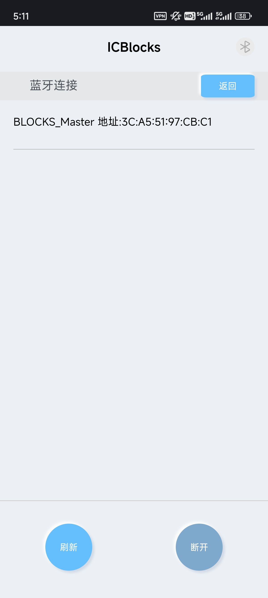
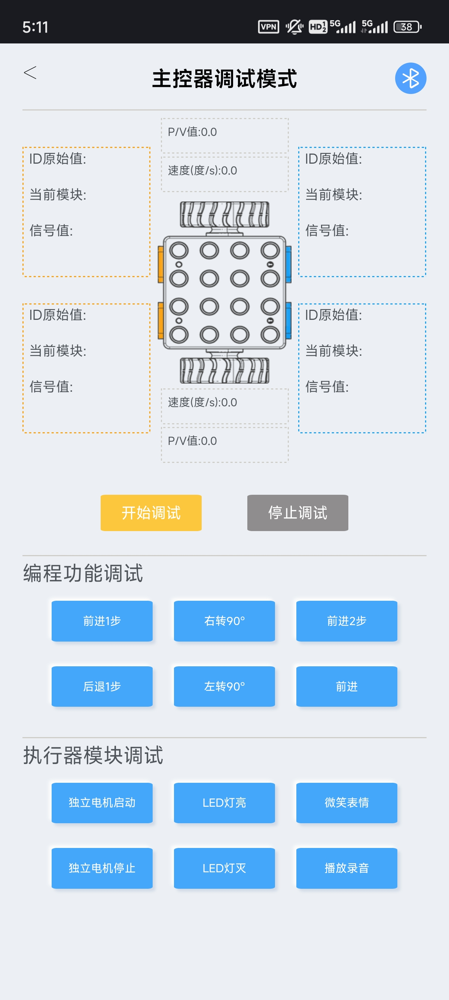

# Boxy Robot Cleaning Steps
## Preparation  
|  |  |  |  | 
| :---: | :---: | :---: | :---: |
|  Boxy Robot   | Gyro Block |  Debugging Software   |  Precision Electrical Cleaner   |  

## Bluetooth Connection Debugging Software
|  |  |
| :---: | :---: |
| Bluetooth Connection | Start Debugging |

Establish a Bluetooth connection between the Boxy Robot and the debugging software.   Click the “Boxy Robot Debugging Mode� to enter debugging mode.   Click the “Start Debugging� to view real-time data for the four magnetic interfaces.  

## Magnetic Connector Testing  

Connect the Gyro Block sequentially to the four magnetic connectors.   

Check the "Raw ID Value" displayed for each connector.  

+ Normal range: 360 to 370.
+ If all values fall within this range after repeated connection and disconnection, the connectors are functioning properly.
+ If abnormal data is detected, proceed with cleaning.

## Spraying Cleaner and Brushing Probes  
|  |  |
| :---: | :---: |
| **Correct:** Spray directly on the pogo pin metal probes.   | **Incorrect:** Avoid spraying on strong magnets or plastic components.   |

1. Shake the precision electrical cleaner canister evenly to mix the contents.
2. Attach the spray nozzle and insert it into the gaps of the pogo pin probes.
3. Press the nozzle vertically and spray the cleaner slowly onto the probe surfaces.

|  |  |
| :---: | :---: |
| **Correct:** Focus on cleaning the pogo pin metal probes.   | **Incorrect:** Avoid cleaning strong magnets or plastic components.   |

+ Use the dedicated hard-bristle cleaning brush to reach the gaps of the pogo pin probes.
+ Perform quick back-and-forth brushing, observing until the probe surfaces regain their metallic shine.

## Repeat Cleaning and Testing  
Repeat the steps of magnetic connector testing, spraying cleaner, and brushing probes until the Gyro Block's "Raw ID Value" for all four magnetic interfaces falls within the normal range.  

