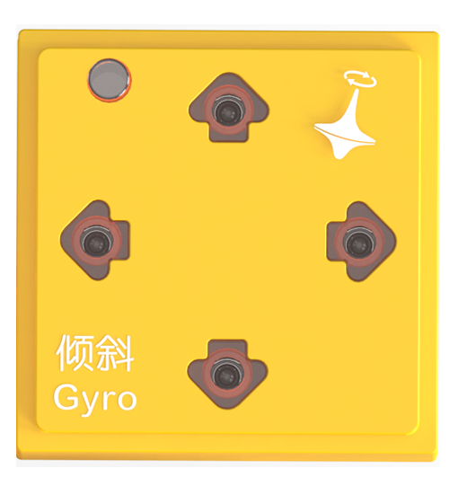
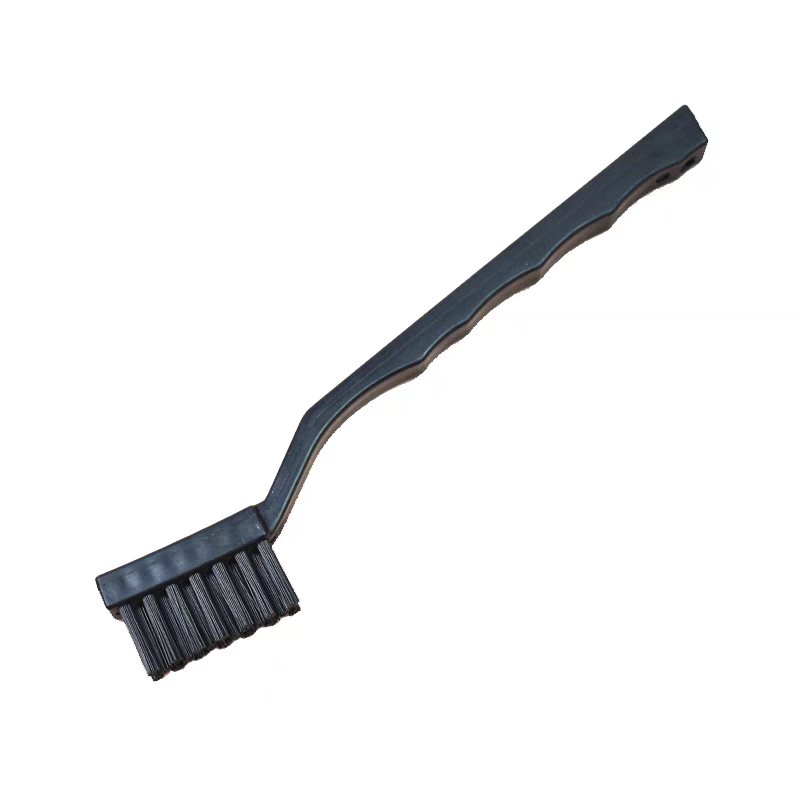

# Coding Board Cleaning Steps
## Preparation  
| |  |  |  |  |
| --- | :---: | :---: | :---: | :---: |
|  Coding Board   |  Gyro Block   |  Debugging Software   |  Precision Electronics Cleaner   |  Hard-istle Circuit Cleaning ush   |

## Bluetooth Connection Debugging Software
|  |  |
| :---: | :---: |
| Bluetooth Connection | Start Debugging |

While the coding board is turned off, hold the start button and press the power switch for 1s.The coding board will turn on and enter debugging mode. Establish a Bluetooth connection with the debugging software. Once connected, click the **"Coding Board Debugging Mode"** button to enter debugging mode and view real-time data from the four magnetic interfaces.

## Magnetic Connector Testing 

+ Connect the gyro block to the eight magnetic interfaces one by one.
+ Check the "Raw ID Values" displayed for each interface. Normal values range from 360 to 370.
+ Repeatedly connect and disconnect the gyro block.
+ If all values are within the normal range, the interfaces are functioning correctly.
+ If any abnormal data appears, use the cleaner to spray and ush the pogo pin probes.

## Spraying Cleaner and ushing Probes  
|  |  |
| :---: | :---: |
| **Correct:** Spray directly on the pogo pin metal probes.   | **Incorrect:** Avoid spraying on strong magnets or plastic components.  |

1. Shake the precision electrical cleaner canister evenly to mix the contents.
2. Attach the spray nozzle and insert it into the gaps of the pogo pin probes.
3. Press the nozzle vertically and spray the cleaner slowly onto the probe surfaces.

|  |  |
| :---: | :---: |
| **Correct:** Focus on cleaning the pogo pin metal probes.   | **Incorrect:** Avoid cleaning strong magnets or plastic components.   |

1. Use the dedicated hard-istle cleaning brush to reach the gaps of the pogo pin probes.
2. Perform quick back-and-forth brushing, observing until the probe surfaces regain their metallic shine.

## Repeat Cleaning and Testing 
Repeat the magnetic interface testing, spraying, and ushing steps until all magnetic interfaces detect the gyro block with raw ID values within the normal range.  

