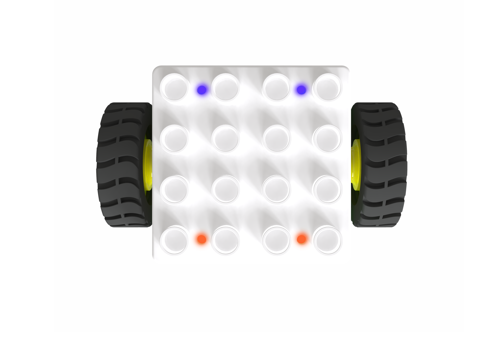
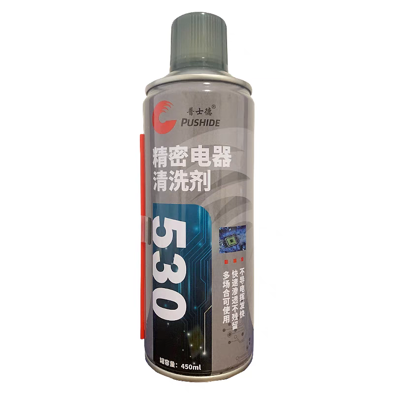
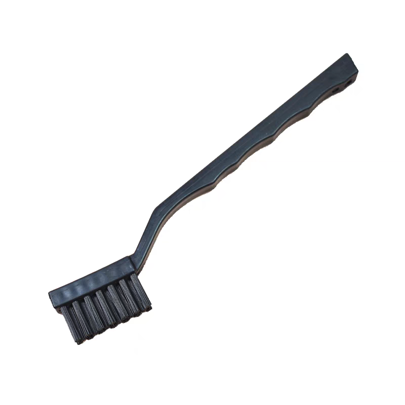
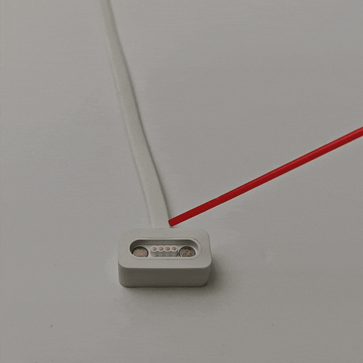
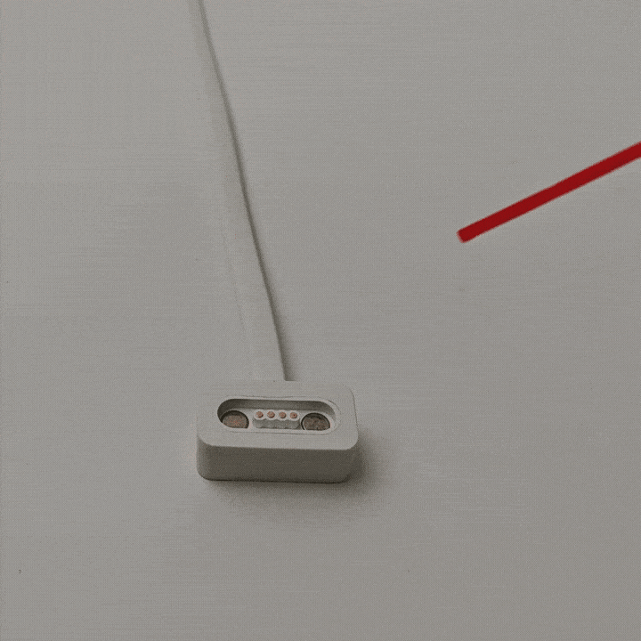

# Blocks Cleaning Steps
## Preparation  
| | | | | |
| :---: | :---: | :---: | :---: | :---: |
| Motor Block |  Boxy Robot   |  Debugging Software   |  Precision Electrical Cleaner |  Hard-bristle Circuit Cleaning Brush   |

## Bluetooth Connection Debugging Software
|  |  |
| :---: | :---: |
| Bluetooth Connection | Start Debugging |

Establish a Bluetooth connection between the Boxy Robot and the debugging software. Click the **"Boxy Robot Debugging Mode"** and then the **"Start Debugging"** to view real-time data from the four magnetic interfaces.

## Motor Block Testing 

+ Connect the motor to any **blue magnetic interface** on the Boxy Robot.
+ Verify the "Raw ID Value" displayed for the interface is between **1100 and 1300**.
+ Use the **"Independent Motor Start"** and **"Independent Motor Stop"** in the software to test the block's rotation and stopping functionality.
+ If the data and functionality are normal, the interface is functioning correctly.
+ If abnormal data appears, use the cleaner to spray and brush the copper column contacts on the motor.

## Spraying Cleaner and Brushing Copper Contact Points
|  |  |
| :---: | :---: |
| **Correct:** Spray the copper contact points. | **Incorrect:**  Avoid spraying on strong magnets.  |

+ Shake the cleaner can evenly to ensure proper mixing.
+ Attach the spray nozzle and aim it at the four copper column contacts.
+ Press the nozzle vertically and spray the cleaner slowly onto the metal surface.

|  |  |
| :---: | :---: |
|  **Correct:** Brush the copper contact points.   | **Incorrect:**  Do not brush the strong magnets.  |

+ Use a hard-bristle circuit cleaning brush to clean the copper contact points.  
+ Quickly brush back and forth while observing, ensuring the contacts regain their bright metal appearance.

## Repeat Cleaning and Testing 
Repeat the motor testing, spraying, and brushing steps until the debugging software detects the motor with raw ID values within the normal range and can control the motor's rotation and stopping actions normally.  

