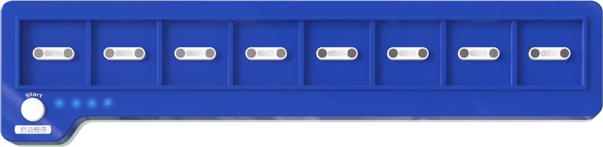
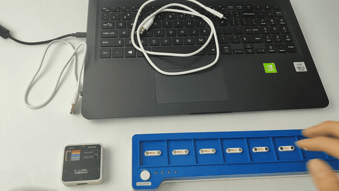
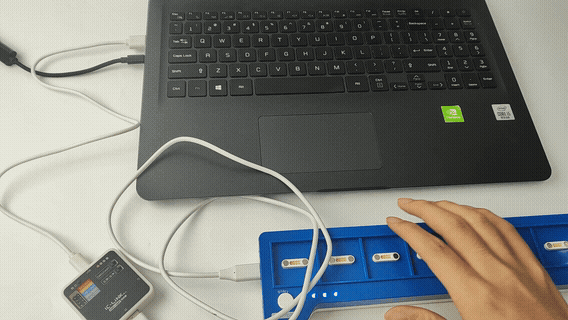
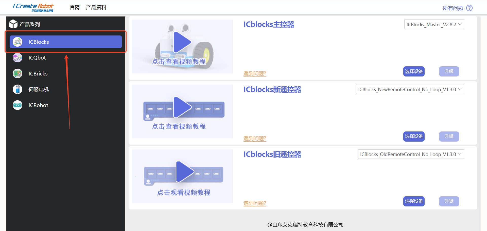
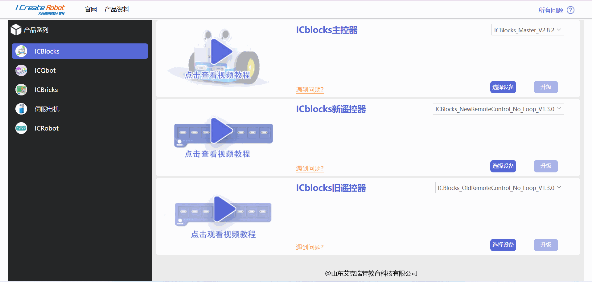
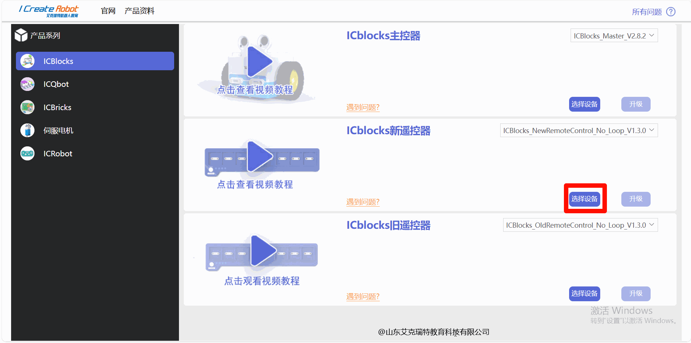
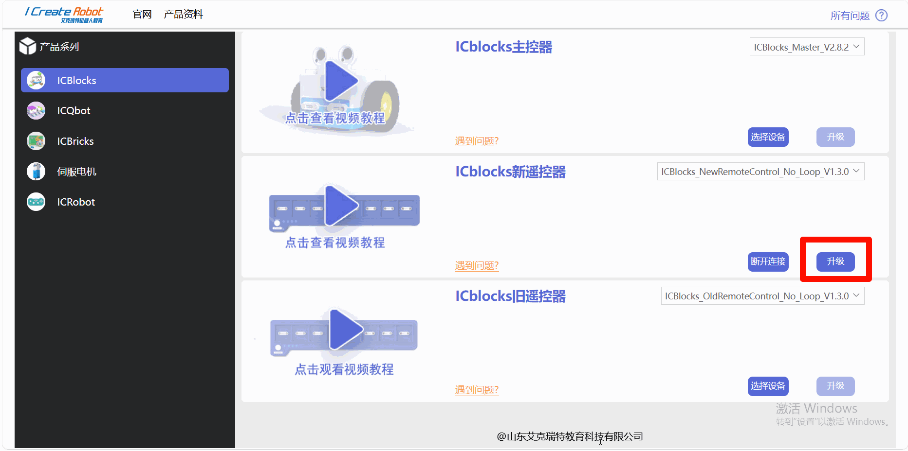
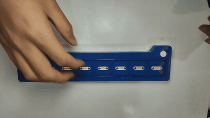
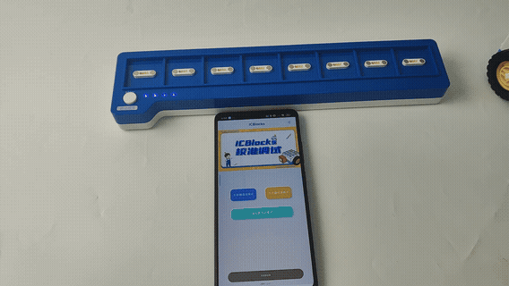
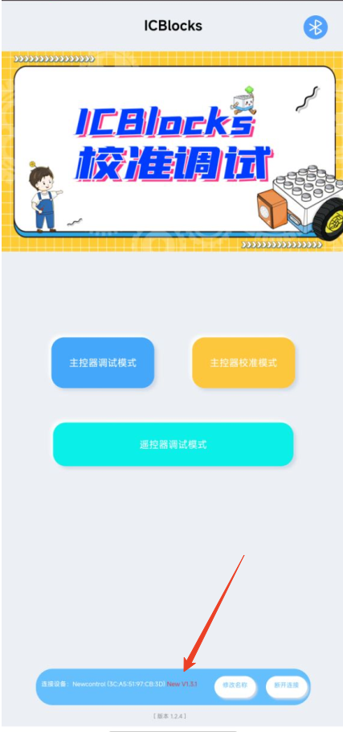

# Coding Board Firmware Upgrade
## Online Upgrade  
### Preparation  
1. Software Preparation  
2. Upgrade website: [https://update.icrobot.cn/](https://update.icrobot.cn/)  
_(Recommended browsers: Chrome or Microsoft Edge)_
3. Hardware Preparation  

|  |  |  |
| :---: | :---: | --- |
| ICBlocks Coding Board x1     | USB-C Data Cables x2   |  ICLink 2.0 Upgrade Tool x1   |

### Upgrade Steps  
|  |  |
| --- | --- |
| ① Toggle the switch on the **ICLink 2.0** to the **SWD/Forward** position.   | ② Connect the ICLink 2.0 to the ICBlocks coding board using one USB-C cable, then connect the ICLink 2.0 to your PC via USB using the second USB-C cable.   |
|  |  |
| ③ Once connected, the coding board's indicator light will show a charging status.   | ④ Open the firmware upgrade platform in **Chrome** or **Microsoft Edge**, and select the **ICBlocks Series** from the left panel.   |
|  |  |
| ⑤ Locate the **ICBlocks Coding Board** on the right panel. Expand the dropdown list to view available firmware upgrades.   | ⑥ Choose the desired firmware version and click **Upgrade.** |
|  |  |
| ⑦ Wait for the page to display **"Upgrade Successful."** Observe the blue indicator light on the ICLink 2.0 for confirmation of completion.   | ⑧ Power on the upgraded coding board by pressing the **Start** and **Power** buttons.   |
|  |  |
| ⑨ Connect the Coding Board to the ICBlocks Calibration and Debugging Tool.   | ⑩ On the **Home Interface** of the software, check the **device connection status** at the bottom to verify the firmware version. Firmware versions below **1.3.1** do  not support software version checking.   |

