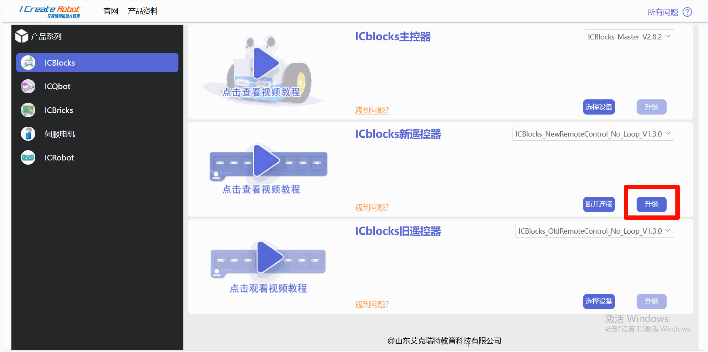
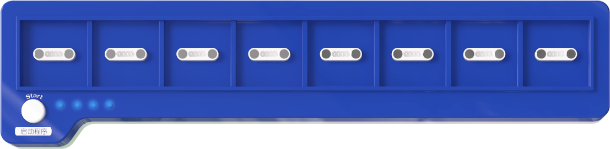

# Coding Board Firmware Upgrade
## Online Upgrade  
### Preparation  
1. Software Preparation  
2. Upgrade website: [https://update.icrobot.cn/](https://update.icrobot.cn/)  
_(Recommended browsers: Chrome or Microsoft Edge)_
3. Hardware Preparation  

|  |  |  |
| :---: | :---: | --- |
| ICBlocks Coding Board x1     | USB-C Data Cables x2   |  ICLink 2.0 Upgrade Tool x1   |

### Upgrade Steps  
|  |  |
| --- | --- |
| â‘? Toggle the switch on the **ICLink 2.0** to the **SWD/Forward** position.   | â‘?Connect the ICLink 2.0 to the ICBlocks coding board using one USB-C cable, then connect the ICLink 2.0 to your PC via USB using the second USB-C cable.   |
|  |  |
| â‘?  Once connected, the coding board's indicator light will show a charging status.   | â‘? Open the firmware upgrade platform in **Chrome** or **Microsoft Edge**, and select the **ICBlocks Series** from the left panel.   |
|  |  |
| â‘? Locate the **ICBlocks Coding Board** on the right panel. Expand the dropdown list to view available firmware upgrades.   | â‘? Choose the desired firmware version and click **Upgrade.** |
|  |  |
| â‘? Wait for the page to display **"Upgrade Successful."** Observe the blue indicator light on the ICLink 2.0 for confirmation of completion.   | â‘? Power on the upgraded coding board by pressing the **Start** and **Power** buttons.   |
|  |  |
| ⑨Connect the Coding Board to the ICBlocks Calibration and Debugging Tool.   | � On the **Home Interface** of the software, check the **device connection status** at the bottom to verify the firmware version. Firmware versions below **1.3.1** do not support software version checking.   |

### Local Upgrade  
### Preparation  
1. Software Preparation  
2. Firmware download link: [[Click Here](https://www.icrobot.com/www/cn/index.html#/file/index?type1=%E8%BD%AF%E4%BB%B6%E8%B5%84%E6%96%99&type2=ICBlocks)]  
3.  Hardware Preparation  

|  |  |  |
| --- | :---: | --- |
|  ICBlocks Coding Board x1   |  USB-C Data Cable x1   |  ICLink 1.0 Upgrade Tool x1   |

### Upgrade Steps  
|  |  |
| --- | --- |
| â‘? Connect the **ICLink 1.0** to the ICBlocks Coding Board using the USB-C cable, then connect the ICLink 1.0 to your PC via USB.   | â‘? Open **File Explorer** and check for a drive labeled **"ICRobot."** |
|  |  |
| â‘? Use your browser to navigate to the firmware download platform via the provided link and download the desired firmware.   | â‘? Extract the downloaded ZIP file and copy the firmware file to the **"ICRobot"** drive. Ensure the drive contains only the **"DETAILS.TXT"** file. If a **"FAIL.TXT"** file appears, reconnect the ICLink 1.0 to the USB port and repeat the process.   |
|  |  |
| ⑤Wait for the copying to complete and observe the green indicator light on the ICLink 1.0 for confirmation of completion.   | � Power on the upgraded coding board by pressing the **Start** and **Power** buttons.   |
|  |  |
| ⑦Connect the coding board to the ICBlocks Calibration and Debugging Tool.   | ⑧On the **Home Interface** of the software, check the **device connection status** at the bottom to verify the firmware version. Firmware versions below **1.3.1** do not support software version checking.   |

