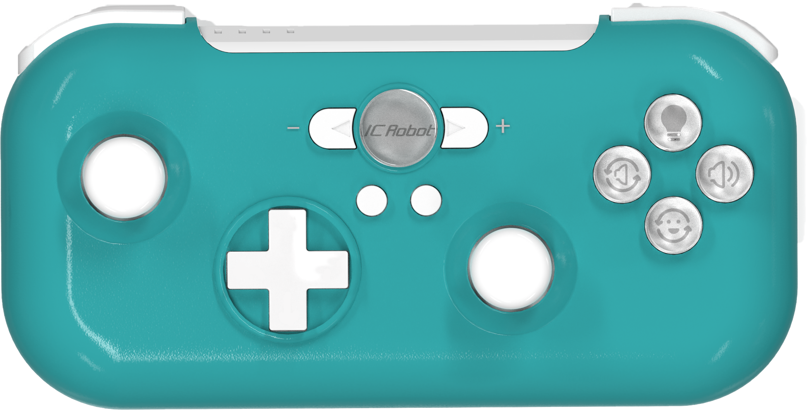
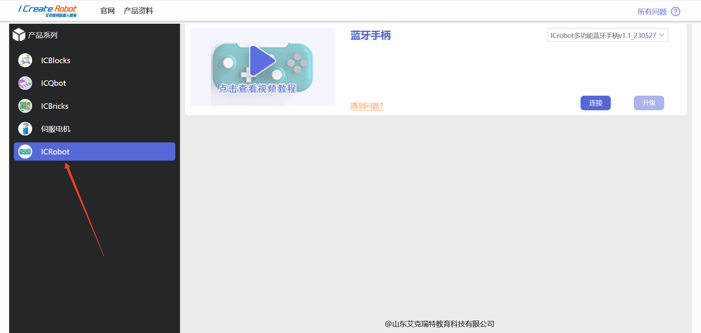
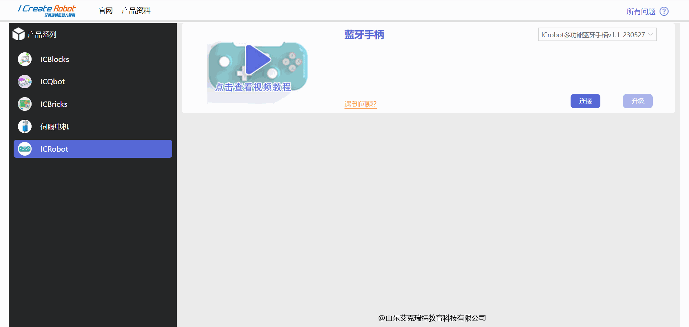
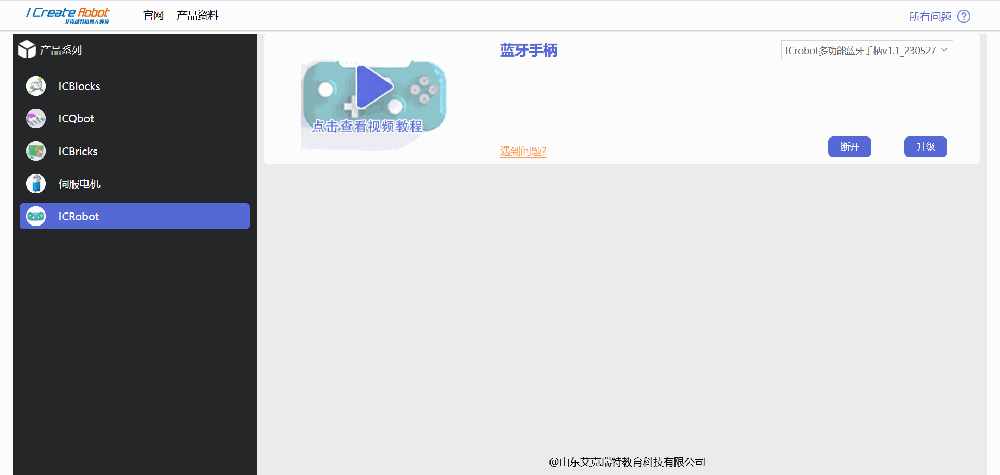
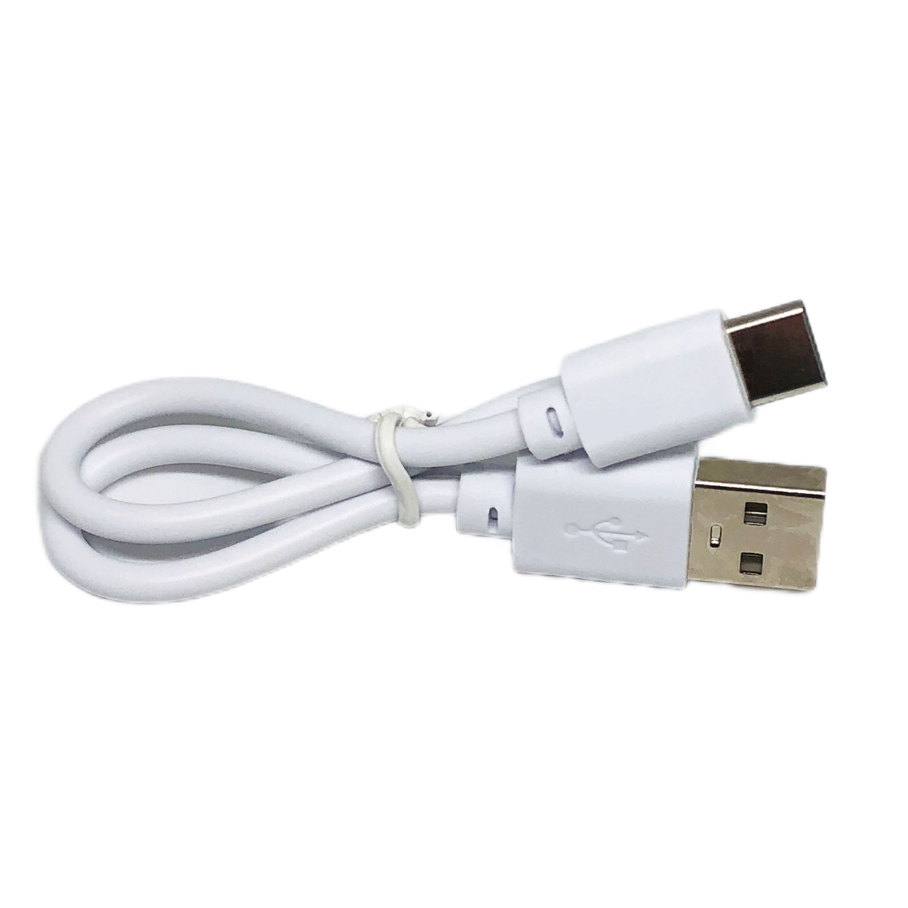
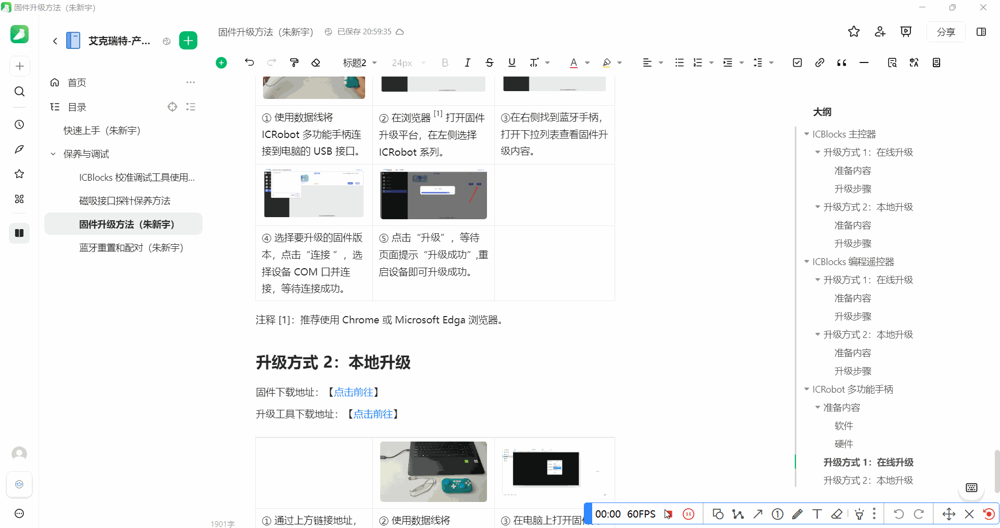
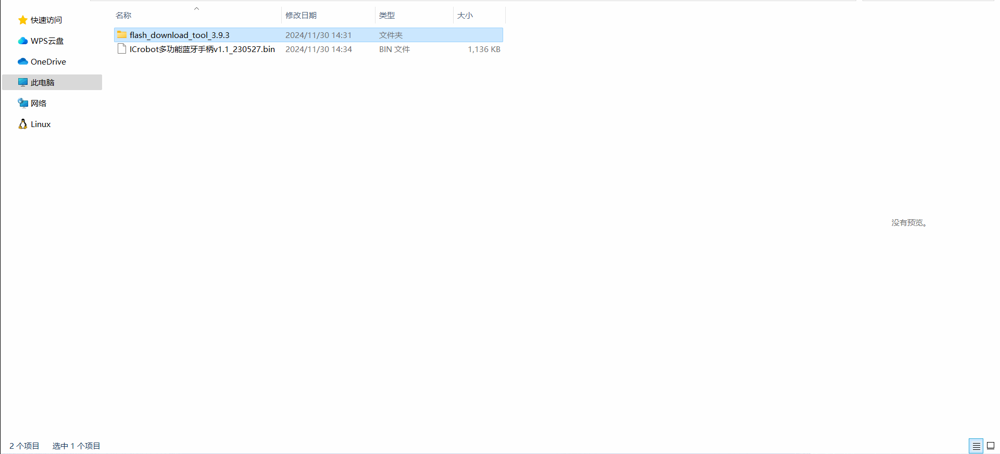
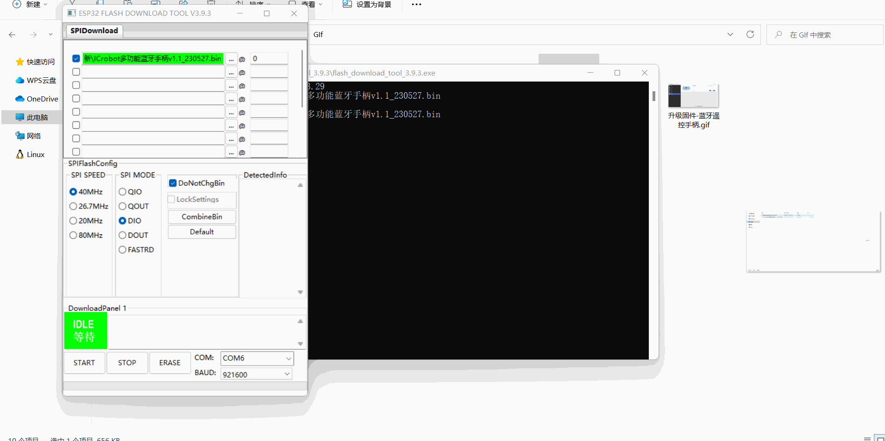
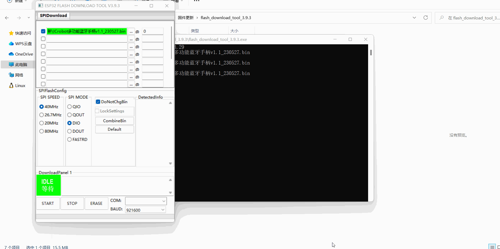
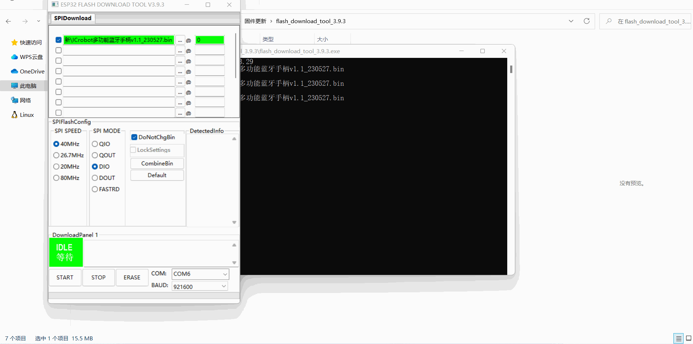

# ICRobot Multifunctional Bluetooth Controller Firmware Upgrade
## Online Upgrade  
### Preparation
1.Software Preparation  

Download and install the CH340 driver on your computer. Use the following links:  

1. **Windows Driver**：[https://www.wch.cn/download/CH341SER_EXE.html](https://www.wch.cn/download/CH341SER_EXE.html)
2.  **Linux Driver**：[https://www.wch.cn/download/CH341SER_LINUX_ZIP.html](https://www.wch.cn/download/CH341SER_LINUX_ZIP.html)
3.  **Mac Driver**：[https://www.wch.cn/downloads/CH34XSER_MAC_ZIP.html](https://www.wch.cn/downloads/CH34XSER_MAC_ZIP.html)
4. ** Android Driver**：[https://www.wch.cn/download/CH341SER_ANDROID_ZIP.html](https://www.wch.cn/download/CH341SER_ANDROID_ZIP.html)

2.Hardware Preparation  

|  |  |
| :---: | :---: |
|  ICRobot Multifunctional Bluetooth Controller × 1   | USB-C Data Cable x  1 |

### Upgrade Steps 
|  |  |
| --- | --- |
|  ? Connect the ICRobot Multifunctional Bluetooth Controller to the computer using a USB-C cable.   |  ? Open the firmware upgrade platform in Chrome or Microsoft Edge browser, and select the **ICRobot Series** on the left side.   |
|  |  |
| ③Locate the **Bluetooth Controller** on the right side, expand the drop-down menu to view the firmware upgrade options.   |  ? Select the firmware version to upgrade, click **Connect**, select the device's COM port, and wait for the connection to succeed.   |
|  | |
|  ? Click **Upgrade**. Once the page displays "Upgrade Successful," restart the device to complete the upgrade.   | |

## Local Upgrade  
### Preparation
1. Software Preparation

Firmware download link: [[Download Here](https://www.icrobot.com/www/cn/index.html#/file/index?type1=%E8%BD%AF%E4%BB%B6%E8%B5%84%E6%96%99&type2=ICRobot%E5%A4%9A%E5%8A%9F%E8%83%BD%E8%93%9D%E7%89%99%E6%89%8B%E6%9F%84)]  

Download the upgrade tool: [[Download Here](https://www.icrobot.com/www/cn/index.html#/file/index?type1=%E8%BD%AF%E4%BB%B6%E8%B5%84%E6%96%99)]  

2. Hardware Preparation 

|  |  |
| :---: | :---: |
|  ICRobot Multifunctional Bluetooth Controller × 1   | USB-C Data Cable x  1 |

### Upgrade Steps  
|  |  |
| --- | --- |
|  ?  Download the firmware file and upgrade tool from the provided links.   |  ? Connect the ICRobot Multifunctional Bluetooth Controller to the computer using a USB-C cable.   |
|  |  |
|  ? Open the firmware upgrade tool on your computer. (Do not close the black console window after opening the tool!) Select **Esp32** as the "ChipType," and **Develop** as the "WorkMode," then click **OK**.   |  ? Ensure the first row is checked. Click the  ?... ?, select the downloaded firmware file in the pop-up dialog box, and click **Open**.   |
|  |  |
|  ? Enter "0" in the last input box of the first row. Choose the device's COM port. If unsure about the COM port, disconnect the device from the computer and check which COM port disappears. Reconnect the device to identify the new COM port.   |  ? Click "START" to start the firmware upgrade, wait for the prompt to upgrade successfully, and restart the device to complete the firmware upgrade. |

