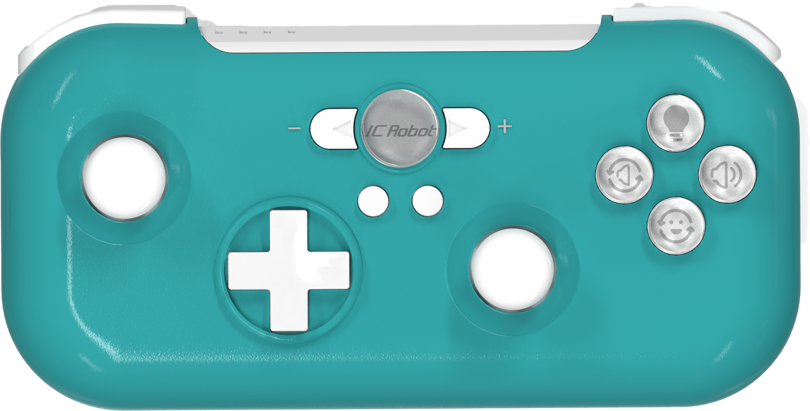
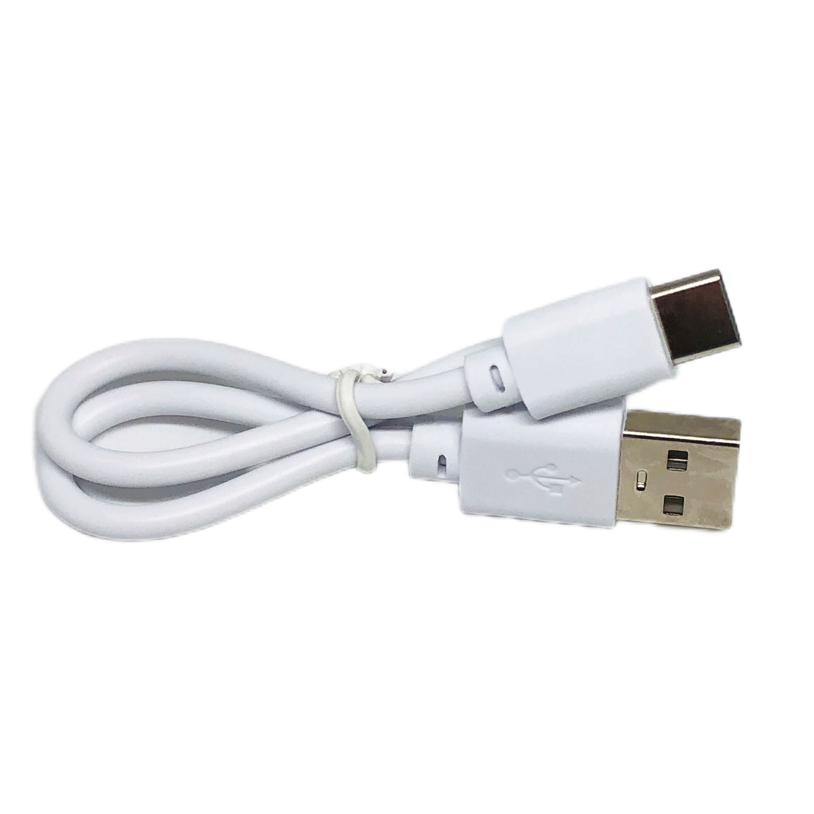
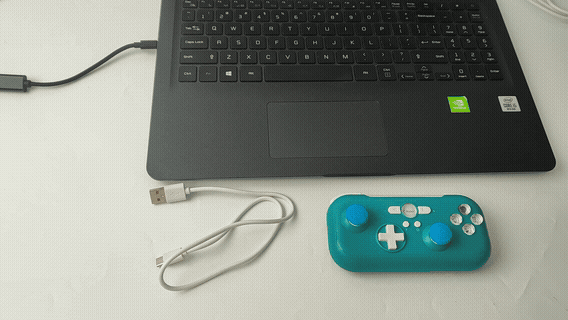
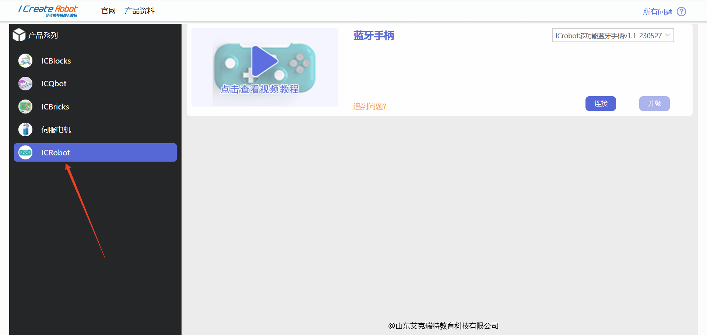
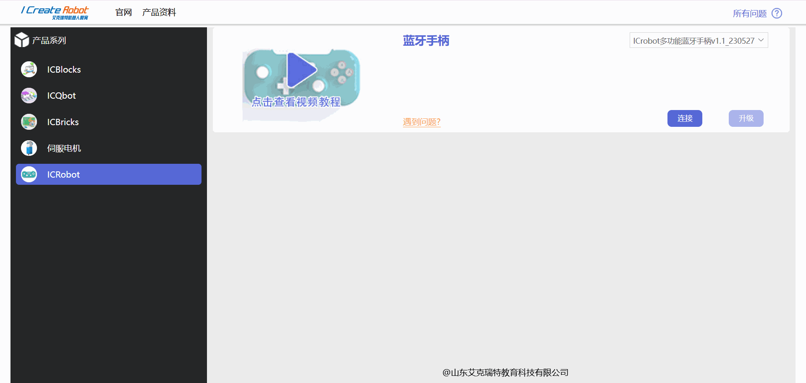
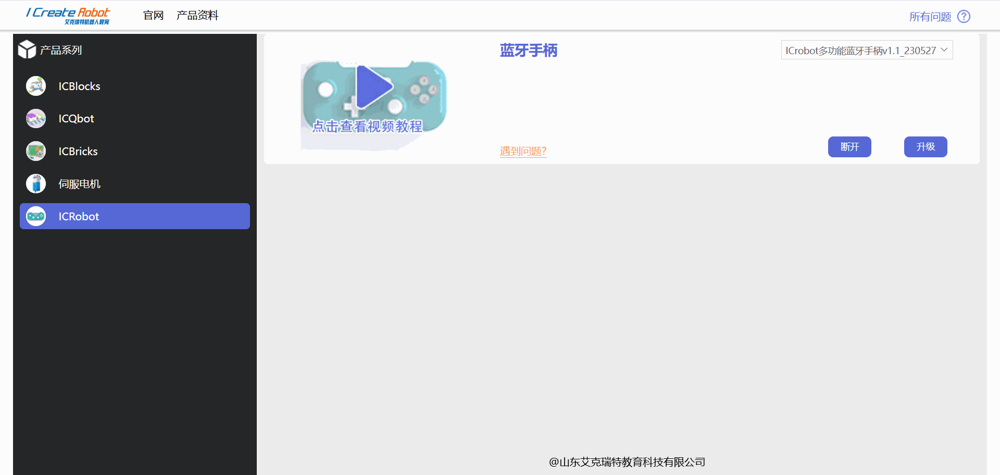

# ICRobot Multifunctional Bluetooth Controller Firmware Upgrade
## Online Upgrade  
### Preparation
1.Software Preparation  

Download and install the CH340 driver on your computer. Use the following links:  
[CH341SER](https://www.wch.cn/search.html)
1. **Windows Driver**：

 

3.  **Linux Driver**：

 
   
5.  **Mac Driver**：

 
   
7. **Android Driver**：

 

2.Hardware Preparation  

|  |  |
| :---: | :---: |
|  ICRobot Multifunctional Bluetooth Controller × 1   | USB-C Data Cable x  1 |

### Upgrade Steps 
|  |  |
| --- | --- |
|  ① Connect the ICRobot Multifunctional Bluetooth Controller to the computer using a USB-C cable.   |  ②  Open the firmware upgrade platform in Chrome or Microsoft Edge browser, and select the **ICRobot Series** on the left side.   |
|  |  |
| ③Locate the **Bluetooth Controller** on the right side, expand the drop-down menu to view the firmware upgrade options.   |  ④ Select the firmware version to upgrade, click **Connect**, select the device's COM port, and wait for the connection to succeed.   |
|  | |
|  ⑤ Click **Upgrade**. Once the page displays "Upgrade Successful," restart the device to complete the upgrade.   | |

