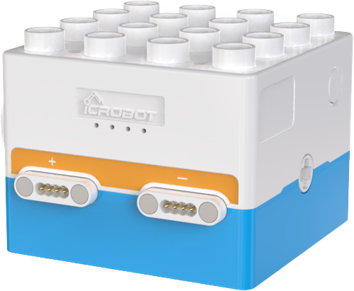
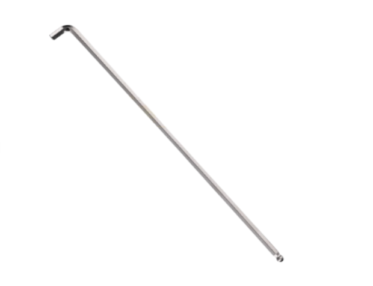

# Bluetooth Unpairing and Pairing
For user convenience, the **ICBlocks Boxy Robot** and **Coding Board** are pre-paired via Bluetooth at the factory. To re-pair these devices, reset the Bluetooth settings on the coding board before initiating the pairing process.  The specific operation steps are as follows:

## Preparation
|  |  |  |
| :---: | :---: | :---: |
|  Coding Board × 1   |  Boxy Robot × 1   |  Thin Rod Tool  × 1[1] |

**Note [1]**: Diameter less than 2mm, length greater than 3cm (e.g., a small screwdriver, an L-shaped wrench under 2mm, or a paperclip).  

## Bluetooth Unpairing  
Turn on the coding board and locate the Bluetooth reset hole (2mm diameter) on the back. Insert the thin rod tool into the reset hole and press the reset button for 5s. Once reset, the coding board will unpair from the previous Boxy Robot and be ready to pair with another.  

## Bluetooth Pairing  
When both the reset coding board and the Boxy Robot to be paired are powered on, the coding board will automatically search for nearby Boxy Robots. Once a Boxy Robot is detected, pairing will be completed automatically.  

After successful pairing:

+ The two orange magnetic interface indicators on the Boxy Robot will turn blue.
+ The Bluetooth status indicator on the coding board will remain lit.

If pairing is unsuccessful after a long period, press the Bluetooth reset button again and try once more.  

