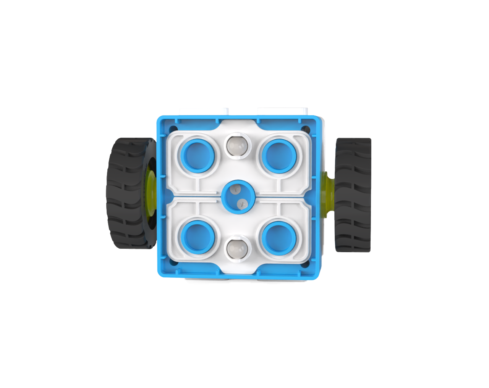
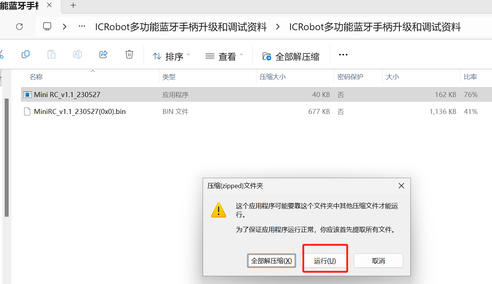
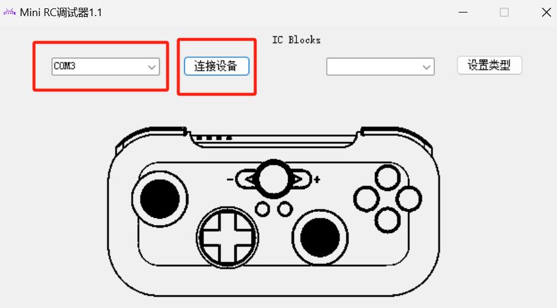
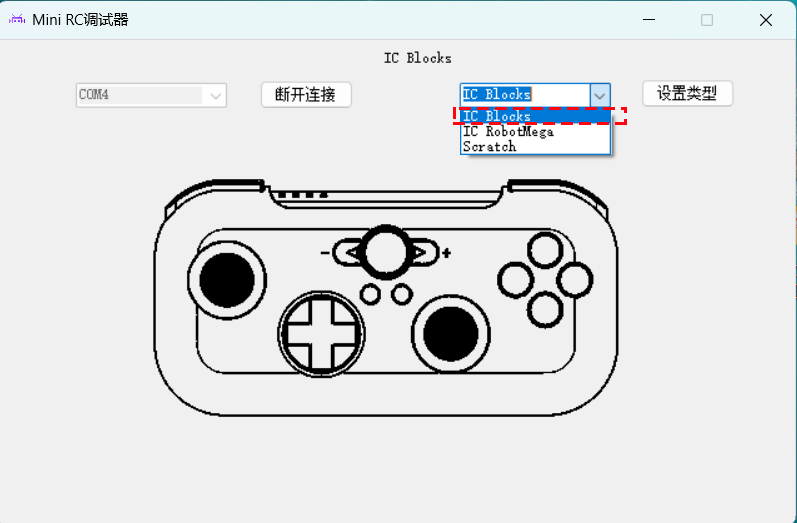
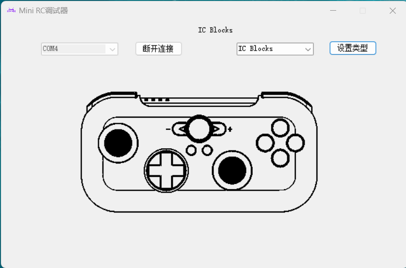

# Failure Analysis and Solution
## Boxy Robot
### **Issue:** The robot wobbles and is unstable during movement.  
 Solution:  

1. This issue usually occurs because the robot's base does not have an omnidirectional wheel installed or the wheel is installed in the wrong direction.  
2. **Correct Installation Direction:** Ensure the wheel is installed properly.  

### Issue: The top white casing of the Boxy Robot bulges.  
**Solution:**

+ This is likely due to battery damage causing the casing to swell.

### **Issue:** There is a rattling noise from inside the Boxy Robot.  
**Solution:**

+ The speed measurement raster cover inside the Boxy Robot may have come loose due to impact. This can cause a rattling noise.
+ The internal battery of the Boxy Robot may have detached.

### **Issue:** The Boxy Robot cannot move properly.  
**Solution:**

+ Check if the couplers on both sides of the Boxy Robot are cracked. If so, replace them or contact customer service for repairs.
+ Internal hardware damage may require factory repairs.

### **Issue:** Blocks connected to the Boxy Robot are not recognized.  
**Solution:**

+ The block may not be connected to the correct port. For logical control:
    - **Orange Ports:** Connect to sensors (orange blocks).
    - **Blue Ports:** Connect to actuators (blue blocks).
+ There may be debris on the magnetic ports of the Boxy Robot and block.
    - Clean the magnetic ports. Refer to the [Boxy Robot cleaning guide](https://icreaterobot-docs.readthedocs.io/en/latest/docs/ICBlocks/06MaintenanceandDebug/02CleaningMagneticConnectors/02BoxyRobotCleaningSteps.html) for detailed methods.
+ The magnetic interface pins may be damaged.

## Coding Board
### **Issue:** The Boxy Robot does not execute programmed actions when the start button is pressed, despite a successful Bluetooth connection.  
**Solution:**

1. The start button may become unresponsive over time. Use the [**ICBlocks Debug Tool**](https://icreaterobot-docs.readthedocs.io/en/latest/docs/ICBlocks/06MaintenanceandDebug/01ICBlocksCalibrationandDebuggingToolGuide.html) for the coding board control debugging. Refer to the debugging tool guide for details.
2. The coding block may not have been recognized.  
3. No actuator is connected to the Boxy Robot.  

### **Issue:** A single block in the program does not execute and skips to the next command.  
**Solution:**

1. The coding block may not have been recognized. Reconnect the block.
2. Clean the magnetic pins of the coding block. Refer to [the coding board cleaning guide](https://icreaterobot-docs.readthedocs.io/en/latest/docs/ICBlocks/06MaintenanceandDebug/02CleaningMagneticConnectors/03CodingBoardCleaningSteps.html).  
3. The Coding board control firmware version problem, need to go to the firmware upgrade center for firmware upgrade. Refer to [the firmware update guide](https://icreaterobot-docs.readthedocs.io/en/latest/docs/ICBlocks/06MaintenanceandDebug/03FirmwareUpgrade/02CodingBoardFirmwareUpgrade.html).

## Motor Block  
### **Issue:** The motor does not rotate despite proper connections.  
 **Solution:**

1. The magnetic port of the motor may not be recognized. Clean the port. Refer to [the product maintenance guide.](https://icreaterobot-docs.readthedocs.io/en/latest/docs/ICBlocks/06MaintenanceandDebug/02CleaningMagneticConnectors/04BlocksCleaningSteps.html)
2. The motor cable may be internally broken and needs replacement.
3. Internal hardware damage requires repair through after-sales service.

### **Issue:** The motor rotates only in one direction and cannot reverse.  
**Solution:**

1. Internal hardware damage requires repair through after-sales service.  
2. The motor may not have been recognized by the Boxy Robot. Reconnect the block.  

### **Issue:** The motor rotates normally but cannot adjust speed.  
**Solution:**

1. Internal hardware damage requires repair through after-sales service.               

## ICRobot Multifunctional Bluetooth Controller  
### Issue: The controller cannot move the robot when the left or right joystick is pushed after connection.  
**Solution ?**

1. Calibrate the joystick:  
    1. While powered on, press and hold the  '- ' and  '+ ' buttons simultaneously. The Home button will flash blue, indicating debug mode.  
    2. Rotate the left and right joysticks in a 360° motion 3-4 times.  
    3.  Turn off the device.  
    4. Power it back on to resume normal functionality.  

### **Issue:** The robot moves abnormally after connecting the controller.  
**Solution:**

1. Calibrate the joystick following the above steps.

### **Issue:** The Bluetooth controller cannot connect to the robot.  
Solution:  

 If the controller has been paired with other devices, [reset the Bluetooth connection](https://icreaterobot-docs.readthedocs.io/en/latest/docs/ICBlocks/04FeatureOverview/03BluetoothControllerFunction.html):

+ Switch to the correct mode if connected to other series devices.

### Debugger Installation and Device Connection  
   1. **Install the Mini RC Debugger Application:**

Download and install the **Mini RC Debugger** software.[Mini RC_v1.1.zip](https://icreate-help-center.yuque.com/attachments/yuque/0/2026/zip/43021771/1785486289892-72da6a72-c215-403a-8ac4-2c55a5a74ec6.zip)

After installation, open the debugger. Use a USB-C cable to connect the controller to the computer's COM port.   Click "Connect Device" and select the corresponding COM port.   The controller will beep, and the Home button will flash continuously, indicating a successful connection. The initial program will appear at the top of the interface.  

   2. **Set Controller Mode:**

In the **Mini RC Debugger**, select the "ICBlocks" mode.   Click the "Set Type" button. The controller will beep again, indicating a successful mode switch.  

   3. **Test Controller Performance:**

After switching modes, test various function buttons or joysticks. If the corresponding operations in the debugging tool match, the controller is functioning correctly.  

 

   4. **Reconnect Device:**

Press and hold the "T" button for 3s. When the Home button displays blue, the Bluetooth connection is successful. Refer to the [Bluetooth connection guide](https://icreaterobot-docs.readthedocs.io/en/latest/docs/ICBlocks/04FeatureOverview/03BluetoothControllerFunction.html) for more details.  

