# Introduction
## Design Concept

ICRobot is an intelligent coding robot that integrates AI technology, featuring powerful functions such as color recognition, object tracking, voice interaction, and wireless image transmission. It is equipped with a visual block-based programming interface that supports both graphical programming and Python development, making it suitable for learners from beginner to advanced levels.

With a built-in 2-megapixel camera and deep-learning computing module, ICRobot can perform real-time tasks such as object detection and facial recognition. It also comes with a launcher, robotic gripper, and a five-channel color and grayscale sensor. The system supports multiple sensor connections and hardware extensions, allowing users to DIY vehicles, robotic arms, and more.

Whether in a school's STEAM classroom, an education and training center, or a family setting, ICRobot inspires children's creativity and curiosity, accompanying them on their journey into AI programming.

## Parts List
|  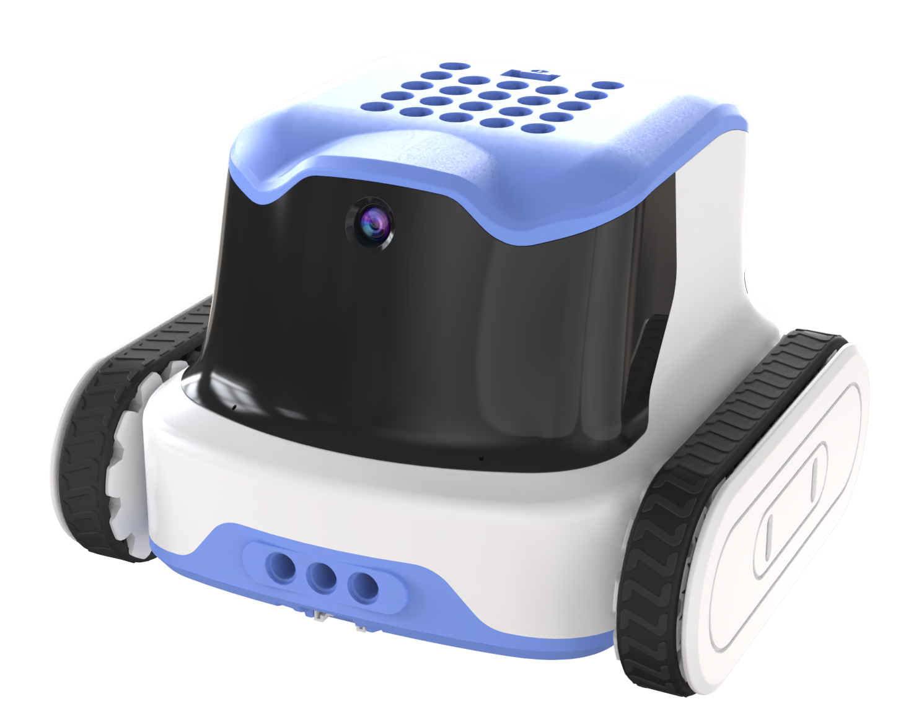 |  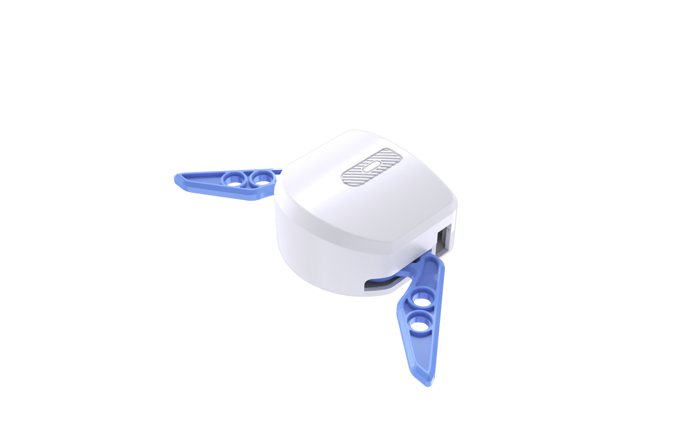 |  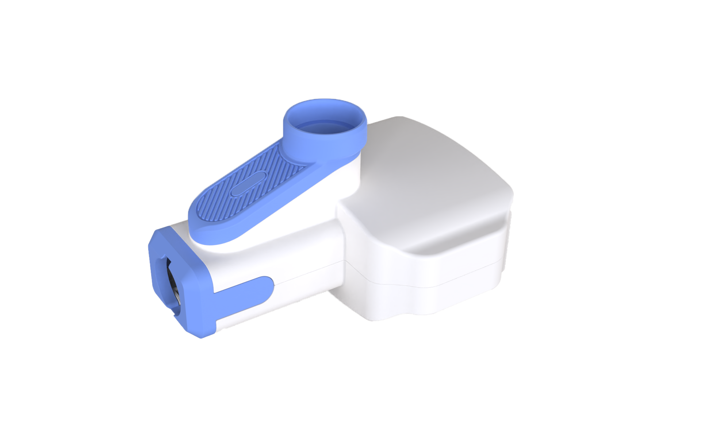 |
| --- | --- | --- |
| ICRobot | Robotic Gripper | Launcher |
|  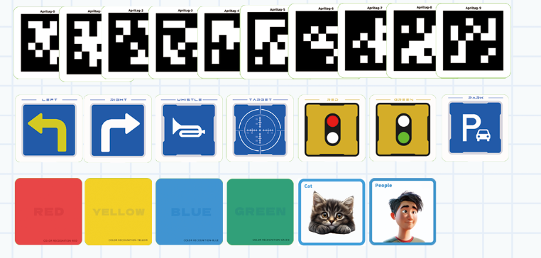 |  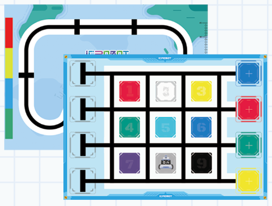 |    |
| Visual Recognition Cards | Map | Ammo Balls |
|   |   |  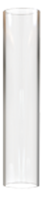 |
| USB-C Cable | Grove Cable | Extended Ammo Magazine |
| 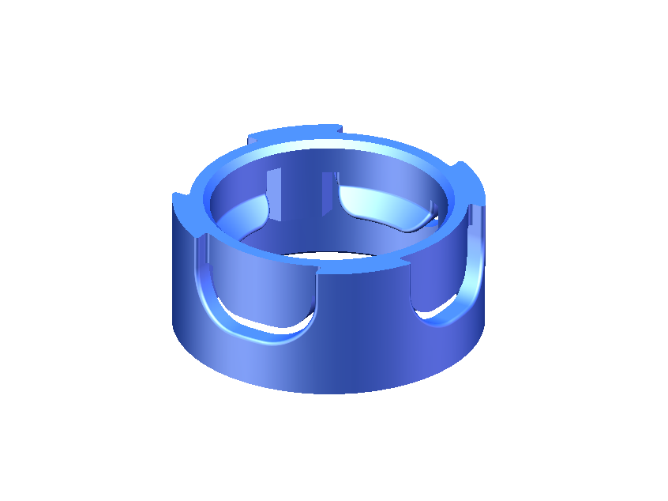 | 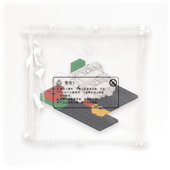 |  |
| Magazine Lock Clip | Building Block Set |  |

## Building Block Parts List
| Item | Diagram | Quantity |
| :---: | :---: | :---: |
| Plate 4 x 4 Round with Hole and Snapstud | 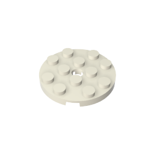 | 4 |
| Brick 1 x 2 with Studs on Opposite Sides | 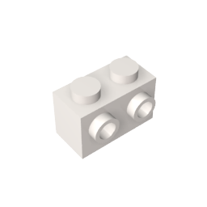 | 2 |
| Slope 1 x 4 Curved | 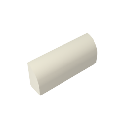 | 8 |
| Brick 2 x 4 | 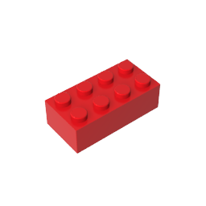 | 4 |
| Green Brick 2 x 4 with Axle Holes | 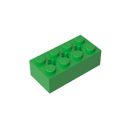 | 4 |
| Blue Brick 2 x 4 with Axle Holes | 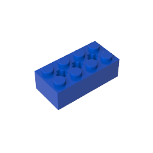 | 4 |
| Yellow Brick 2 x 4 with Axle Holes | 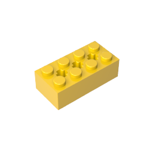 | 4 |
| Brick 2 x 2 Round | 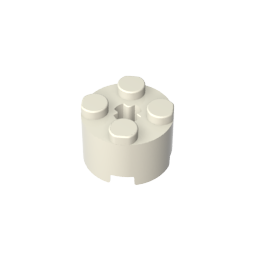 | 16 |
| Technic Plate 2 x 4 with Holes | 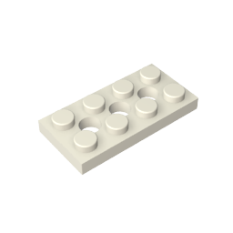 | 4 |
| Plate 1 x 8 | 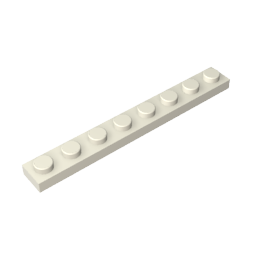 | 2 |
| Plate 1 x 10 | 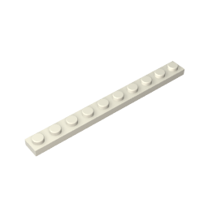 | 2 |
| Plate 2 x 2 | 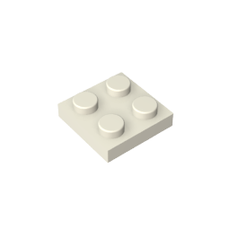 | 4 |
| Plate 1 x 2 | 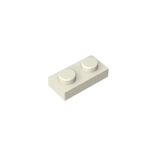 | 9 |
| Plate 1 x 1 | 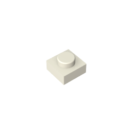 | 20 |
| Beam Bent 53 Degrees, 4 and 6 Holes | 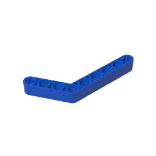 | 2 |
| Beam 3 x 3.8 x 7 Bent 45 Double | 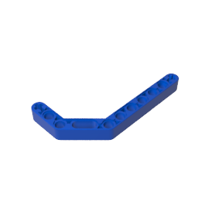 | 2 |
| Three Quarter Pin | 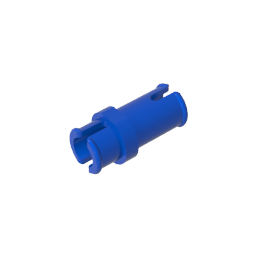 | 5 |
| Technic Pin with Short Friction Ridges | 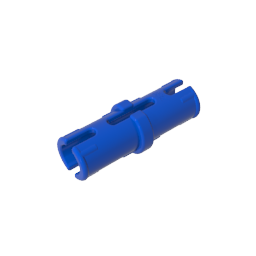 | 15 |
| Brick Separator | 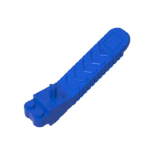 | 1 |
| Plate 10 x 10 | 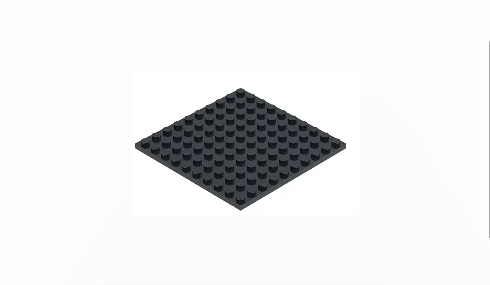 | 1 |

_Note: Due to different production batches, there may be slight variations in certain components. This is a normal occurrence._

## ICRobot Kit Parts List
| Item | Quantity |
| :---: | :---: |
| **ICRobot** | 1 |
| **Robotic Gripper** | 1 |
| **Launcher** | 1 |
| **Visual Recognition Card Set** | 1 |
| **Map** | 1 |
| **Extended Ammo Magazine** | 1 |
| **Magazine Lock Clip** | 1 |
| **USB-C Cable** | 1 |
| **Grove Cables** | 2 |
| **Building Block Sets** | 2 |
| **Ammo Balls** | 10 |

