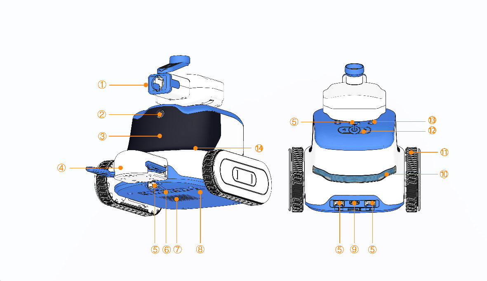

# Structure

| No. | Name | Description |
| :---: | :---: | --- |
| ① | Launcher | Programmable to control the number of launches; accurately fires 12 mm marbles. |
| ② | Camera | Supports image capture at 1600×1200 resolution; delivers high-quality images with low power consumption. |
| ③ | Expression Dot Matrix Display | 8×24 white LED dot-matrix panel with adjustable overall brightness; each LED point is programmable to display expressions, status, or user-defined content. |
| ④ | Robotic Gripper | Provides precise gripping and releasing functions; supports programmable open-close actions. |
| ⑤ | Grove Ports | Equipped with four Grove ports for connecting various sensors or expansion modules, enabling versatile functional extensions. |
| ⑥ | 5-Channel Color & Grayscale Sensor | Detects ground color and brightness values; recognizes line-following tracks or field colors—ideal for smart-driving and similar applications. |
| ⑦ | Speaker | Programmable to produce different types of sounds as required. |
| ⑧ | Privacy Switch | Toggle-type switch that directly controls power to the camera and microphone. When turned on, the system disables both to protect user privacy. |
| ⑨ | Type-C Port | Used for charging and serial communication via Type-C cable; enables program downloading and debugging. |
| ⑩ | Programmable Tail Light | Programmable RGB tail light supporting multiple color effects; functions as a battery indicator during charging or standby. |
| ⑪ | Motion Module | Employs a track-drive system with encoder motors for precise, stable movement and excellent traction and obstacle-crossing performance. |
| ⑫ | Navigation/Confirm Buttons | Center button for power and confirmation; A/B buttons for program switching—also programmable for custom functions. |
| ⑬ | Building-Block Peg Holes | Compatible with small-particle building-block peg connections. |
| ⑭ | Microphone | Captures sound for voice input and recognition. |

