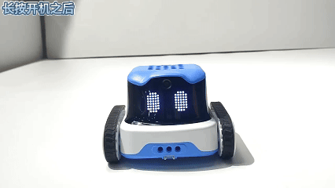
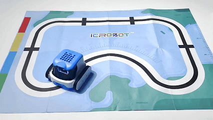
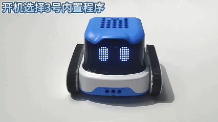
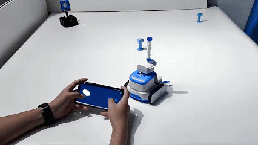
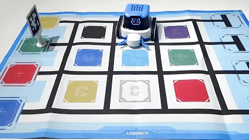

# Using Built-in Example Programs
## Usage Instructions
（1）Power On: 

Press and hold the power button for 2s. The tail light will turn on, and the LED matrix will display an emoji to indicate successful startup.

（2）Select and Use Built-in Programs: 

The robot comes pre-installed with 5 built-in programs. These programs are represented on the screen in the order <1>, <2>, <3>, <4>, and <5>. After powering on, you can switch between the programs using the A and B buttons. Press the power button to run the selected program.

For example: To run Program 2, power on the robot, switch to <2>, and press the power button to select and run it.

Note: In download mode on the software, the built-in sample programs can be replaced by custom-written content. You can also download the sample programs from the software.




## Descriptions of 5 Built-in Programs</font>
### <1> : Line-Following Robot
**Program Introduction: **After entering the program, the robot does automatic line patrol.

Built-in Code Overviews

```plain
time.sleep(0.5)
icrobot.display.show_image([0x0,0x0,0x0,0x10,0x7E,0x91,0x81,0x81,0xC1,0x82,0x84,0x84,0x84,0x84,0x82,0xC1,0x81,0x81,0x91,0x7E,0x10,0x0,0x0,0x0],0)
time.sleep(0.5)
icrobot.rgb_sensor.line_tracking(2)
```

**Demonstration**



### <2> : Voice-Controlled Robot
**Program Introduction:** When the robot detects that the sound exceeds the set threshold of 65, the robot performs the action of moving forward for one second.

**Built-in Code Overviews**

```plain
time.sleep(0.5)
icrobot.display.show_image([0x0,0x0,0x0,0x0,0x0,0x0,0x0,0x0,0x0,0xC,0x90,0xEF,0xEF,0x90,0xC,0x0,0x0,0x0,0x0,0x0,0x0,0x0,0x0,0x0],0)
while True:
    if (icrobot.asr.vol()) > 65:
        icrobot.motor.move_forward(50,duration=1,distance=-1)
        time.sleep(1)
    time.sleep_ms(50)
```

**Demonstration**


### <3> : AprilTag Recognition
**Program Introduction:** 

The ICRobot performs corresponding actions by recognizing AprilTag codes:

When the robot detects the number 0, it turns left 90°.

When it detects the number 1, it moves backward 10 cm.

When it detects the number 2, it moves forward 10 cm.

When it detects the number 3, it plays a bicycle bell sound.

When it detects the number 4, it plays a police siren sound.

When it detects the number 5, it plays a car horn sound.

When it detects the number 6, it plays an ambulance siren sound.

When it detects the number 7, it plays a train whistle sound.

When it detects the number 8, it plays a cat meow sound.

When it detects the number 9, it turns right 90°.


**Built-in Code Overviews**

```plain
icrobot.camera.open(0)
icrobot.ai.set_model(icrobot.ai.apriltag_recognition)
while True:
    if icrobot.ai.apriltag_isrecognized():
        if icrobot.ai.get_apriltag_information() == None:
            continue
        num = icrobot.ai.get_apriltag_information()
        icrobot.display.show_text(str(num))
        if num == 0:
            icrobot.motor.turn_left(50,duration= -1,distance= 90)
        elif num == 1:
            icrobot.motor.move_backward(50,duration= -1,distance= 10)
        elif num == 2:
            icrobot.motor.move_forward(50,duration=-1,distance=10)
        elif num == 3:
            icrobot.speaker.play_music_until_done('/flash/bicycle.wav')
        elif num == 4:
            icrobot.speaker.play_music_until_done('/flash/police.wav')
        elif num == 5:
            icrobot.speaker.play_music_until_done('/flash/car.wav')
        elif num == 6:
            icrobot.speaker.play_music_until_done('/flash/ambulance.wav')
        elif num == 7:
            icrobot.speaker.play_music_until_done('/flash/train.wav')
        elif num == 8:
            icrobot.speaker.play_music_until_done('/flash/cat.wav')
        elif num == 9:
            icrobot.motor.turn_right(50,duration= -1,distance= 90)    
    time.sleep(0.5)

```

**Demonstration**



### 
### <4> : App Remote Control
**Program Introduction:**  Mobile APP connects with the ICRobot robot via Bluetooth. Control the ICRobot robot through the APP.

**Operation steps:**

  a. Connect the powered-on ICRobot robot to the APP, refer to <font style="color:#117CEE;">[Bluetooth Mode (BT)](https://icreaterobot-icrobot-docs.readthedocs.io/en/latest/docs/ICRobot/04OperationManual/01ConnectionMethod/03BluetoothModeBTMode.html)</font> for connection operation.

  b. Press ICRobot A/B button to switch to programme <4> and select it. 

  c. APP Bluetooth remote control ICRobot movement.

**Built-in Code Overviews**

```plain
R_Rocker = {"x": 0, "y": 0, "key": 0}
L_Rocker = {"x": 0, "y": 0, "key": 0}
Xkey = Ykey = Akey = Bkey = 0
UPkey = DOkey = Lkey = Rkey = 0
Lshoulder = Rshoulder = 0
Ltrigger = Rtrigger = 0
icrobot.display.show_image([0x0,0x0,0x0,0x0,0x7C,0x82,0x91,0xB9,0x91,0x83,0x85,0x85,0x85,0x85,0x83,0xA9,0x91,0xA9,0x82,0x7C,0x0,0x0,0x0,0x0],0)
def get_all_bluetooth_data():
    global Xkey, Ykey, Akey, Bkey, UPkey, DOkey, Lkey, Rkey
    global Lshoulder, Rshoulder, Ltrigger, Rtrigger
    global R_Rocker, L_Rocker
    if ble.flag:
        # 假设接收到的数据（字节数组）
        temporary = ble.BLE_MESSAGE
        
        if temporary and temporary[0] == 0xff:
            # 解析数据
            R_Rocker["x"] = temporary[1] if temporary[1] <= 127 else temporary[1] - 256
            R_Rocker["y"] = temporary[2] if temporary[2] <= 127 else temporary[2] - 256

            L_Rocker["x"] = temporary[3] if temporary[3] <= 127 else temporary[3] - 256
            L_Rocker["y"] = temporary[4] if temporary[4] <= 127 else temporary[4] - 256

            Rtrigger = ((temporary[5] >> 0) & 1)
            Rshoulder = ((temporary[5] >> 1) & 1)

            Ltrigger = ((temporary[5] >> 2) & 1)
            Lshoulder = ((temporary[5] >> 3) & 1)

            R_Rocker["key"] = ((temporary[5] >> 4) & 1)
            L_Rocker["key"] = ((temporary[5] >> 5) & 1)

            Ykey = ((temporary[6] >> 0) & 1)
            Xkey = ((temporary[6] >> 1) & 1)
            Bkey = ((temporary[6] >> 2) & 1)
            Akey = ((temporary[6] >> 3) & 1)

            Rkey = ((temporary[6] >> 4) & 1)
            Lkey = ((temporary[6] >> 5) & 1)
            DOkey = ((temporary[6] >> 6) & 1)
            UPkey = ((temporary[6] >> 7) & 1)
                         
while True:
    get_all_bluetooth_data()
    # 控制前后运动（通过右摇杆 Y 轴）
    l_speed = 0  # 左轮速度
    r_speed = 0  # 右轮速度
    lx = L_Rocker["x"]
    ly = L_Rocker["y"]
    if Ltrigger == 1 or Rtrigger == 1:
        icrobot.gun.fire(1,1) 
    if Xkey == 1:
        icrobot.gripper.open(2)
    if Ykey == 1:
        icrobot.gripper.close(2)
    if R_Rocker["key"]==1 or L_Rocker["key"]==1:
        icrobot.speaker.play_music_until_done("/flash/car.wav")

    if abs(lx) > 20 or abs(ly) > 20:
        l_speed = ly + lx
        r_speed = ly - lx
        l_speed = max(-100, min(100, l_speed))
        r_speed = max(-100, min(100, r_speed))
    # 调用 uart.send_move() 控制小车
    icrobot.motor.drive(l_speed,r_speed)
    time.sleep_ms(100)
```

**Demonstration**




### <5> : Transport Robot
**Program Introduction:** The ICRobot activates its camera and moves to a designated position to locate the AprilTag code (target position).

If the recognized AprilTag code value is 1, the robot executes the following sequence of actions:

grab → turn left → move forward → turn left → move forward → turn right → move backward → release,

placing the object within the designated boundary area.

**Built-in Code Overviews**

```plain
time.sleep(0.5)
icrobot.display.show_image([0x0,0x0,0x0,0x0,0x0,0x0,0x38,0x47,0x91,0x8A,0x92,0x82,0x82,0x92,0x8A,0x91,0x47,0x38,0x0,0x0,0x0,0x0,0x0,0x0],0)
icrobot.camera.open(0)
icrobot.ai.set_model(icrobot.ai.apriltag_recognition)
icrobot.gripper.open_until_done(2)
icrobot.motor.move_forward(50,duration=-1,distance=0.7*10)
icrobot.motor.turn_right(50,duration=-1,distance=90)
icrobot.motor.move_forward(50,duration=-1,distance=2.1*10)
while True:
    if icrobot.ai.apriltag_isrecognized():
        if icrobot.ai.get_apriltag_information() == None:
            continue
        if icrobot.ai.get_apriltag_information() ==1:
            num = icrobot.ai.get_apriltag_information()
            icrobot.gripper.close_until_done(2)
            icrobot.motor.turn_left(50,duration=-1,distance=90)
            icrobot.motor.move_forward(50,duration=-1,distance=1.4*10)
            icrobot.motor.turn_left(50,duration=-1,distance=90)
            icrobot.motor.move_forward(50,duration=-1,distance=2.1*10)
            icrobot.motor.turn_right(50,duration=-1,distance=90)
            icrobot.motor.move_backward(50,duration=-1,distance=0.7*10)
            icrobot.gripper.open_until_done(2)
            break
    time.sleep(0.3)
```

**Demonstration**




