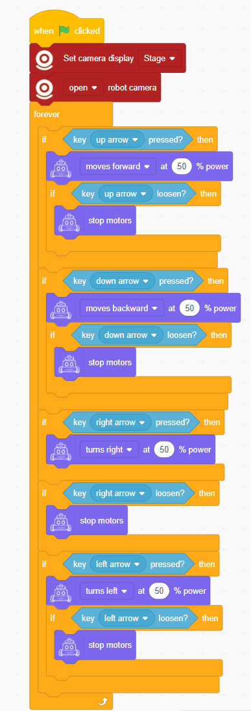
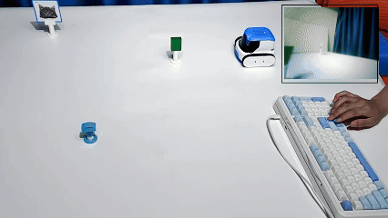

# Programming the Robot via Software
## Definition
When programming the robot, ICRobot interacts and communicates with the ICreateCode programming software through certain connections.

## Connection Methods
There are two available wireless connection modes between ICRobot and the ICreateCode platform: Access Point Mode (AP) and Station Mode (STA)

For setup instructions, refer to the guide on AP Mode and STA Mode configuration.

## Programming Modes
Programming operations can be performed in two modes of use: interactive mode and download mode. For details on the operation of the interactive and download modes, refer to the User's Guide.

## Example Program: Button-Controlled Robot
Program Description: Control the robot using directional buttons, with a first-person view displayed on the stage.

### Program

### **Demonstration**

