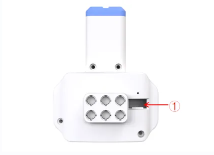
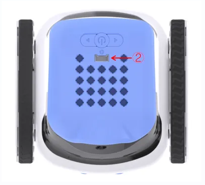
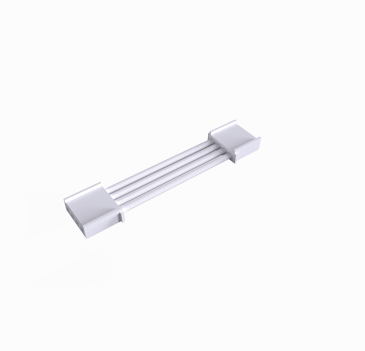

# Launcher

## Introduction
ICRobot is equipped with a launcher, programmable control of the number of launches of marble launching device, built-in high-speed motors, and an elastic energy storage structure to ensure the smooth launch of marbles. The internally integrated current detection sensor can monitor the launching status in real time, improving the intelligence and reliability of the system.

## Specifications
| Item | Description |
| :---: | :---: |
| Product Name | Launcher |
| Product Code | B0210003 |
| Rated Voltage | 5V |
| Firing Frequency | 33 balls/min |
| Communication Protocol | I²C |
| Interface Type | Grove |

## Structure

| **No.** | **Name** | **Description** |
| :---: | :---: | --- |
| ① | Indicator Light | Indicates device status: lights up when connected to the robot; breathes when data is being transmitted. |
| ② | Grove Port | Connects via Grove cable. |
| ③ | Building Block Peg Holes | Used to attach the launcher to small-particle building blocks using half-pins. |
| ④ | Ammo Loading Port | Port for loading POM balls into the magazine. |
| ⑤ | Launcher Exit | Ball exit point during launching. |
| ⑥ | Magazine Lock Clip | Locks the extended magazine to prevent ball spillage. |
| ⑦ | Extended Ammo Magazine | Increases magazine capacity for more ammo. |
| ⑧ | Ammo Ball (12mm POM) | 12mm-diameter POM spherical balls used as projectiles. |

## Usage Instructions
|  |  |  |
| :---: | :---: | --- |
| Launcher × 1 | ICRobot × 1 | Grove Cable × 1 |

### Operating Steps:
Insert one end of the Grove cable into the Grove port on the launcher (refer to position "①" above).

Connect the other end of the Grove cable to any Grove port on the ICRobot. In this example, we use Port 2 (refer to position "②" above).

### [Demonstration](https://icreaterobot-icrobot-docs.readthedocs.io/en/latest/docs/ICRobot/03ComponentsandHardwareDescription/12ComponentUsageExamples.html#)

