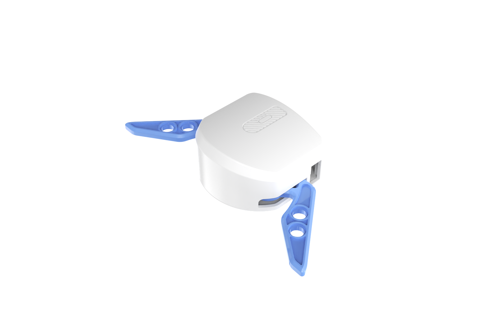
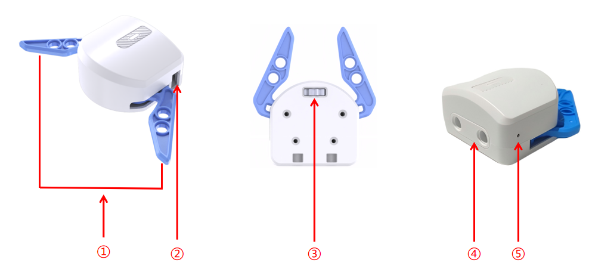
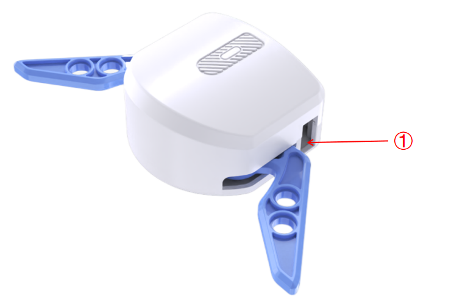
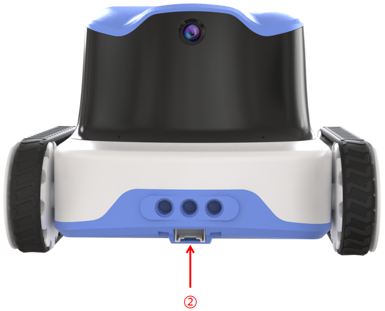
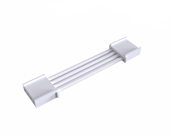

# Robotic Gripper

## Introduction
The ICRobot is equipped with a robotic gripper powered by an N20 geared motor. It provides precise grasping and opening/closing capabilities, making it an efficient tool for object manipulation in a wide range of applications.

## Specifications
| Item | Description |
| :---: | :---: |
| Product Name | Robotic Gripper |
| Product Code | B0210004 |
| Rated Voltage | 5V |
| Communication Protocol | I²C |
| Interface Type | Grove |

## Structure

| **No.** | **Name** | **Description** |
| :---: | :---: | --- |
| ① | Gripper Claw | Opens and closes to grasp objects. |
| ② | Grove Port | Connects to the robot via Grove cable. |
| ③ | Adjustment Gear | Allows manual operation of the gripper when powered off. |
| ④ | Building Block Peg Holes | Compatible with small-particle bricks for structural integration. |
| ⑤ | Indicator Light | Lights up when connected; breathes during data transmission. |

## Usage Instructions
### Connection
|  |  |  |
| :---: | :---: | :---: |
| Robotic Gripper × 1 | ICRobot × 1 | Grove Cable × 1 |

### Operating Steps:
1. Insert one end of the Grove cable into the Grove port on the gripper (see position “①” above).
2. Connect the other end of the Grove cable to any Grove port on the ICRobot. In this example, use Port 2 (see position “②” above).

### [Demonstration](https://icreaterobot-icrobot-docs.readthedocs.io/en/latest/docs/ICRobot/03ComponentsandHardwareDescription/12ComponentUsageExamples.html#)

