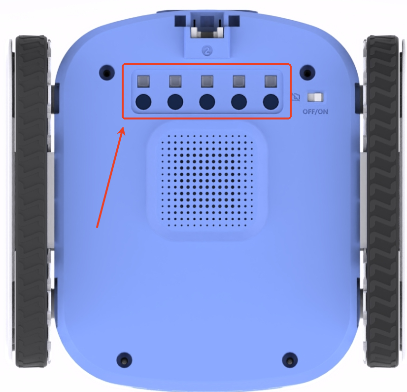

# Five-way Color & Gray Sensor

## Introduction
The ICRobot robot's five colour greyscale sensors are designed using the photoelectric effect and are programmed to convert the collected light information into three modes: dichroic, greyscale and colour. Each sensor consists of five sets of infrared diodes and receiver tubes that emit infrared light and receive reflected light. Different coloured surfaces absorb light to different degrees and the intensity of the reflected light varies, which is converted into different voltage signals for colour and grey scale recognition.

## Usage Instructions
Combined with a five-way greyscale colour sensor, ICRobot applications encompass a wide range of scenarios including detection and recognition of black and white images, detection of object colours, and intelligent line patrolling.

| Paradigm | Functionality |
| :---: | :---: |
|  Binary Mode  | In binary mode, the sensor processes the detected surface information and returns either a 0 or a 1. A 0 indicates a dark-coloured surface; a 1 indicates a light-coloured surface. |
|  Greyscale Mode | In greyscale mode, the sensor processes the detected surface information and returns a greyscale value ranging from 0 to 255 (black to white). |
|  Colour Mode | In colour mode, the sensor processes the detected surface information and recognises it as one of the following nine colours: red, orange, yellow, green, cyan, blue, purple, black and white. |

### [Demonstration](https://icreaterobot-icrobot-docs.readthedocs.io/en/latest/docs/ICRobot/03ComponentsandHardwareDescription/12ComponentUsageExamples.html#)
