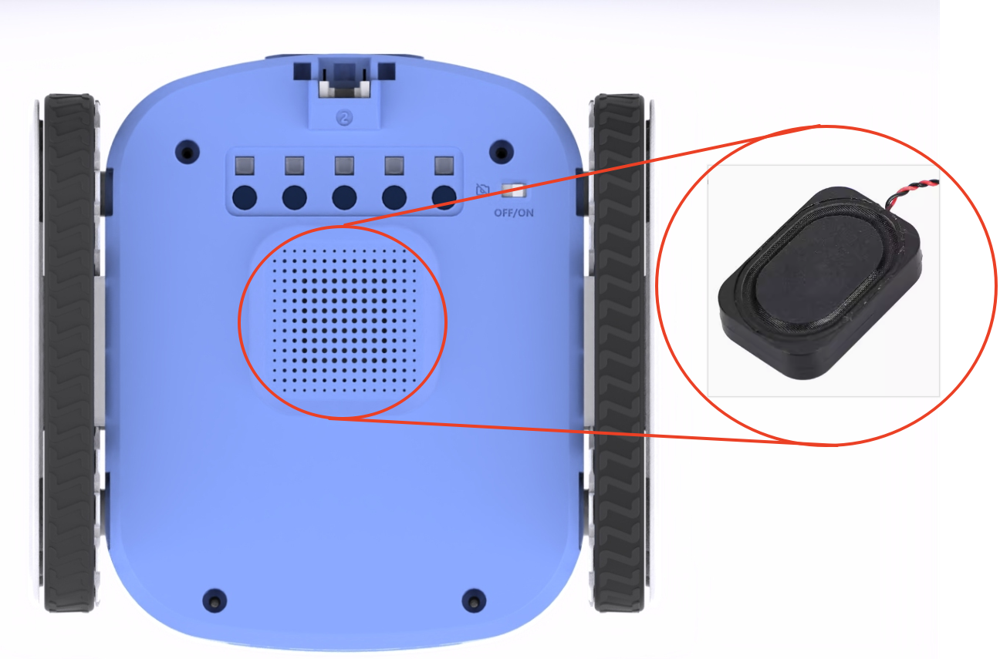

# Speaker
## 
## Introduction
The ICRobot integrates a small speaker that provides clear audio output and is suitable for a variety of audio application scenarios, such as voice prompts, music playback, and sound interaction, to enhance the robot's interactive capabilities and user experience.

## Usage Instructions
The speaker in programming control mode has the following functions: 

1. Outputs the power-on sound and prompts the setting information when powering on the device; 

2. Supports programming control in order to emit the corresponding sound in different contexts.

The speaker has the following functions after updating the Xiaozhi AI firmware: 

1. It can achieve sound output during intelligent dialogue;

### [Demonstration](https://icreaterobot-icrobot-docs.readthedocs.io/en/latest/docs/ICRobot/03ComponentsandHardwareDescription/12ComponentUsageExamples.html#)
