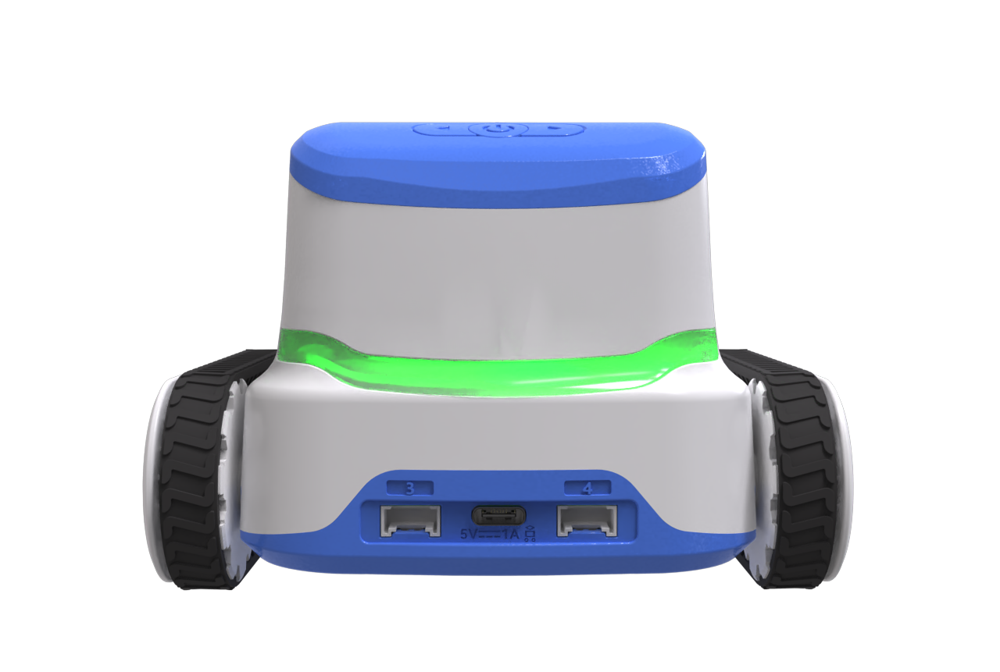
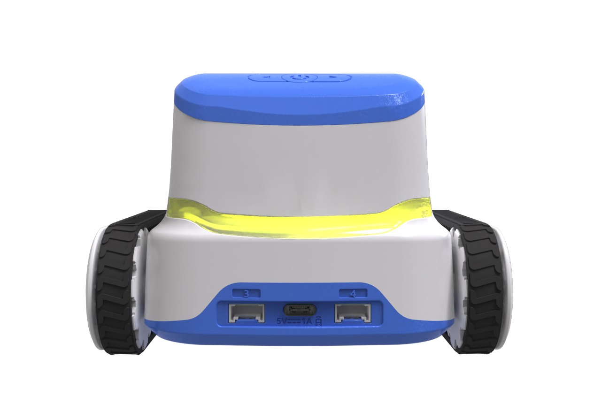
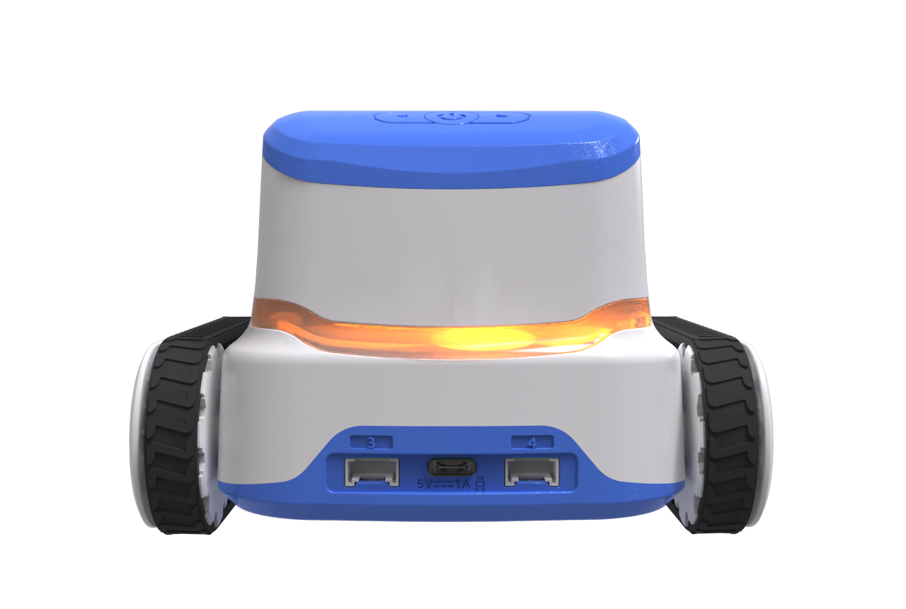
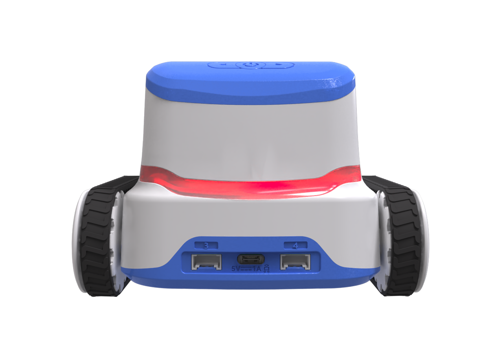

# Programmable Tail Light Module
## Introduction
The programmable tail light at the rear not only has a practical power display function to provide users with convenient power alerts, but also attracts attention with its unique visual effect. It gives intuitive visual feedback during the programming learning process, making the learning experience more efficient and interesting.

## Usage Instructions
### Battery Level Indicator
The programmable taillight has a practical power display function. The robot's power status is clearly and intuitively presented through a gradation of four colours: green, yellow, orange and red. Green represents sufficient power (100%), yellow alerts moderate power (75%), orange indicates low power (50%), and red warns of insufficient power (25%).

|  |  |  |  |
| --------------- | --------------- | --------------- | --------------- |
| 1        | 2        | 3        | 4        |

1. At Startup: By default, the tail light displays battery level using the gradient color scheme described above.
2. Charging Behavior Overview:

| Robot Status | Device Not Running Program | Device Running Program |
| --- | :---: | :---: |
|  Powered Off | Breathing light shows the colour of the charging power level, and the constant green light shows full charge. |   ———— |
|          Powered On | Battery colour is always on | Display of colours after programming control |

### [Demonstration](https://icreaterobot-icrobot-docs.readthedocs.io/en/latest/docs/ICRobot/03ComponentsandHardwareDescription/12ComponentUsageExamples.html#)
