# Component Usage Examples
## Launcher
### Usage Instructions
| 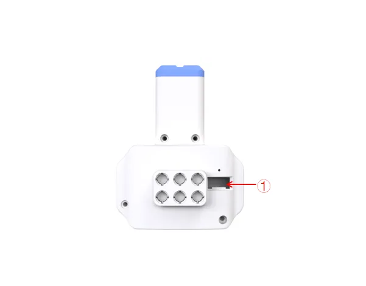 | 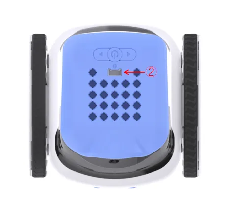 | 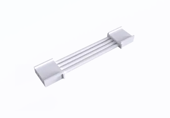 |
| --- | --- | --- |
| Launcher ×1 | ICRobot ×1 | Grove Cable×1 |

Steps:

1. Insert one end of the Grove cable into the Grove port on the launcher (refer to position "①" above).
2. Connect the other end of the Grove cable to any Grove port on the ICRobot. In this example, we use Port 2 (refer to position "②" above).

## Example: Launching Marbles 
**Program Description: **When the green flag is clicked, repeat the execution: Launcher 1 launches 1 marble and waits for 4 seconds.

**Program**

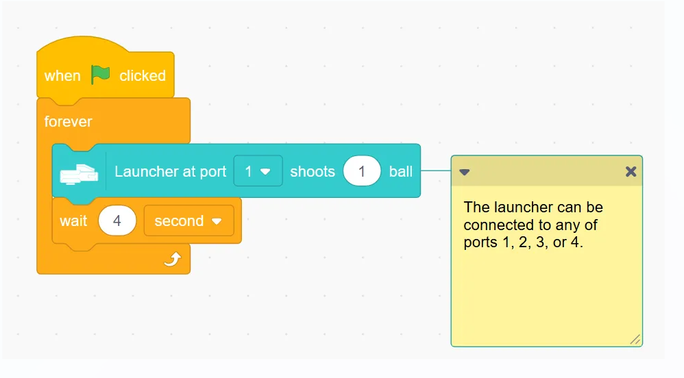

**Demonstration**

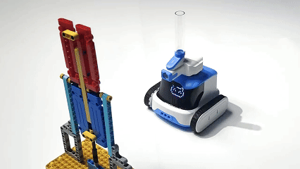

## Robotic Gripper
### Usage Instructions
### Connections
| 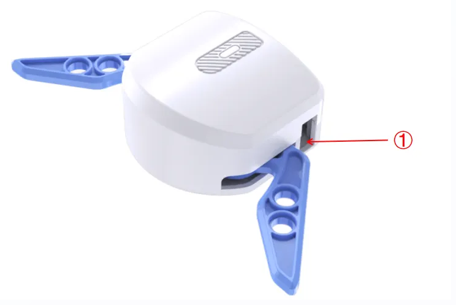 | 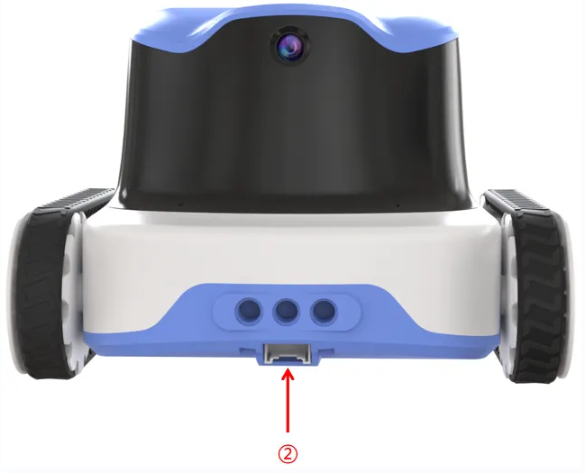 | 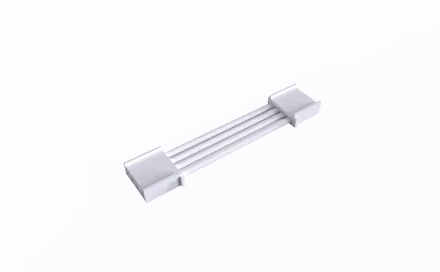 |
| --- | --- | --- |
| Robotic Gripper ×1 | ICRobot ×1 | Grove Cable ×1 |

Steps:

1. Insert one end of the Grove cable into the Grove port on the launcher (refer to position "①" above).
2. Connect the other end of the Grove cable to any Grove port on the ICRobot. In this example, we use Port 2 (refer to position "②" above).

### Program
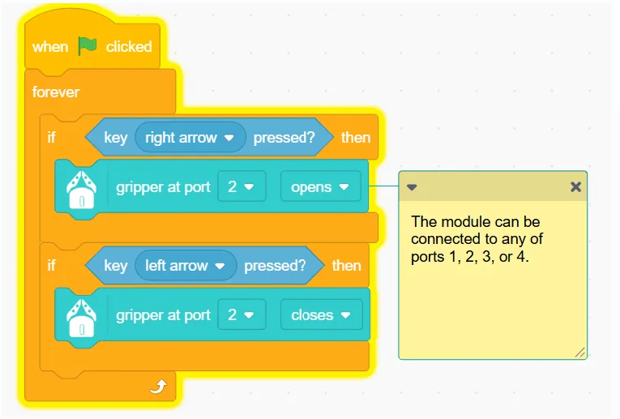

### Demonstration
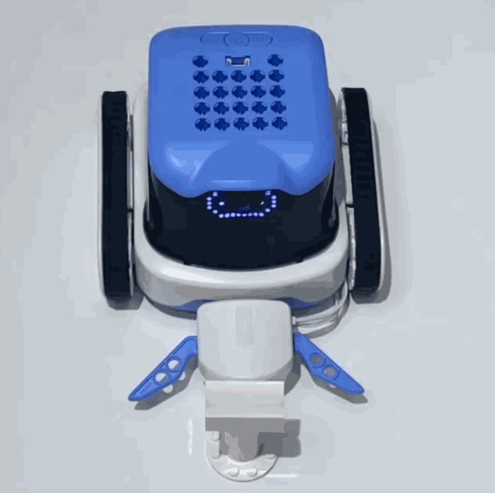

## LED Matrix Display 
### Example: Dot Matrix Display "ICROBOT" 
Description: When the green flag is clicked, set the brightness of the dot matrix screen to 10 and repeat the execution to display the text "ICROBOT" character.

### Program
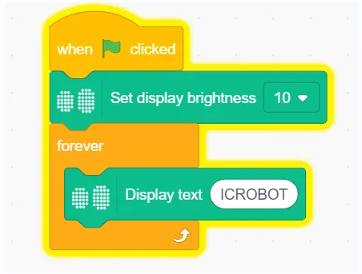

### Demonstration

## Camera 
### Example: Stage area displaying camera screen 
Program description: When the green flag is clicked, set the camera screen loaded stage display and then turn on the robot camera.

### Program
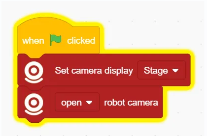

### Demonstration
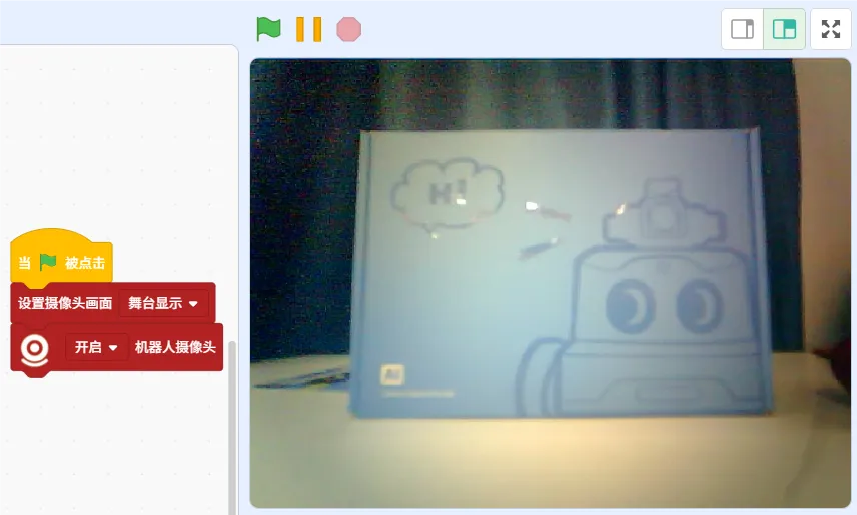

## Movement Module 
### Example Program: Walking Square.
Program description: When the green flag is clicked, repeat the execution of moving forward with 50 % power, wait for 2 seconds and then the robot will turn left with 50 % power and wait for 0.75 seconds. ps: please adjust the waiting time according to the actual effect.

### Program
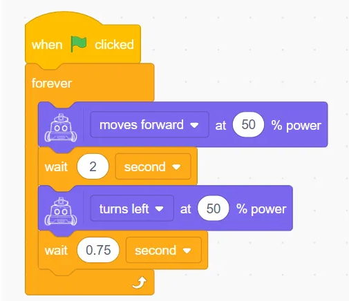

### Demonstration
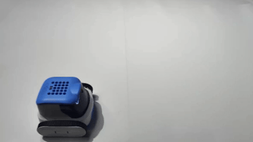

## Five-way Color&Gray sensor
### Example: Autonomous Line Following
Program description: At the beginning of the program, the robot starts the Auto Patrol in low speed mode, waits for 10 seconds and then stops the Auto Patrol.

### Program
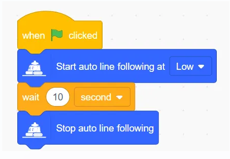

### Demonstration

## Speaker 
### Example: Speaker Playing Sound 
Program Description: Click on the green flag to execute the Program, set the volume, and the loudspeaker plays the corresponding sound by pressing the left and right buttons.

### Program
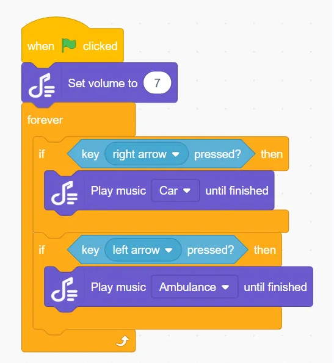

### Demonstration

## Function Button
### Example: Button Interaction 
Program Description: Customise the usage of the keys by programming the keys to interact with the stage character when the keys are pressed.

### Program
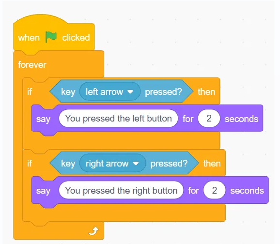

### Demonstration
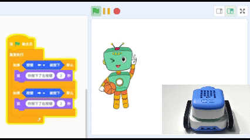

## Programmable Tail Light Module
### Example: Tail Light Color Change 
Program Description: When the program is executed, the tail light is sky blue, wait for two seconds, then the tail light changes in a cycle of red, green and blue colours.

### Program
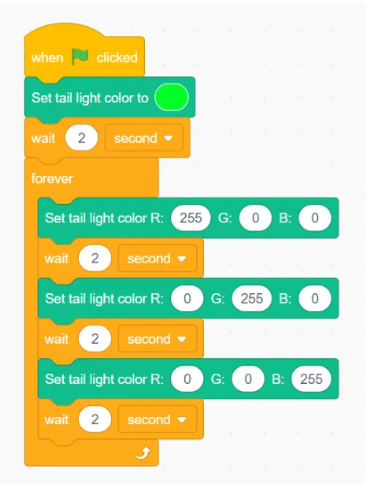

### Demonstration
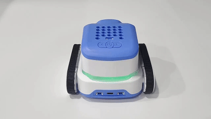

## Microphone 
### Example: Voice-controlled Robot
Program Description: When an ambient sound greater than 70 is detected, the robot advances at 50% power for one second.

### Program
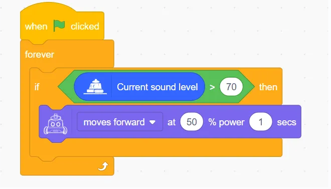

### Demonstration

