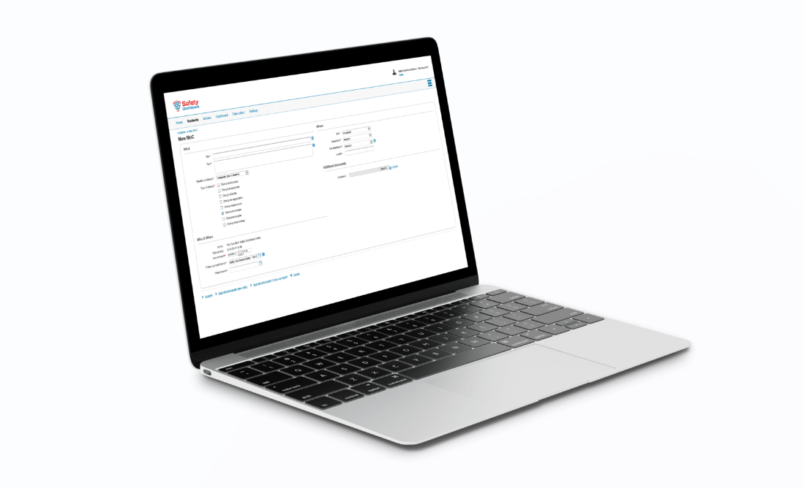
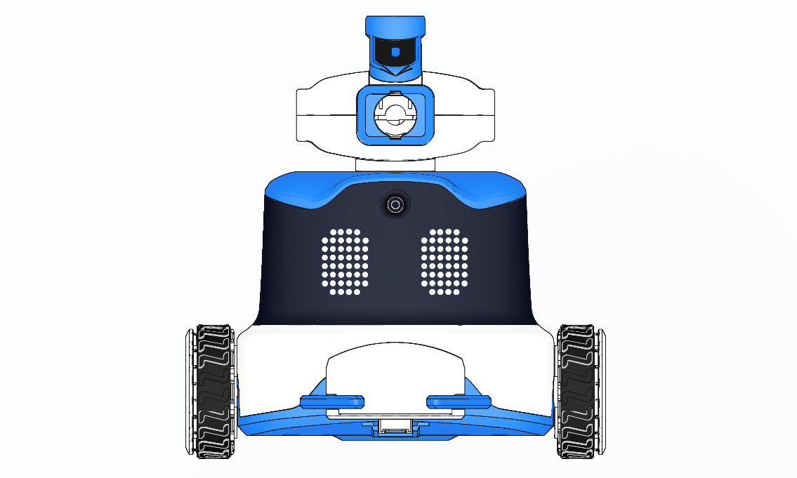
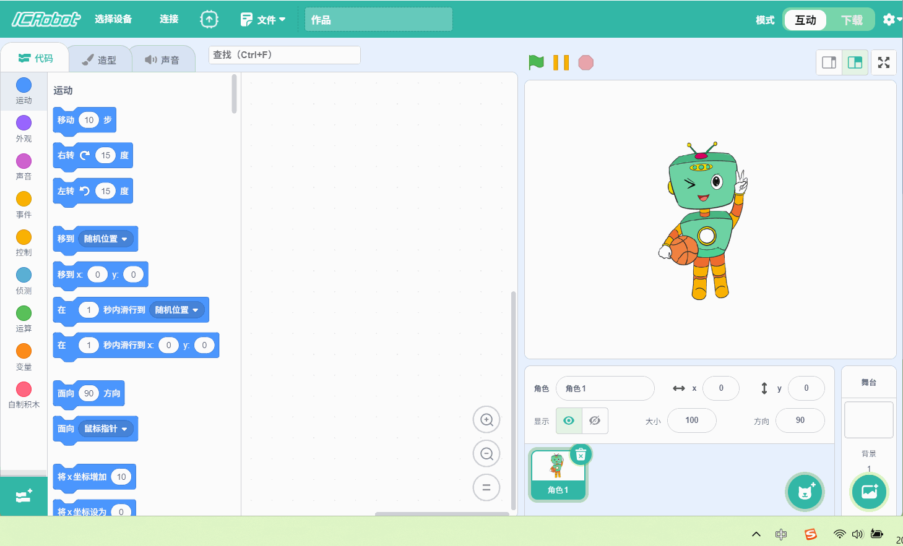
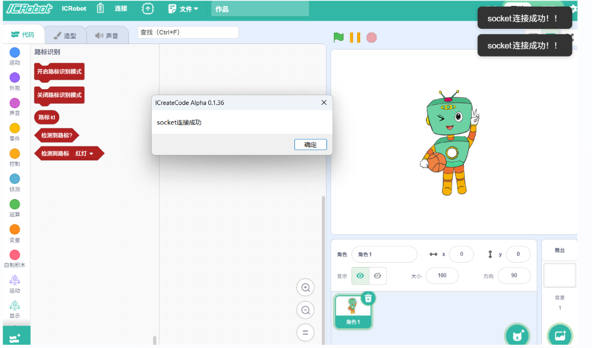

# Access Point Mode (AP Mode)
## Definition

In AP Mode, the ICRobot acts as a wireless hotspot. The PC searches for and connects to the robot's Wi-Fi signal to enable wireless communication.

## Preparation
|  |  |  |
| :---: | :---: | :---: |
| A computer (Windows/macOS) | ICreateCode software | ICRobot |

## Steps
|  |  |
| --- | --- |
| Step 1: Power on the ICRobot. After startup, press the left or right button to switch to SET Mode. | Step 2: While in SET mode, press the left or right button to switch to AP Mode, then press the power button to confirm. The robot will voice one of the following messages: "Switching to AP Mode." or "Already in AP Mode. No need to switch." |
|  |  |
| Step 3. Programming software interface, click Connect, select WIFI, select ICRobot device name (last four digits of MAC), click Connect. Note: The MAC can be viewed in the tab at the bottom of the cart | Step 4: If the device name is not refreshed in step 3, open WLAN on PC and refresh the device name (the device name is the last 4 digits of the MAC, so you only need to check the device name here without clicking Connect). |
|        | |
|  Step 5: The software prompts "socket connection is successful", the ICRobot display switches to the interactive cat expression and the voice announces successful connection, which means the connection is successful. (Note: When ICrobot connects to PC through AP connection, the wireless network of PC will be disconnected automatically after successful connection). | |

To Disconnect

If you wish to disconnect, simply click “Disconnect current device” in the connection box within the software.

