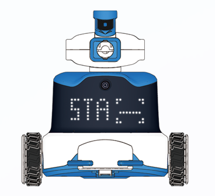
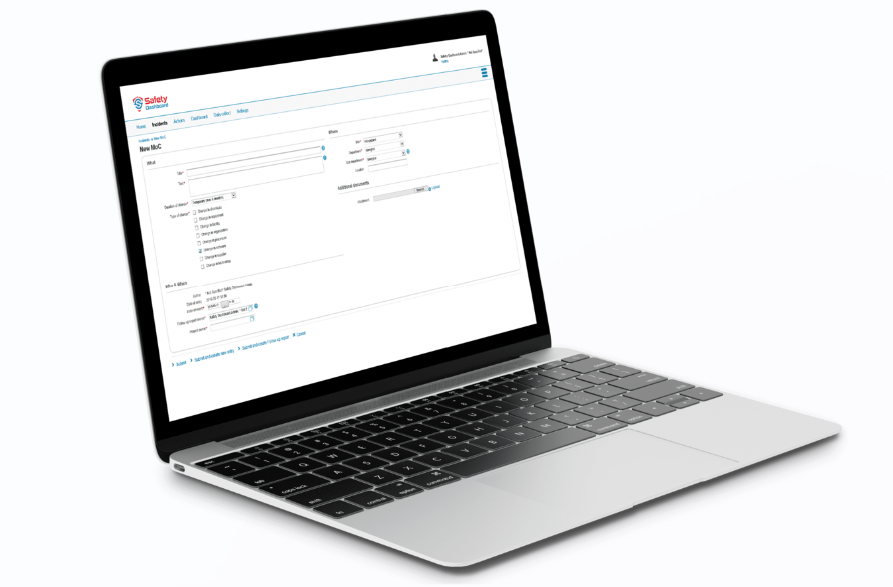
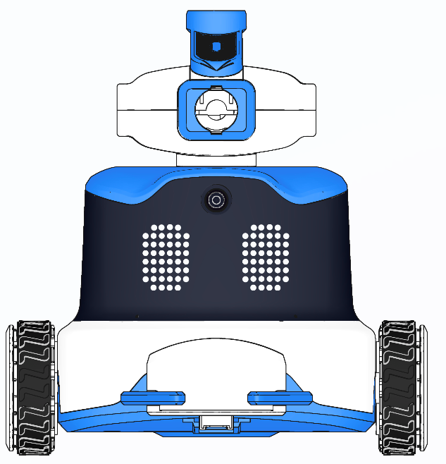
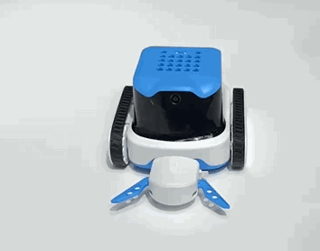
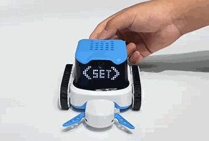
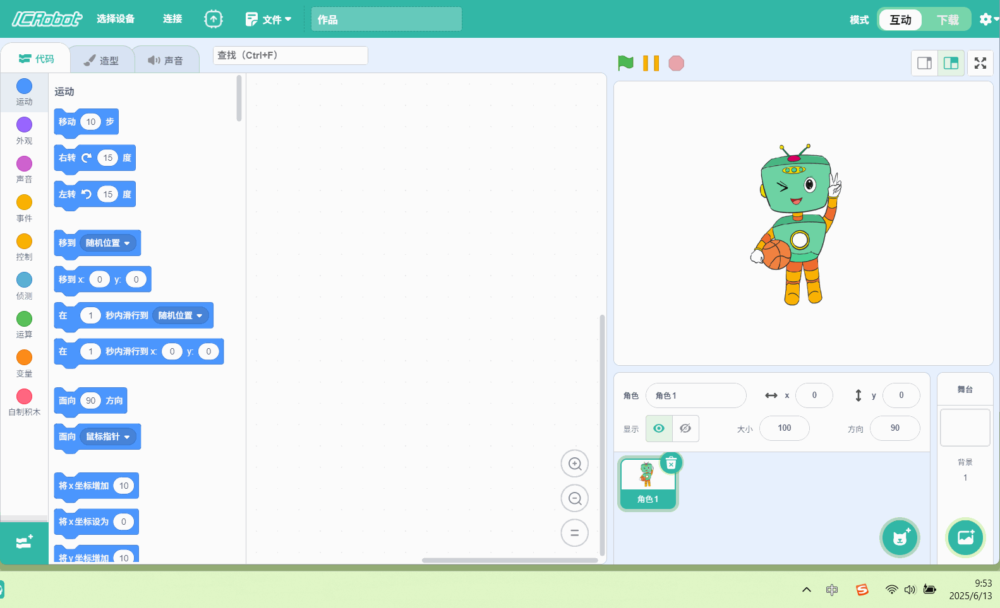
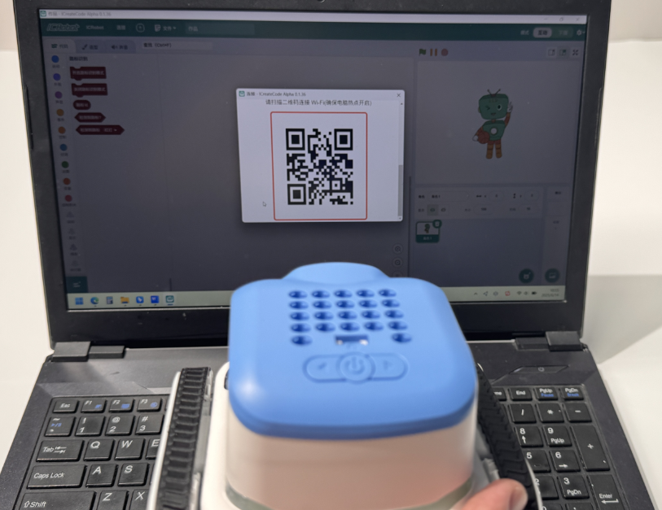

# Station Mode (STA)
## Definition

In STA Mode, the ICRobot connects to the computer's mobile hotspot for wireless communication.

## Preparation
|  |  |  |
| :---: | :---: | :---: |
| A computer (Windows/macOS) | ICreateCode software | ICRobot |

## Steps

|  |  |
| --- | --- |
| Step 1: Power on the ICRobot. After startup, press the left or right button to switch to SET Mode, then press the power button to enter. | Step 2: In SET Mode, press the left or right button to switch to STA Mode, then press the power button to confirm. The robot will voice one of the following prompts:" Switching to STA Mode," or "Already in STA Mode. No need to switch." |
|  |  |
| Step 3: Open the ICreateCode software. Click "Select Device", choose "ICRobot", and in the pop-up dialog, select "QR Code". |  Step 4:   On your PC, turn on Mobile Hotspot. Right-click the hotspot icon and select "Settings" to view the network name (SSID) and password. Enter this information into the QR code fields in ICreateCode, then click "Generate QR Code & Connect."Make sure your hotspot is set to 2.4GHz. 5GHz networks may cause connection failure. |
|  |  |
| Step 5: Have the ICRobot camera scan the QR code displayed on the screen to complete network configuration. | Step 6: Once connected, the robot will: Display a cat interaction emoji on the LED matrix. Voice prompt "Connected successfully." |

To Disconnect

To disconnect, simply turn off the mobile hotspot on your computer.

