# Bluetooth Mode (BT Mode)
## Definition
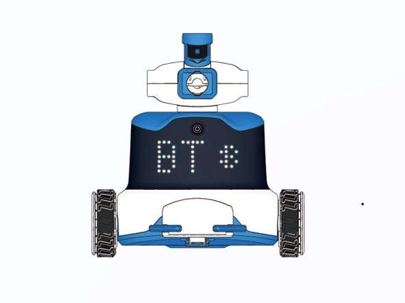

In BT Mode, the ICRobot connects via Bluetooth to either: the ICRemote app on a mobile device, or a Bluetooth game controller, enabling wireless interaction and remote operation.

## Software Interaction
### Preparation
| 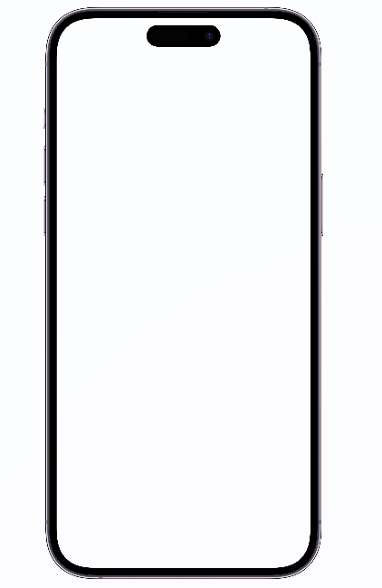 | 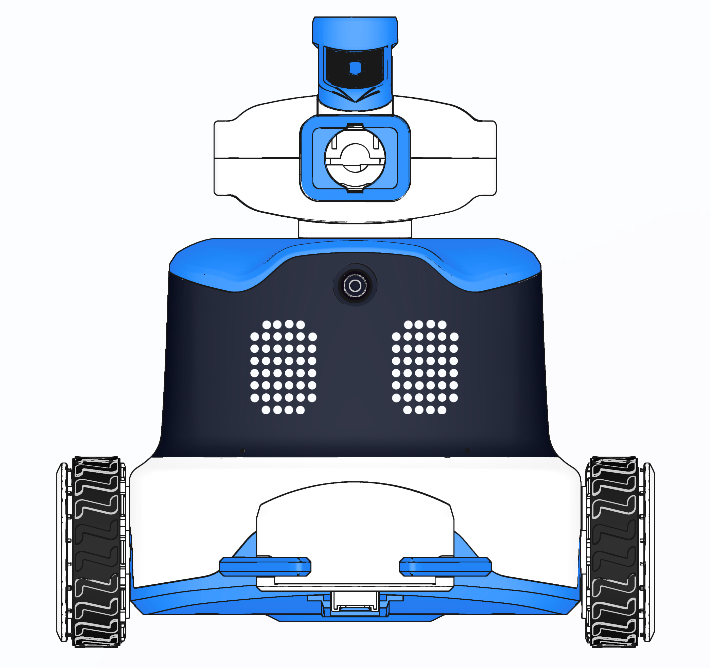 |  |
| :---: | :---: | :---: |
| Android Mobile Device | ICRobot  | ICRemote App |

### Download the App
Scan the QR code or visit the[ ICreateRobot](https://www.icrobot.com/www/cn/index.html#/file/index?type2=ICRobot) official website to download the installation package.

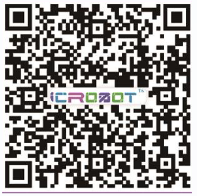

### Steps
| 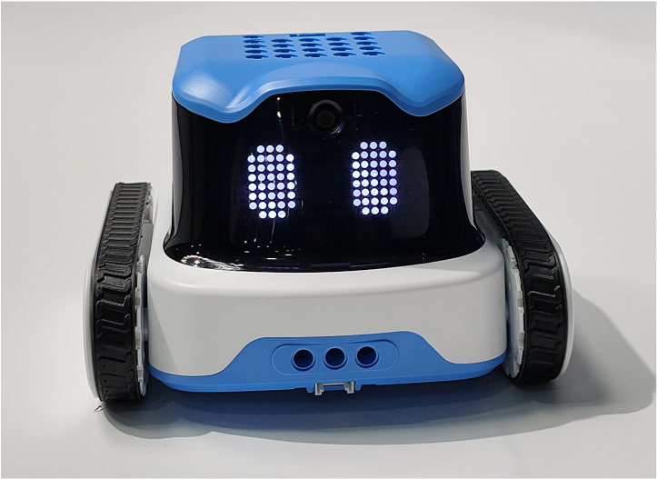 | 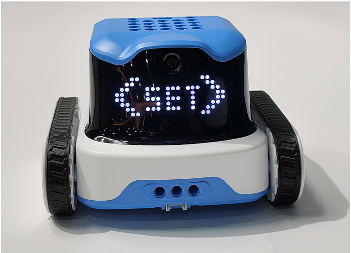 |
| --- | --- |
| Step 1: Power on the ICRobot with the screen facing you. | Step 2: Press the left button to display <SET> on the screen. Press the middle (power) button to enter Settings Mode. |
| 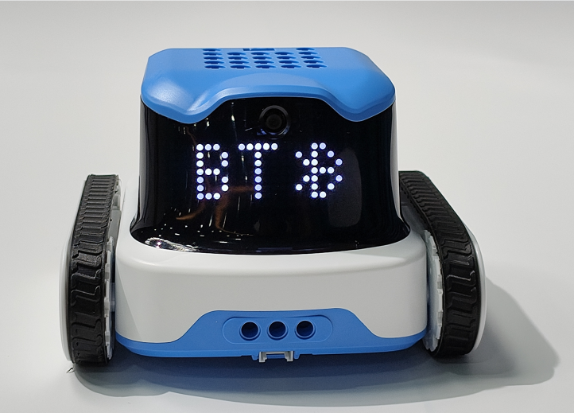 | 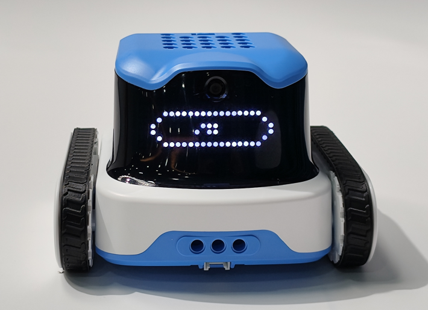 |
| Step 3: Use the left/right buttons to scroll through connection modes. Select BT and press the middle button to confirm. | Step 4: The robot will announce one of the following:“Switching to Bluetooth mode.”“Already in Bluetooth mode. No need to switch.” |
| 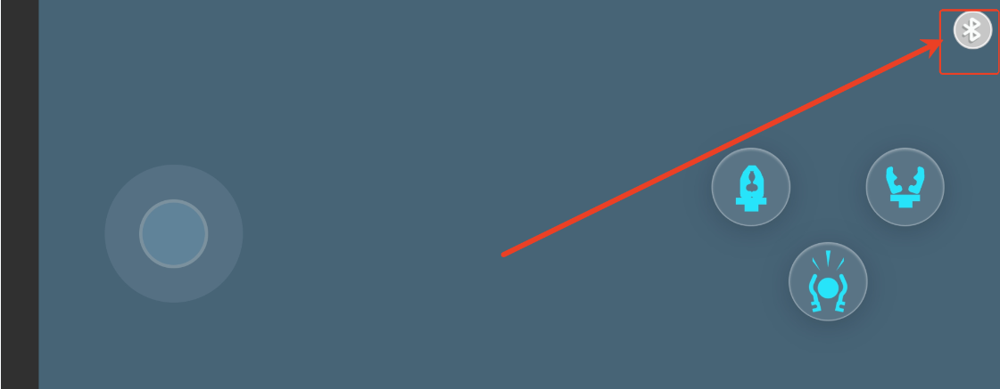 | 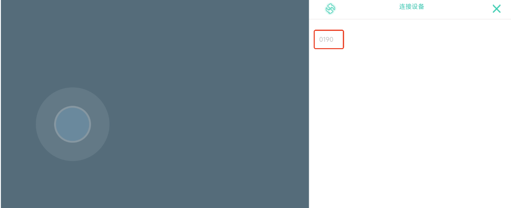 |
| Step 5: Open the ICRemote app, tap the Bluetooth icon, and scan for devices. | Step 6: Select the robot’s device name to initiate connection. |
|  | 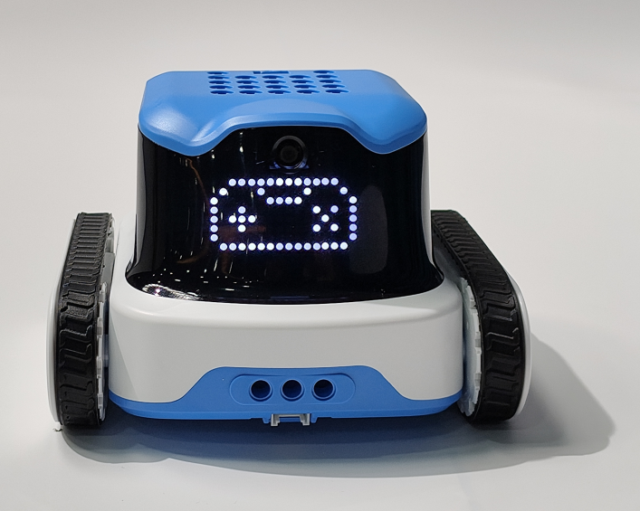 |
| Step 7: The robot will announce: “Bluetooth connected successfully.” or “Bluetooth connection failed.” |  Step 8: Follow the program instruction to switch to Program 4. When the screen shows a gamepad icon, you can control the robot using the app. |

## Bluetooth Gamepad Interaction
### Preparation
| 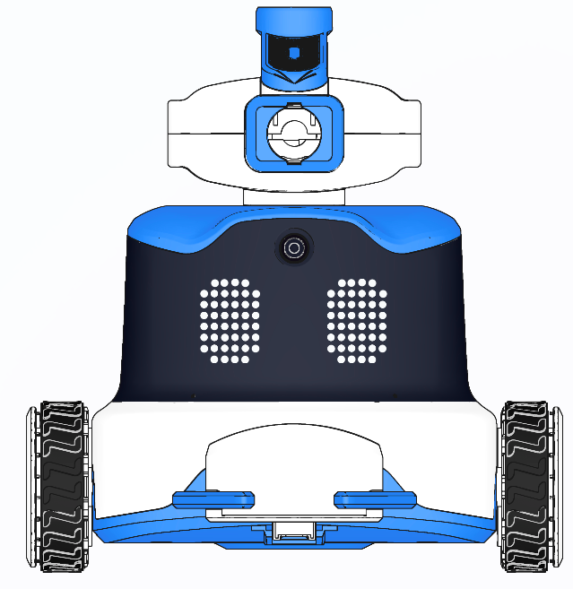 | 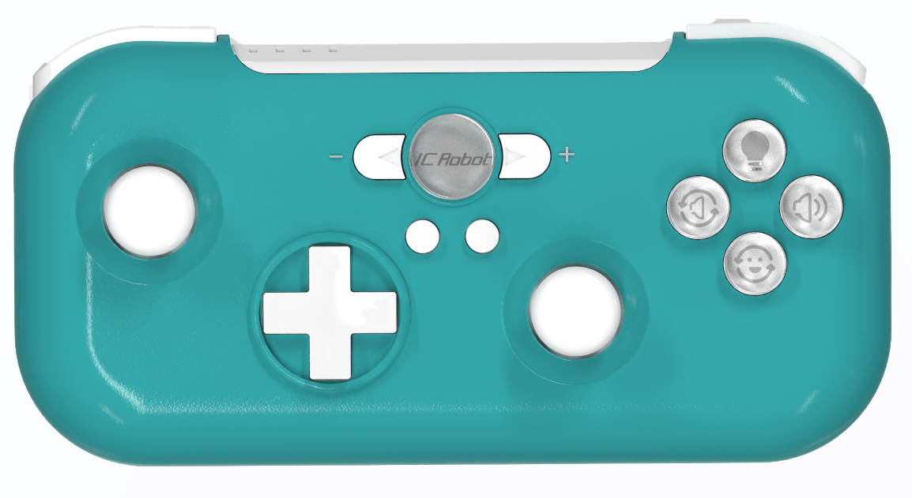 |
| :---: | :---: |
| ICRobot  | ICRobot Multifunctional Bluetooth Handle |

### Steps
| 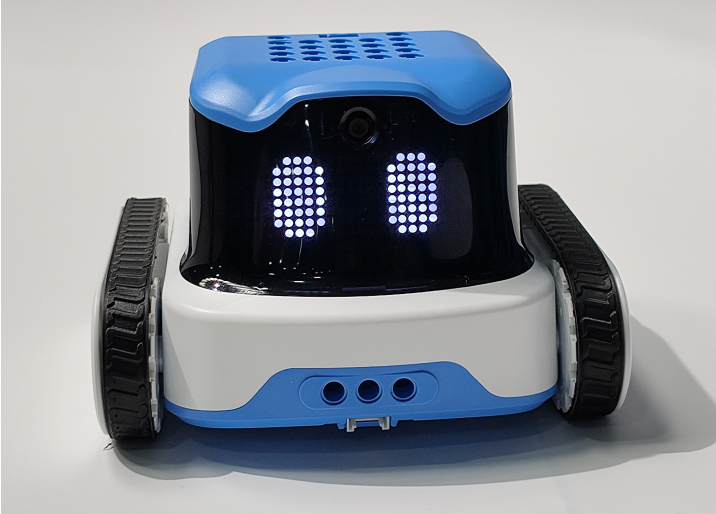 | 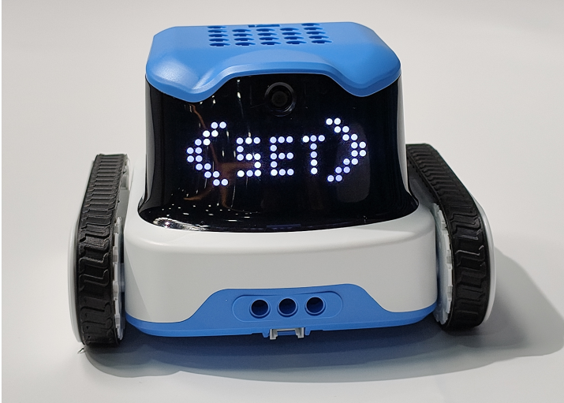 |
| --- | --- |
| Step 1: Power on the ICRobot with the screen facing you. | Step 2: Press the left button to show <SET>, then press the middle button to enter Settings Mode. |
|  | 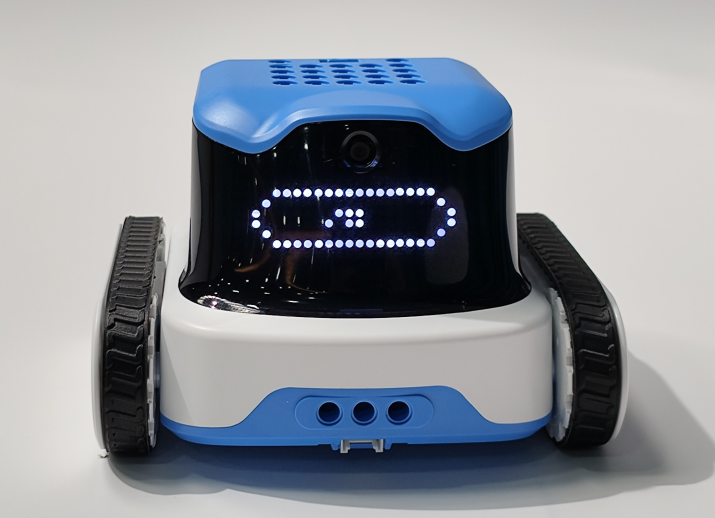 |
| Step 3: Use the left/right buttons to select BT Mode, then press the middle button to confirm. | Step 4: The robot will announce:“Switching to Bluetooth mode.”or “Already in Bluetooth mode. No need to switch.” |
| 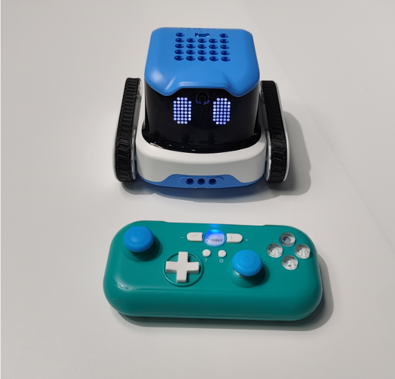 |  |
| Step 5. Refer to the handle connection operation instructions for Bluetooth device pairing operation.  The ICRobot announces the connection process. Announcing: "Bluetooth connection successful". Or broadcast: "Bluetooth connection failed". ICRobot Multi-function Bluetooth Grip (refer to the link): 1 . Switch mode, must be transporter mode, just refer to the switching process. 2. Operation instructions for handle connection, only need to refer to the link process. Note: If you need to brush the bluetooth handle, you can refer to ICRobot multifunctional bluetooth handle firmware upgrade method. | Step 6: Switch to Program 4. When the gamepad icon appears on the screen, you can control the robot with the Bluetooth gamepad. |

