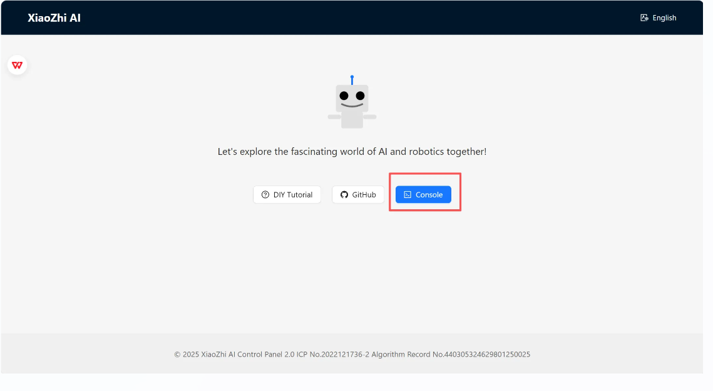
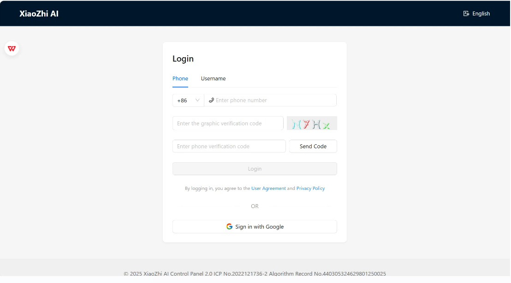
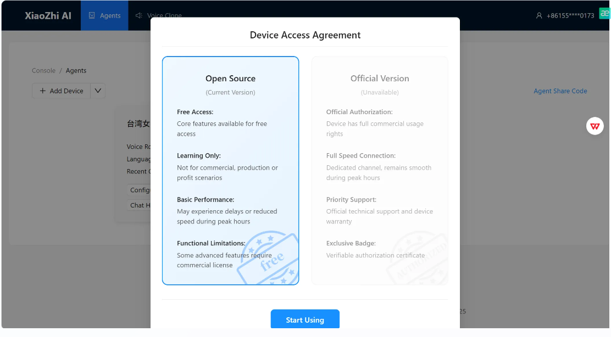
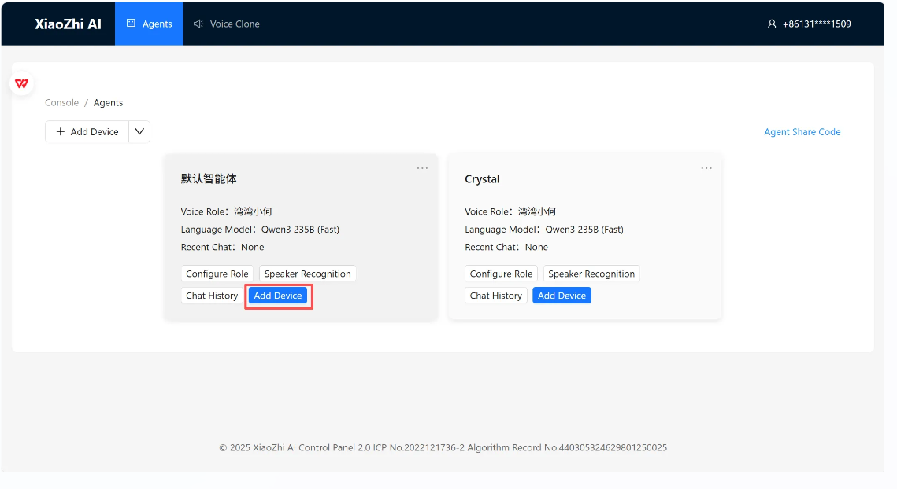
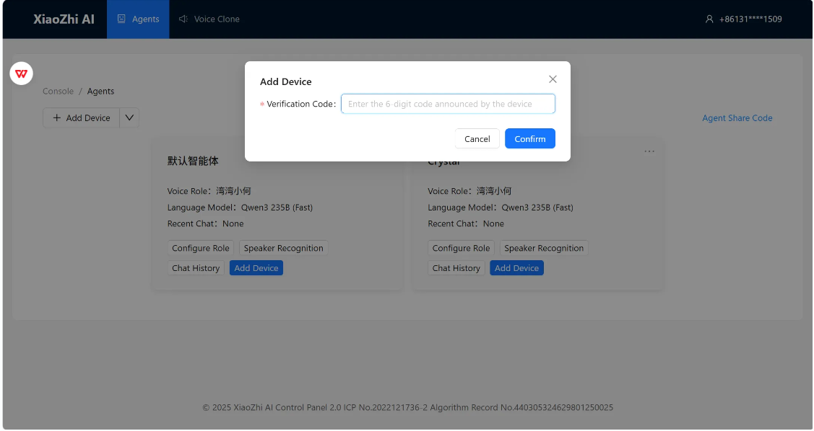
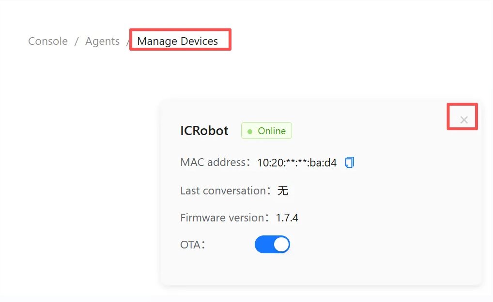

# XiaoZhi AI Configuration Guide
## Instructions
ICRobot Xiaozhi AI  mode, two steps are required before use.

Step 1. Switch the ICRobot internal firmware to Xiaozhi AI, the method can refer to the firmware switching.

Step 2. Connect ICRobot to configure the network operation, details can refer to the contents of this document.

## Connect & Configure Wi-Fi
### Wi-Fi Setup
|  |  |
| --- | --- |
| On your mobile device, go to Settings > Wi-Fi. | Select the network XiaoZhi-XXXX, where XXXX represents the last 4 digits of the MAC address. |
|  |  |
| Your phone should automatically redirect to the network configuration page. | If your phone does not auto-redirect, open a browser and manually enter: [http://192.168.4.1](http://192.168.4.1) This will take you to the same configuration page. |
|  |  |
| ● If you select the wifi name (SSID) from below, you only need to fill in the password. ● or Manually fill in the wifi network name (SSID) and password to connect to the network. | After clicking Connect, the connection is successful, please wait patiently for the device to reboot. Note:  After the device reboots and turns on, it will broadcast the device code, please make sure to remember the device code broadcasted by the device! |

Note: If the device is already configured for a network, but you wish to clear the current network configuration in order to connect to another network, tap the left button three times in succession at any point after powering on the device

### Register & Bind Device
|  |  |
| --- | --- |
| Open a browser and go to: 🔗 [https://xiaozhi.me/](https://xiaozhi.me/) Click “Console” to enter the management dashboard. | Register with your mobile phone number and verification code.    |
|  |  |
| Select “Open Source Version” | Click “Add Device” |
|  |  |
| Enter the Device Code announced by the robot, then click Confirm. If you did not note the Device Code, simply power off and restart the device — it will announce the code again upon startup. | Once the confirmation screen appears, your XiaoZhi AI setup is complete. Note: If the device is already bound to an existing user account and you wish to bind it to a new account, please first remove the device from the original account before proceeding. |

