# ICRobot Block Guide
## Motion
### Robot (moves forward、moves backward、turns left、turns light) at ( ) % power
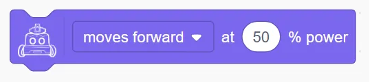

Controls the robot to move in the specified direction with the given power.

Example:

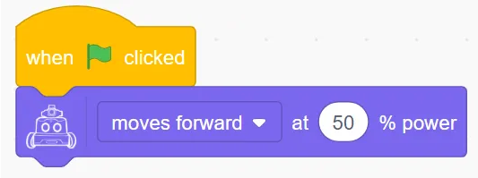

### Robot (moves forward、moves backward、turns left、turns light) at ( ) % power ( ) Seconds
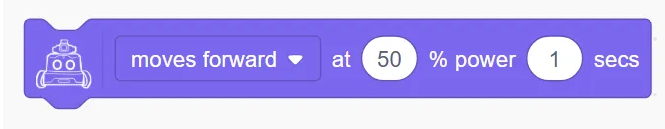

Controls the robot to move in the specified direction with a given power for a certain number of seconds. This is a blocking block.

Example:

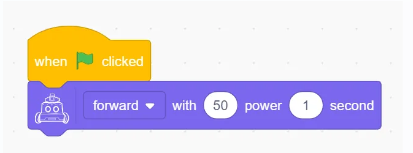

### Robot (moves forward、moves backward、turns left、turns light) at ( ) % power for ( ) cm
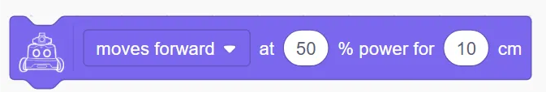

Controls the robot to move in the specified direction with a given power for a specified distance. This is a blocking block.

Example:

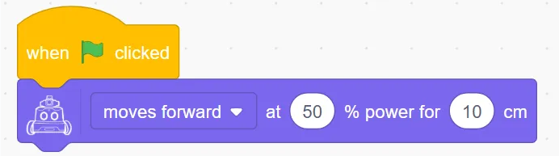

### Robot (moves forward、moves backward、turns left、turns light) at ( ) % power for () degrees until done
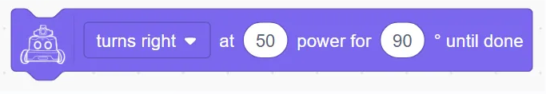

Controls the robot to turn left or right with the specified power until the target angle is reached. This is a blocking block.

Example:

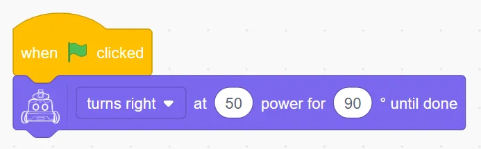

### Robot's left wheel rotates at ( ) % power, right wheel rotates at ( ) % power
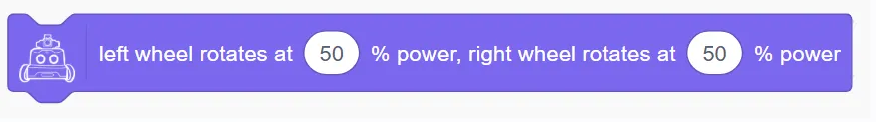

Independently control the power of the left and right wheels.

Example:

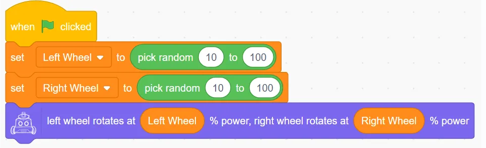

### Robot's motor (left wheel / right wheel) with ( )% power for ( ) (Seconds / cm)
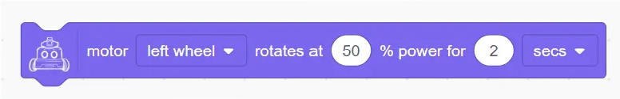

Controls a single wheel to move with the specified power for a given time or distance.

Example:

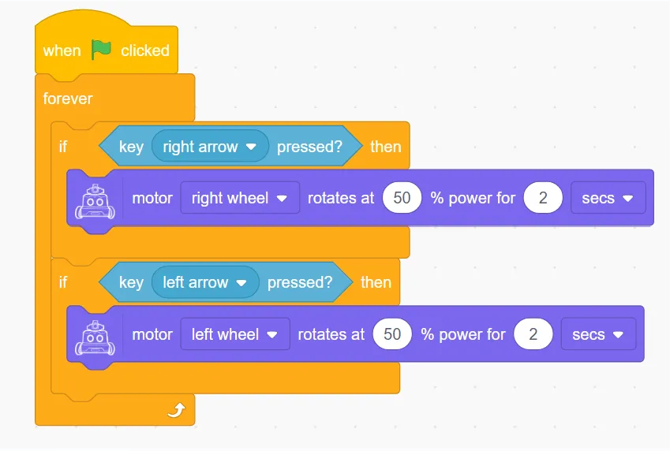

### Robot's motor (left wheel / right wheel) rotates at ( ) % power indefinitely
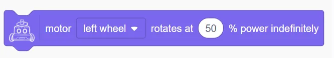

Continuously control a single wheel to move with the specified power.

Example:

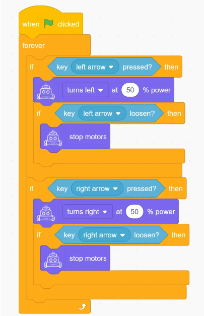

### Stop Movement
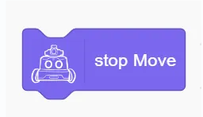

Stop the robot's motion.

## Display (Matrix LED)
### Set display brightness to (1–10)
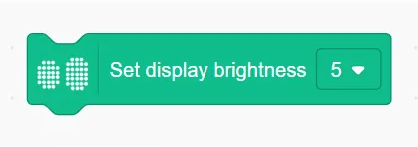

Set the display brightness of the robot's dot-matrix screen, the value is 1-10, the larger the value the brighter it is.

Example:

 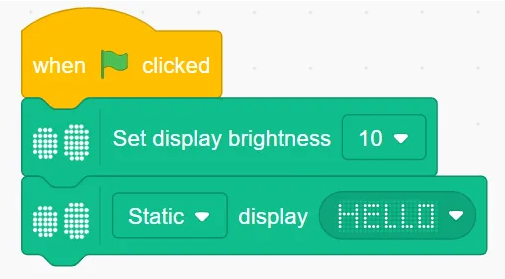

### (Static / Right to Left / Left to Right / Top to Bottom / Bottom to Top) Display () for () seconds
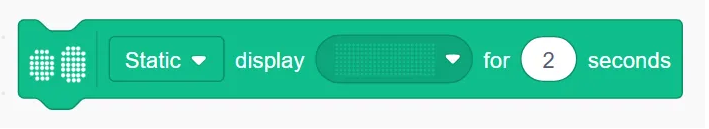

Setting the static or dynamic display of the set dots for a given length of time

Example:

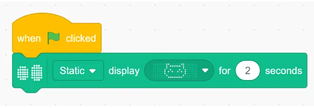

### (Static / Right to Left / Left to Right / Top to Bottom / Bottom to Top) Display ( )
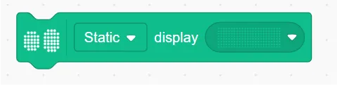

Set static or dynamic display of a given dot matrix all the time

Example:

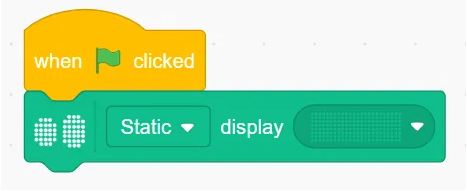

### Display Text ()
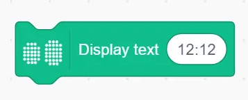

Display a text string on the matrix; if the string exceeds the matrix width, it scrolls; otherwise, it displays statically.

Example:

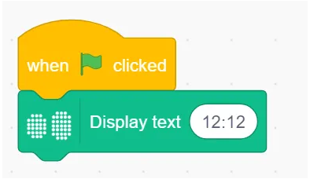

### Light up x() y()
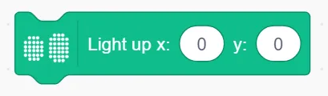

Turn on the LED at coordinate (x, y); (0, 0) is bottom-left.

Example:

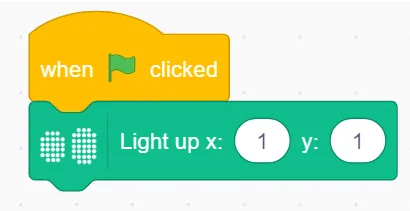

### Only light up x() y()
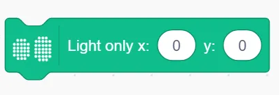

Light up only the LED at (x, y), turning off all others.

Example:

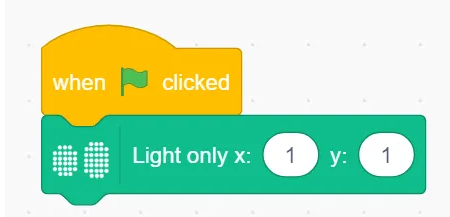

### Turn off x() y()
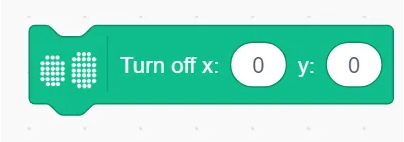

Turn off the LED at coordinate (x, y).

Example:

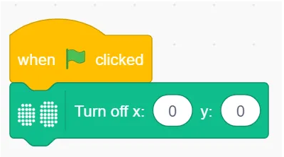

### Toggle x() y()
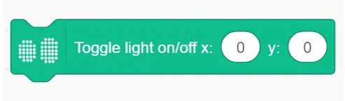

Switch the LED at (x, y) between on and off.

Example:

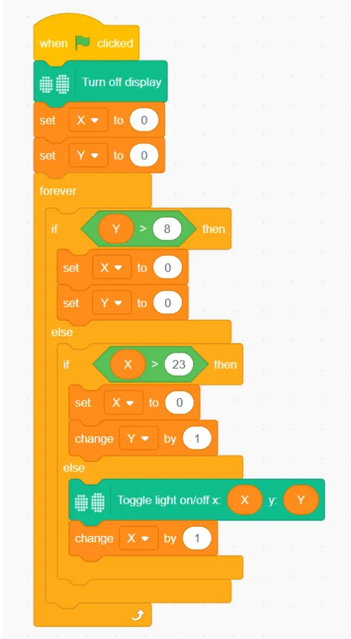

### Set tail light color（）
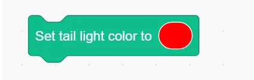

Change the tail light to a selected color.

Example:

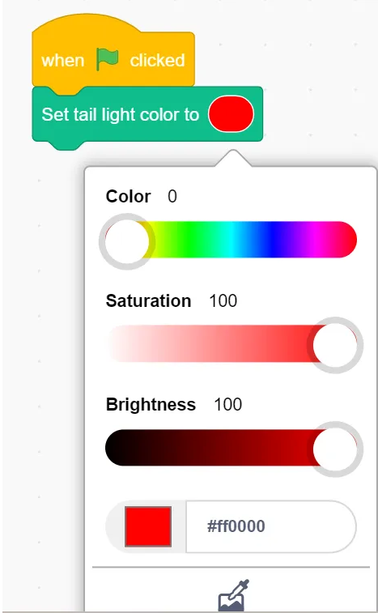

### Set tail light color to R() G() B()
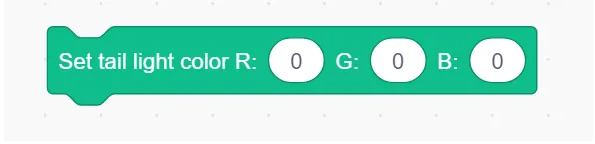

Set RGB values for the tail light.

Example:

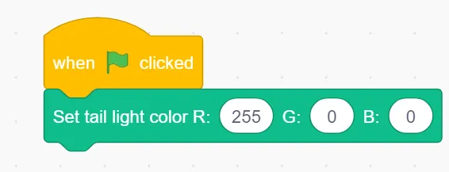

### Turn off display
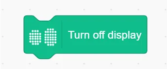

Turn off the matrix display.

Example:

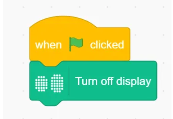

## Audio
### Upload Audio File
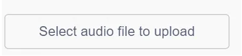

Choose and upload a custom audio file, and assign a filename.

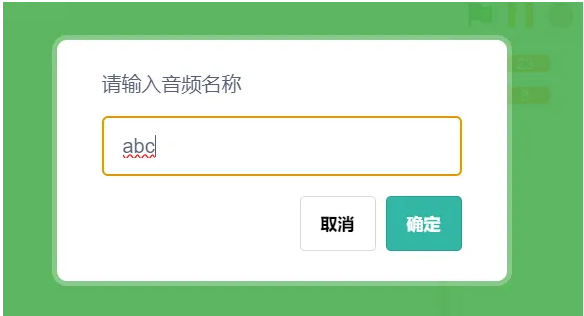

### Set volume to ()
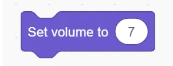

Set playback volume (range: 0–10).

### Play music () until finished

Play selected audio file; wait until it finishes before continuing the next action.

Example:

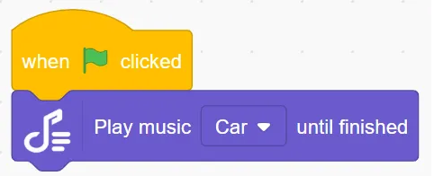

### Play music ()
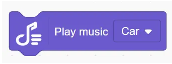

Play the selected audio file immediately.

Example:

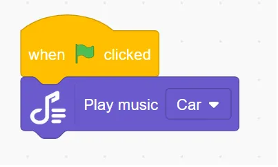

### Stop playback
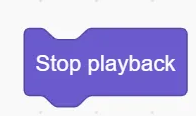

Stop the current audio.

### () Play local audio ()

Play an uploaded audio file in real-time.

Example:

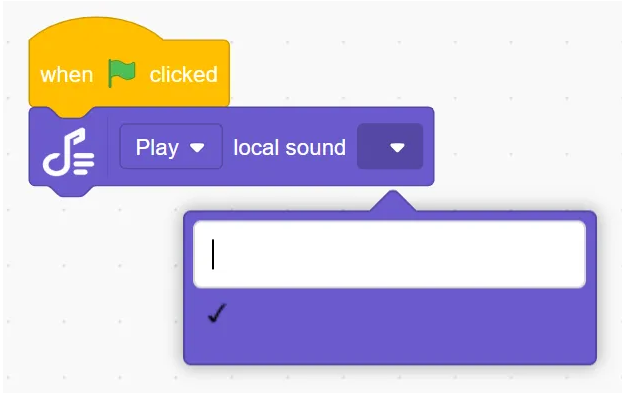

## Actuators
### Robot's gripper at port ( ) (open/close)
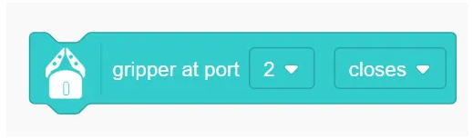

ontrol the gripper at the selected port.

Example:

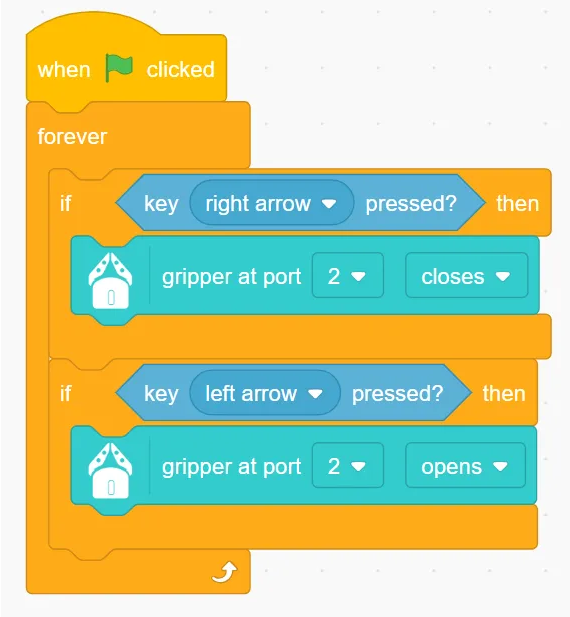

### Robot's gripper at port ( ) (open/close) until done
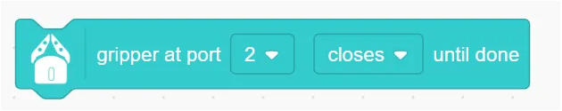

Control the gripper and wait until action completes before next step.

Example:

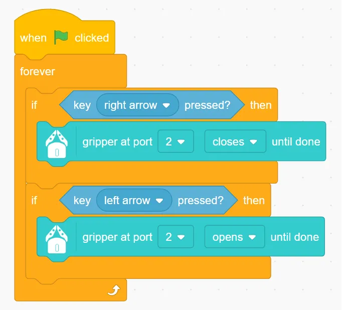

### Robot's launcher at port ( ) shoots (number) ball
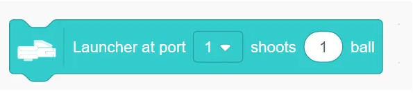

Launch specified number of marbles from selected port.

Example:

### Robot's launcher at port ( ) shoots ( ) ball until done

Launch and wait until finished before proceeding.

Example:

## Sensors
### Button (A/B) pressed

Detect if left or right button is pressed.

Example:

### Sound（）（）

Check if detected sound is greater/less than/equal to a value.

Example:

### Current sound level

Return the detected sound level.

Example:

### Current battery level

Return remaining battery.

Example:

### （）current speed

Get current speed of each wheel.

Example:

### Privacy switch status

Return status of privacy switch.

Example:

### （）movement distance

Return the movement distance.

Example:

### Set line-following sensor to () mode

Choose binary/gray/color  mode.

Example:

### Run Line Following Sensor Binary Learning

Set Line Following Sensor to binary mode learning.

Example:

### Run  Line Following Sensor Learning () Colour

Learn a specific color.

Example:

### Value detected by the roving sensor probe ( )

Get value from probe (L1, L2, M, R2, R1).

Example:

### Line Following probe () detects ()

Check if probe detects specific color.

Example:

### Line Following probe () value () ()

Whether the detected value is greater than/less than/equal to the specified value

Example:

### Turn off Line Following sensor

Disable Turn off Line Following sensor.

Example:

### Start auto line following at () speed

Allow robots to automatically patrol lines at low/medium/high speeds

Example:

### Start auto line following at () speed until state is ()

Controls the robot to start auto-touring at low/medium/high speeds until the value of the five probes is the set value and then stops auto-touring.

Example:

### Stop auto line following

Stop line-following behavior.

Example:

