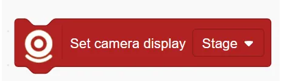
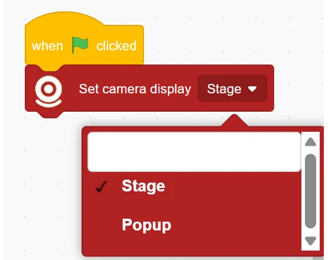
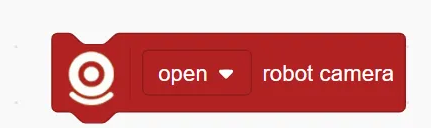
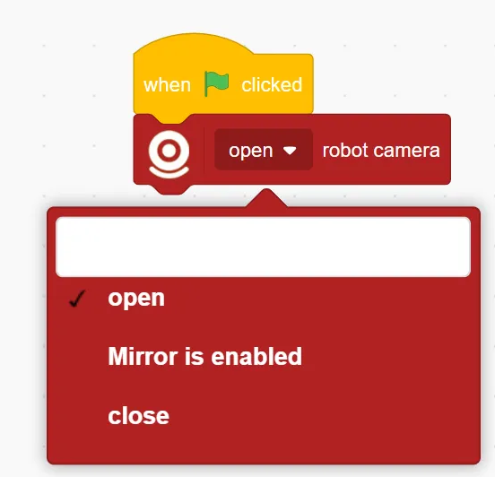
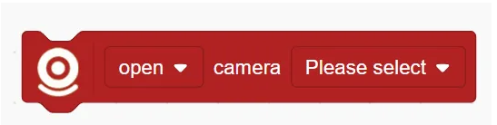
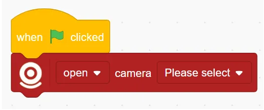
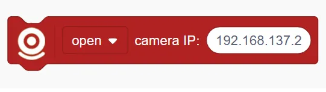
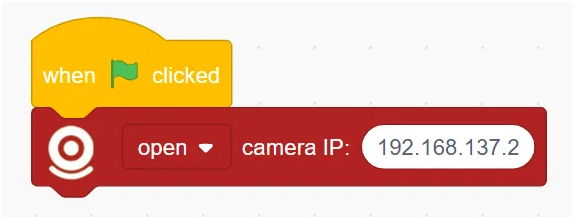
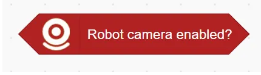
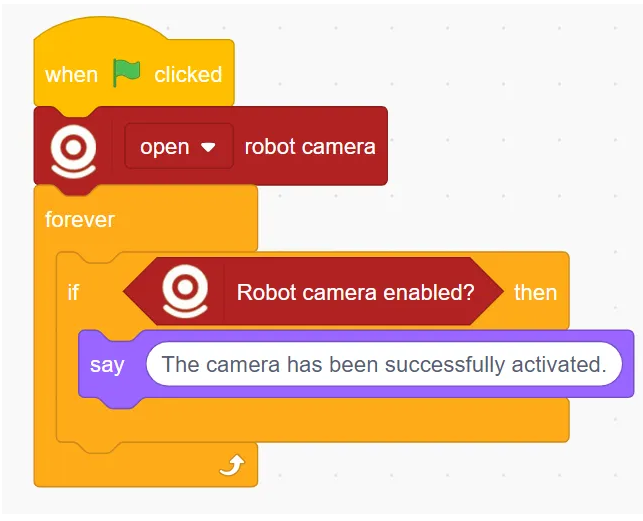

# Vision Recognition Blocks
## Set Camera Display ()

Sets where the camera feed is shown:

Options include Stage Area Display or Popup Window Display

Example

## () Robot Camera

Controls the robot's built-in camera:

Options: open / Mirror is enabled / close

Example:

## () Computer Camera ()

Controls the computer's built-in or external camera:

Options: open / Mirror is enabled / close

Example: 

## () Camera IP ()

Controls an IP camera over the network:

Options: open / Mirror is enabled / close

Example:

## Robot Camera Enabled Successfully?

Checks whether the robot's camera has been successfully enabled. 

Returns a true/false value.

Example:

