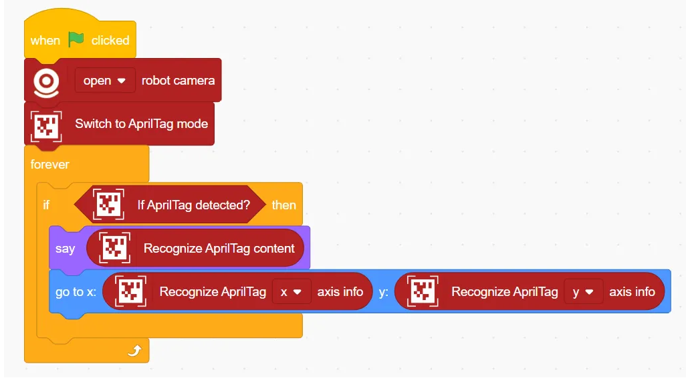
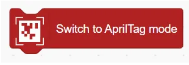
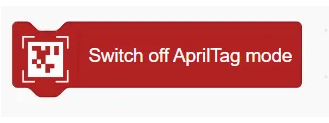
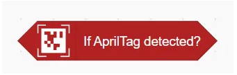
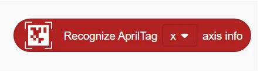
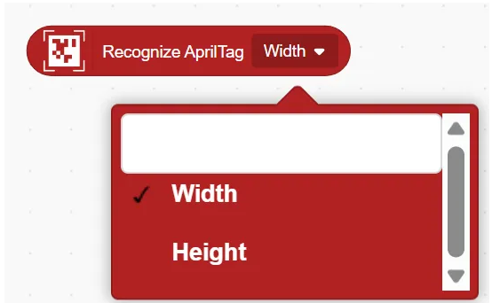

# AprilTag Detection Blocks
## Example

## Switch to AprilTag Mode

Enables AprilTag recognition using the computer's camera.

## Switch off AprilTag Mode

Disables AprilTag recognition.

## If AprilTag detected?

Checks whether an AprilTag has been successfully detected.

## Recognize AprilTag Content

Returns the content (ID) of the detected AprilTag.

## Recognize AprilTag () axis info

Get the x or y axis position information of the code recognised by the AprilTag code.

## Recognize AprilTag ()

Get the contents of the recognised AprilTag code

