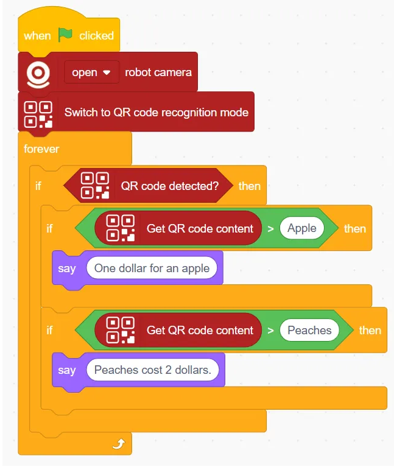
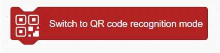
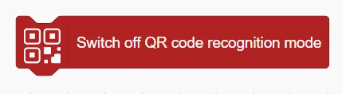
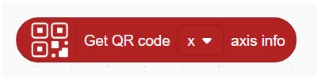

# QR Code Recognition Blocks
## Example

## Switch to QR code recognition mode

Enable the QR code recognition.

## Switch off QR code recognition mode

Disable QR Code Recognition Mode

## QR code detected?
![]img/Q4.png)

Determine whether the QR code is recognised or not

## Get QR code content

Get the content recognised by the QR code

## Get QR code () axis info

Get the coordinate information of the x or y axis of the QR code.

## Get QR code ()

Get the width or height of the QR code

