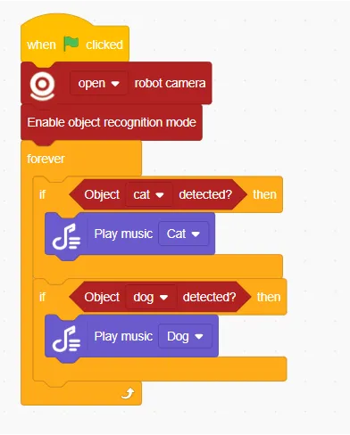
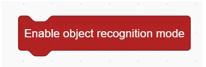
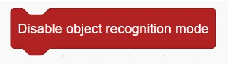
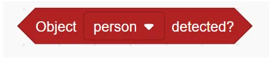

# Object Recognition Blocks
## Example

## Enable Object Recognition Mode

Enable object recognition mode

## Disable Object Recognition Mode

Disable object recognition mode

## Object Detected ( )

Detect whether the specified object is recognised or not

## Get Object Position ()

Get the x,y position of the object

## Get Object ()

Get the width/height of the object

