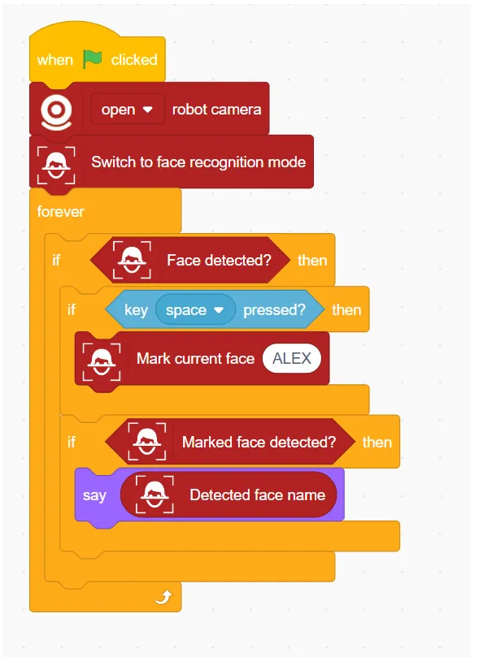
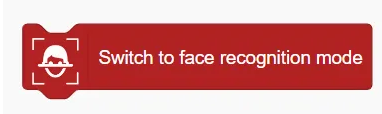
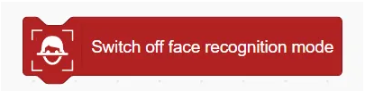
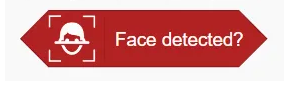
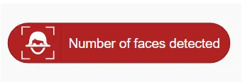
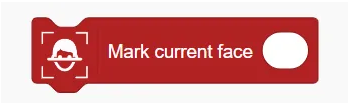
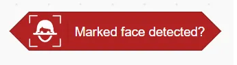
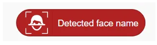

# Face Detection Blocks
## Example

## Switch to face recognition mode

Enable Face Recognition Mode

## Switch off face recognition mode

Disable Face Recognition Mode

## Face detected?

Determine if a face is detected

## Number of faces detected

Returns the number of faces detected

## Get face position ()

Get face position (X or Y)

## Get face ()

Get the position information of the face in the x or y axis.

## Mark Current Face ()

Mark the current face as a specified name (for subsequent recognition)

## Reset faces

Reset (delete) all marked faces

## Marked face detected?

Determine whether a marked face has been detected

## Detected face name

Returns the name of the detected face

