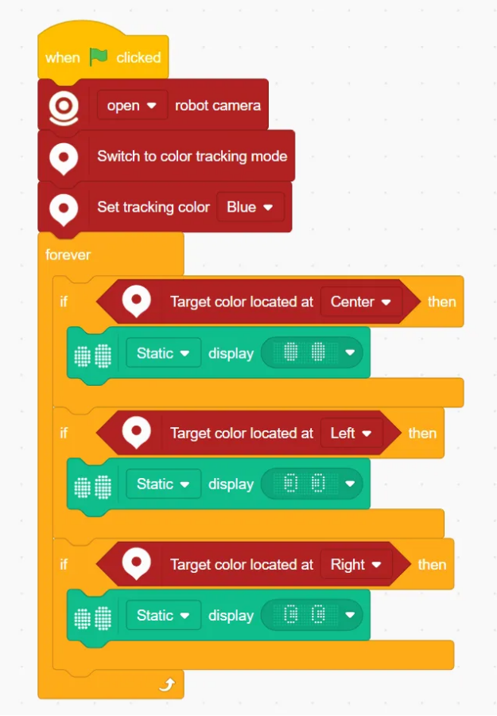
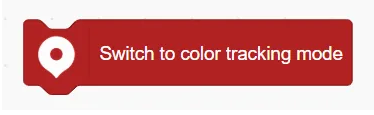
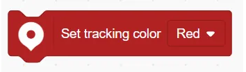

# Color Position Tracking Blocks
## Example

## Switch to color tracking mode

Activates the color position tracking mode.

## Switch off color tracking mode

Deactivates the color position tracking mode.

## Set tracking color ()

Sets the color to be tracked.

## Target color is located at ()

Determines where the target color appears on the screen:  Center / Left/ Right/ Top/ Bottom.

