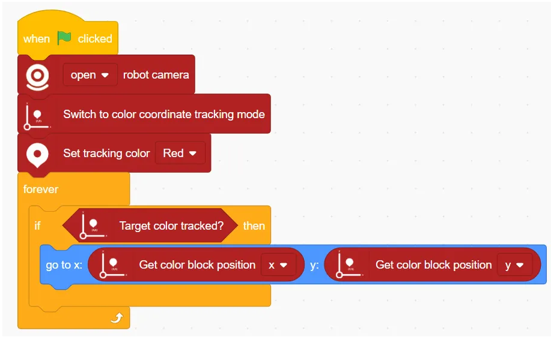
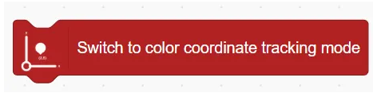
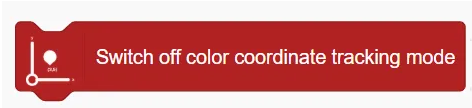
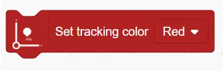
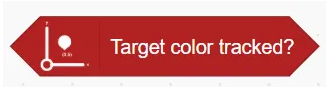
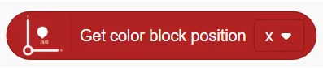
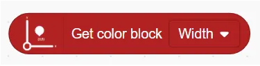

# Color Coordinate Tracking Blocks
## Example

## Switch to color coordinate tracking mode 

Enable Color Coordinate Tracking Mode 

## Switch off color coordinate tracking mode

Disable Color Coordinate Tracking Mode

## Set tracking color ()

Sets the target color to be tracked.

## Target color tracked?

Checks whether the target color is currently detected.

## Get color block position ()

Get the position information of the x or y axis of the colour block.

## Get color block ()

Get the width or height of the colour block.

