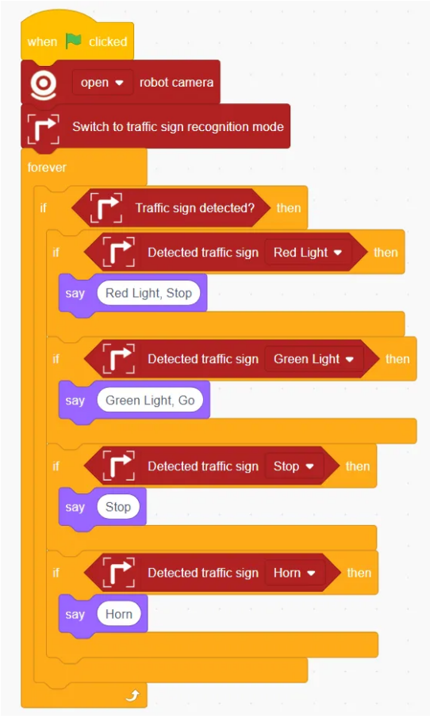
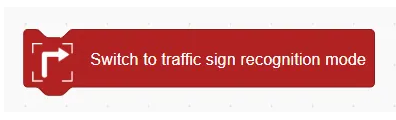
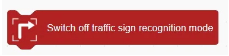
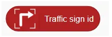
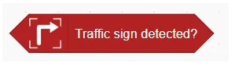
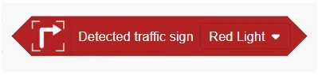

# Road Sign Recognition Blocks
## Example

## Switch to traffic sign recognition mode

Enables the robot's road sign recognition function.

## Switch off traffic sign recognition mode

Disables the road sign recognition function.

## Traffic sign id

Returns the ID of the detected road sign.

## Traffic sign detected?

Checks whether any road sign has been detected. Returns true/false.

## Detected traffic sign ()

This program command is used to make the robot automatically perform corresponding actions based on the traffic signs detected by the camera, such as red light, green light,  stop, horn, turn left, turn right.

