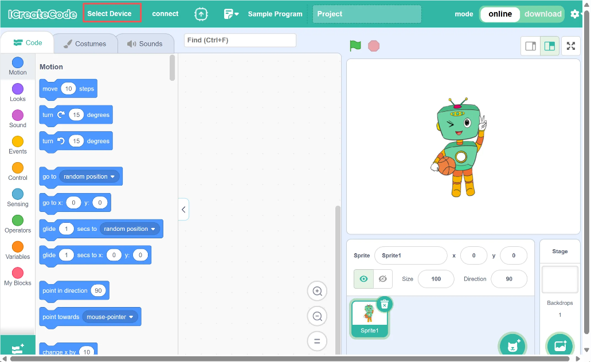
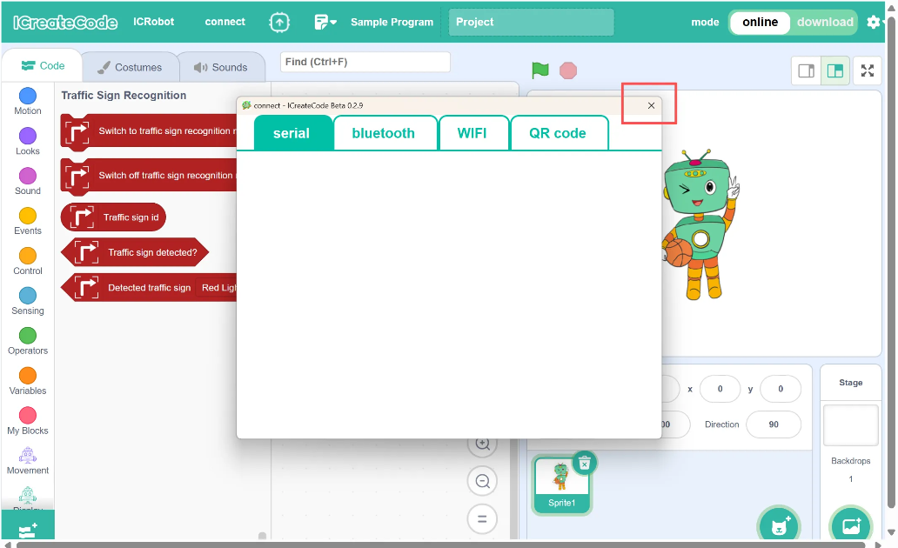
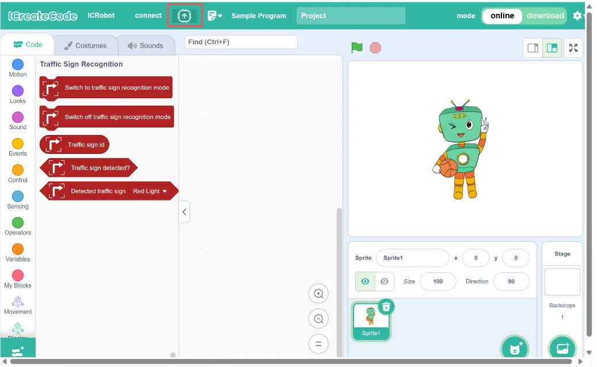
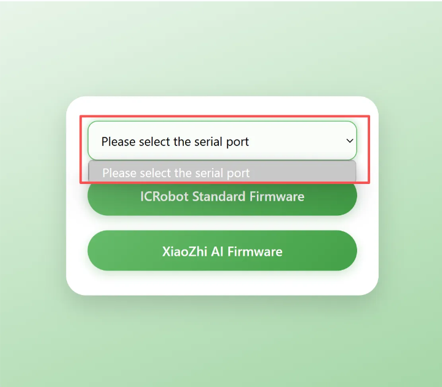
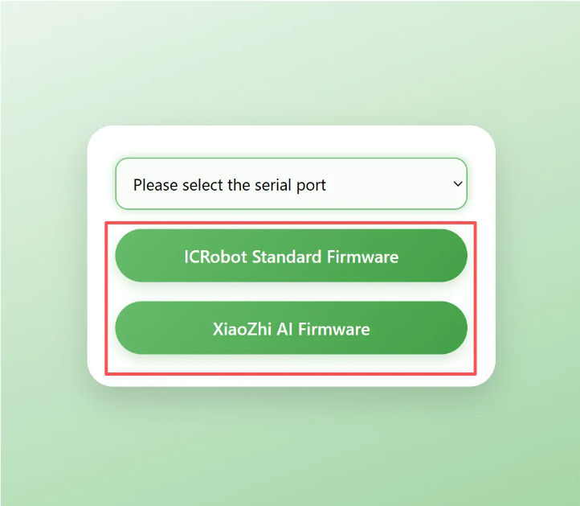
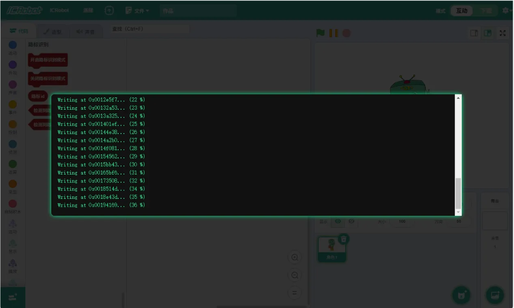
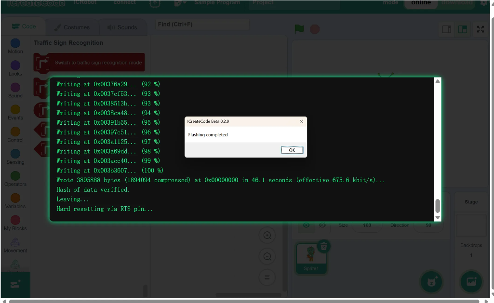

# Firmware Switching
## Instructions
ICRobot provides two modes of use: programming and Xiaozhi AI, and the factory default is programming mode. If you need to switch to Xiaozhi AI mode, you need to update its internal firmware. Please refer to this document for specific operation steps.

## Steps
|  | |
| :---: | --- |
| Step 1: Connect the device. Plug the ICRobot into the computer and power it on. | |
|  |  |
| Step 2: Open the software and click “Select Device.” | Step 3: Choose “ICRobot.” |
|  |  |
| Step 4: Close the connection method directly. | Step 5: Select the “Firmware Burning” option. |
|  |  |
| Step 6: Choose the correct COM port for firmware burning. | Step 7: Select the firmware (feature) you want to flash. |
|  |  |
| Step 8: No further action is needed — wait for the firmware flashing to complete. | Step 9: No further action is needed — flashing is complete. |

 

