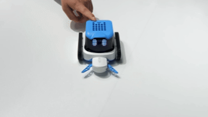

# Firmware Upgrade
## Preparation
+ A stable 2.4GHz Wi-Fi network with internet access (such as a router or a computer/mobile hotspot that supports 2.4GHz)
+ ICRobot AI Coding Robot
+ A charger (≥5V 1A) and one USB-C data cable.

## Precautions
+ Ensure the battery is not too low. A battery level above 30% is recommended.
+ Plug in the charger before entering the upgrade process.
+ Do not interrupt the upgrade process (e.g., shutting down or disconnecting from the network).
+ The upgrade is automatic and requires no further operation after confirming the start.

## Upgrade Steps
### Preparation
Power on the ICRobot and plug in the charger.

Use the left/right button to switch to the SET position, then select UPD.

The device will prompt: “Please scan the QR code to connect to the network.”

### A 2.4G Wi-Fi connection is required for network setup.
    1. In the coding software, select the connection mode as STA (Station Mode) and choose Generate QR Code Only. Scan the QR code with the robot. The robot will announce: “QR code scanned successfully, connecting to the network.” Be sure to select Generate QR Code Only, not connect.
    2. If the robot is already connected to a Wi-Fi network in STA mode before starting the upgrade and the connection is still active, you do not need to reconnect.
    3. Alternatively, you can use a mobile hotspot to generate a QR code, and make sure the hotspot is set to 2.4GHz.
    4. Or you can share the 2.4GHz Wi-Fi QR code directly from your phone.

### Network Connection
    1. Once connected, the robot will say:“Checking for firmware updates, please wait.”
    2. If the connection fails, it will say:“Network connection failed.” Please verify the network settings and ensure it’s a 2.4GHz Wi-Fi.

### Firmware Update – Automatic Version Check
If the current firmware version is not the latest:

    1. A voice prompt will say: “A new firmware version is available. Please confirm if you wish to upgrade.” The LED screen will display Y/N.Select Y to proceed with the update. If the current version is already the latest.Select N to exit the update.
    2. If the firmware is already up to date, a voice prompt will say: “The current version is the latest.” The update process will exit automatically.

### Firmware Update – Pre-check Procedure
When the upgrade starts, a voice prompt will say: “Starting firmware upgrade. Please ensure the charging device is connected.” (This is a reminder to check the battery level to avoid failure due to low power.)

After the update is completed, a voice prompt will say: “Upgrade successful.”

The ICRobot will then automatically shut down. To use it again, please restart the device.

## Demonstration

